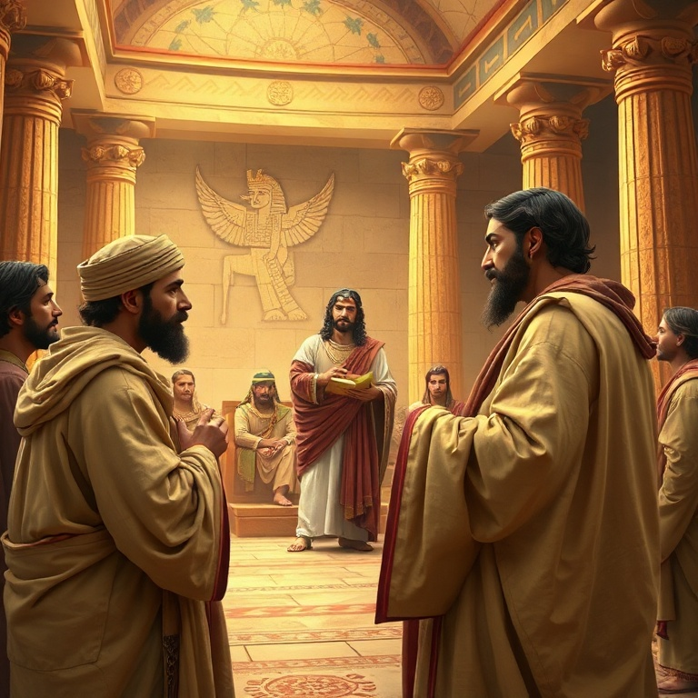

# O Princípio: Um Estudo em Gênesis

## Índice

1. [Criação e Queda](#1-criacao-e-queda)
2. [O Dilúvio e a Aliança com Noé](#2-o-diluvio-e-a-alianca-com-noe)
3. [Abraão e a Fé](#3-abraao-e-a-fe)
4. [Isaque e Jacó](#4-isaque-e-jaco)
5. [José e a Providência](#5-jose-e-a-providencia)

---

## Introdução

Gênesis é o livro dos começos. Nele encontramos a origem de todas as coisas — o universo, a humanidade, o pecado e o plano de redenção de Deus. Moisés escreveu este livro para registrar como tudo começou e para mostrar que o Deus criador não abandonou a sua criação. Cada página revela o cuidado divino e a paciência de um Deus que caminha com pessoas imperfeitas.

O livro se divide em duas grandes partes: os primeiros onze capítulos tratam da história primitiva, desde a criação até a Torre de Babel; os capítulos seguintes focam nos patriarcas — Abraão, Isaque, Jacó e José. Gênesis estabelece as bases para toda a narrativa bíblica, apresentando temas como aliança, fé, promessa e bênção que ecoarão por toda a Escritura.

Mais do que um livro histórico, Gênesis é teologia em narrativa. Cada história aponta para o caráter de Deus e para a necessidade humana de redenção. Ao estudar este livro, somos convidados a confiar no Deus que age na história e que cumpre as suas promessas, mesmo quando tudo parece impossível.

---

## Capítulo 1: Criação e Queda

Deus criou os céus e a terra em seis dias, e tudo o que fez era bom. O ser humano foi criado à imagem de Deus, macho e fêmea, recebendo o mandato de frutificar, encher a terra e dominá-la. O relato da criação não é apenas uma descrição científica, mas uma declaração teológica: o mundo pertence a Deus, e os seres humanos são seus representantes na terra.

No jardim do Éden, Adão e Eva desobedeceram a Deus ao comer do fruto proibido. A tentação veio através da serpente, que questionou a palavra de Deus e semeou dúvida no coração de Eva. O pecado trouxe consequências imediatas: vergonha, culpa, separação de Deus e a entrada da morte no mundo. A terra foi amaldiçoada por causa do homem, e o relacionamento entre Deus e a humanidade foi rompido.

Apesar da queda, Deus não abandonou a sua criação. Ele fez vestimentas de peles para cobrir Adão e Eva, indicando que o sacrifício seria necessário para cobrir o pecado. A promessa de que a descendência da mulher esmagaria a cabeça da serpente é o primeiro vislumbre do evangelho. Gênesis 3 nos mostra que, mesmo no juízo, Deus já preparava a redenção.

O relato termina com a expulsão do jardim e a colocação de querubins para guardar o caminho da árvore da vida. A partir dali, a humanidade viveria sob o peso do pecado, mas também sob a esperança da promessa. A semente da redenção já havia sido plantada.

---

## Capítulo 2: O Dilúvio e a Aliança com Noé

A maldade humana se multiplicou sobre a terra, e o coração do homem se inclinava continuamente para o mal. Deus se arrependeu de ter feito o ser humano e decidiu enviar um dilúvio para destruir toda a carne. No entanto, Noé encontrou graça diante de Deus. Ele era justo e íntegro entre os seus contemporâneos, e andava com Deus. Por isso, recebeu a ordem de construir uma arca para salvar sua família e os animais.

Noé obedeceu fielmente, mesmo sem ver sinais da chuva que viria. Durante cento e vinte anos, ele pregou justiça e construiu a arca. Quando o dilúvio veio, as fontes do grande abismo se romperam e as janelas dos céus se abriram. Toda a terra foi coberta pelas águas, e apenas Noé e os que estavam com ele na arca foram salvos. O juízo de Deus foi completo, mas a sua misericórdia também.

Após o dilúvio, Noé ofereceu sacrifícios a Deus, e o Senhor estabeleceu uma aliança com ele. O arco-íris foi dado como sinal de que nunca mais haveria um dilúvio para destruir toda a terra. Deus abençoou Noé e seus filhos, renovando o mandato de frutificar e encher a terra. A aliança com Noé é universal e alcança toda a criação.

A história de Noé nos ensina sobre a seriedade do pecado e a certeza do juízo divino, mas também sobre a graça que salva os que creem. Noé é um tipo de Cristo — o justo que oferece salvação a todos os que entram pela porta da arca. Assim como Noé foi salvo pelas águas, nós somos salvos pela morte e ressurreição de Jesus.

---

## Capítulo 3: Abraão e a Fé

Deus chamou Abrão de Ur dos Caldeus e lhe fez uma promessa extraordinária: faria dele uma grande nação, abençoaria todos os povos da terra através dele e lhe daria a terra de Canaã. Abrão creu em Deus, e isso lhe foi imputado como justiça. Aos setenta e cinco anos, ele partiu sem saber para onde ia, confiando apenas na palavra do Senhor. Sua fé não era perfeita, mas era genuína.

Ao longo de sua jornada, Abraão enfrentou provas que testaram sua confiança em Deus. A espera pelo filho prometido, Isaque, durou vinte e cinco anos. Durante esse período, Abraão falhou algumas vezes, como quando mentiu sobre Sara ser sua irmã e quando tentou apressar o cumprimento da promessa através de Agar. Mesmo assim, Deus permaneceu fiel.

O ponto alto da fé de Abraão foi quando Deus lhe pediu que oferecesse Isaque em sacrifício. Sem hesitar, Abraão obedeceu, crendo que Deus poderia ressuscitar seu filho. No momento crucial, o Senhor proveu um cordeiro em lugar de Isaque. Este episódio aponta profeticamente para o sacrifício de Cristo, o Cordeiro de Deus que tira o pecado do mundo.

A vida de Abraão nos ensina que a fé não é ausência de dúvidas, mas confiança na fidelidade de Deus. Ele é chamado de pai da fé e seu exemplo atravessa os séculos. Assim como Abraão, somos justificados pela fé e não por obras, e caminhamos em direção a uma pátria celestial.

---

## Capítulo 4: Isaque e Jacó

Isaque foi o filho da promessa, nascido milagrosamente na velhice de Abraão e Sara. Sua vida foi marcada pela continuidade da aliança. Ele amava Rebeca, orou por ela quando era estéril e Deus lhe deu filhos gêmeos: Esaú e Jacó. Isaque cavou poços em Gerar e enfrentou conflitos com os filisteus, mas demonstrou paciência e confiança nas promessas de Deus.

Jacó, desde o ventre, lutava com seu irmão. Seu nome significa "suplantador", e ele viveu à altura desse nome. Comprou o direito de primogenitura de Esaú por um prato de lentilhas e, mais tarde, enganou Isaque para receber a bênção que pertencia ao irmão. Jacó era um homem astuto e manipulador, mas Deus escolheu trabalhar com ele e transformá-lo.

A transformação de Jacó começou em Betel, quando Deus lhe apareceu em sonho e renovou a aliança com ele. Continuou em Harã, onde serviu a Labão por vinte anos e aprendeu a confiar em Deus em meio às dificuldades. O clímax veio em Peniel, quando Jacó lutou com o Anjo do Senhor e foi transformado em Israel, aquele que luta com Deus e vence.

Jacó morreu no Egito, mas abençoou seus filhos e profetizou sobre o futuro de cada tribo. Sua história nos mostra que Deus não escolhe pessoas perfeitas, mas pessoas com quem ele pode trabalhar. A graça de Deus é maior que nossos erros, e ele pode transformar um suplantador em um príncipe de Deus.

---

## Capítulo 5: José e a Providência

José era o filho preferido de Jacó, o que despertou inveja em seus irmãos. Eles o odiavam por causa do sonho de que um dia se curvaria diante deles. Venderam José como escravo para mercadores ismaelitas e mentiram ao pai, dizendo que ele havia sido devorado por uma fera. José foi levado ao Egito, onde serviu na casa de Potifar.

Apesar das adversidades, Deus estava com José. Ele foi injustamente acusado pela esposa de Potifar e lançado na prisão, mas o Senhor continuou a abençoá-lo. Na prisão, José interpretou os sonhos do copeiro e do padeiro do faraó. Dois anos depois, quando Faraó teve sonhos perturbadores, o copeiro se lembrou de José, e ele foi levado à presença do rei.

José interpretou os sonhos de Faraó como sete anos de abundância seguidos por sete anos de fome. Faraó o nomeou governador de todo o Egito. Durante a fome, os irmãos de José vieram ao Egito comprar alimento e, sem saber, se curvaram diante dele, cumprindo os sonhos proféticos. José revelou sua identidade e os perdoou, reconhecendo a mão de Deus em sua história.

O legado de José é a certeza de que Deus age em todas as circunstâncias para o bem do seu povo. Ele disse a seus irmãos: "Vocês planejaram o mal contra mim, mas Deus o planejou para o bem". José é uma figura de Cristo — o servo sofredor que foi exaltado e se tornou fonte de vida para muitos. Sua história encerra Gênesis com a esperança de que Deus cumpre suas promessas.

---

## Conclusão

Gênesis termina com José no Egito, mas o povo de Israel ainda não havia entrado na terra prometida. O livro termina em aberto, apontando para o êxodo que viria. As promessas feitas a Abraão, Isaque e Jacó ainda estavam por se cumprir plenamente.

Mais que um livro de origens, Gênesis é um livro de esperança. Ele nos mostra que Deus age na história, que ele escolhe pessoas imperfeitas para realizar seus propósitos e que suas promessas são fiéis. Em Cristo, a descendência de Abraão, todas as nações da terra são abençoadas. Gênesis aponta para o evangelho desde o princípio.
