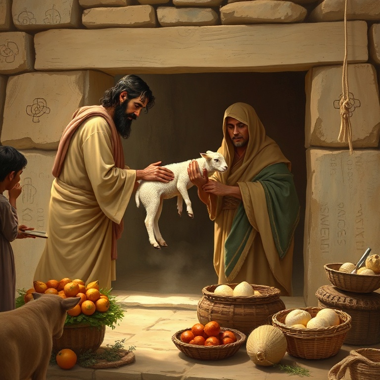
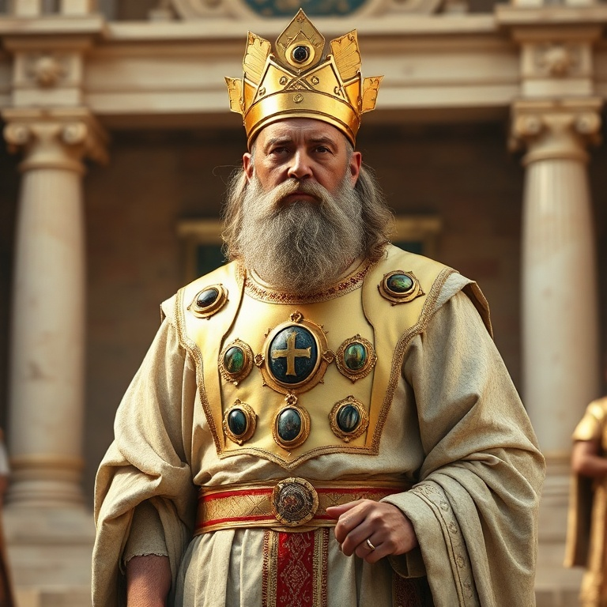
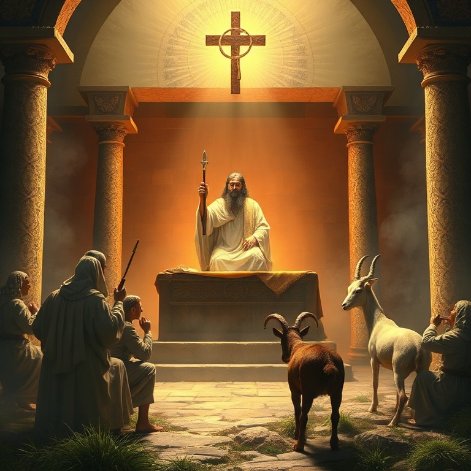
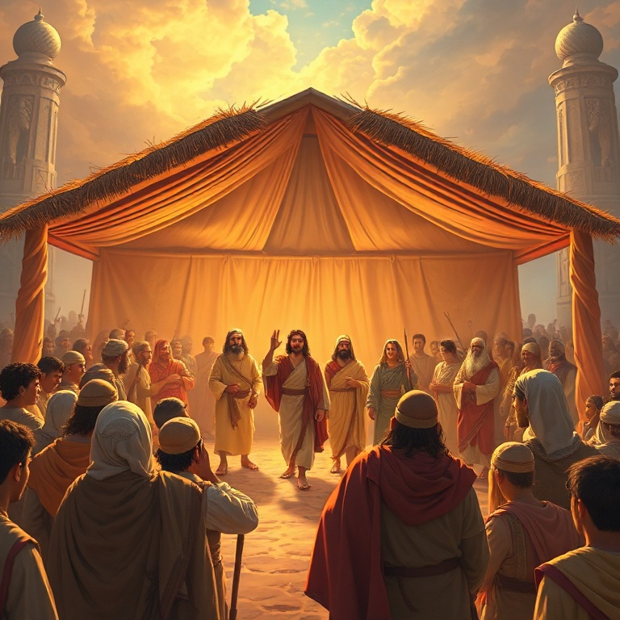

# Chamados à Santidade: Um Estudo em Levítico

## Índice

1. [Sacrifícios e Ofertas](#1-sacrificios-e-ofertas)
2. [O Sacerdócio](#2-o-sacerdocio)
3. [Pureza e Impureza](#3-pureza-e-impureza)
4. [O Dia da Expiação](#4-o-dia-da-expiacao)
5. [Santos como Deus é Santo](#5-santos-como-deus-e-santo)

---

## Introdução

Levítico é o manual de santidade do Antigo Testamento. O nome vem da tribo de Levi, da qual os sacerdotes eram descendentes. O livro ensina o povo de Israel como viver de maneira santa diante de Deus, cobrindo desde os rituais de sacrifício até as leis de pureza e as festas religiosas. Levítico mostra que o Deus santo exige um povo santo.

Muitos leitores consideram Levítico um livro difícil, cheio de regras e repetições. No entanto, ele contém verdades teológicas profundas sobre o pecado, a expiação e a graça de Deus. Cada sacrifício e cada cerimônia apontam para a necessidade de um substituto e para a provisão divina de perdão. O livro inteiro gira em torno da presença de Deus no meio do seu povo.

A mensagem central de Levítico é que Deus habita com o seu povo e, por isso, o povo deve ser santo. Essa santidade não é apenas ritual, mas envolve o coração, as relações sociais e a adoração. Em Cristo, encontramos o cumprimento perfeito de tudo o que Levítico prefigura. O livro nos desafia a viver de forma digna da presença de Deus.

---

## Capítulo 1: Sacrifícios e Ofertas

Levítico começa com instruções detalhadas sobre os cinco tipos principais de ofertas. O holocausto era uma oferta completamente queimada, simbolizando a consagração total a Deus. A oferta de cereais era uma expressão de gratidão e reconhecimento da provisão divina. A oferta pacífica celebrava a comunhão entre Deus, o sacerdote e o ofertante.

A oferta pelo pecado era necessária para expiar pecados cometidos involuntariamente ou por ignorância. O ofertante trazia um animal sem defeito, impunha as mãos sobre sua cabeça, confessava o pecado e sacrificava o animal. O sangue era aspergido no altar, fazendo expiação pela alma. Essa oferta ensinava que o pecado exige uma vida em troca.

A oferta pela culpa era similar, mas incluía restituição. Se alguém pecasse contra o próximo, além de oferecer o sacrifício, deveria restituir o dano acrescido de um quinto. Isso mostrava que o pecado tem consequências tanto verticais (contra Deus) quanto horizontais (contra o próximo). O perdão não anula a responsabilidade de reparar o erro.

Todos esses sacrifícios apontavam para Cristo, o Cordeiro de Deus que se ofereceu uma vez por todas. Diferente dos animais que eram oferecidos repetidamente, Jesus ofereceu um sacrifício perfeito e definitivo. Em Levítico aprendemos que o pecado é grave e exige expiação, e que Deus, em sua graça, provê o meio para o perdão.

---

## Capítulo 2: O Sacerdócio

Deus escolheu Arão e seus filhos para servirem como sacerdotes. Eles eram os mediadores entre Deus e o povo, responsáveis por oferecer sacrifícios, ensinar a lei e interceder por Israel. A consagração dos sacerdotes envolvia rituais de purificação, unção com óleo e sacrifícios. Eles precisavam estar cerimonialmente limpos para ministrar diante do Senhor.

As vestes sacerdotais eram ricas em simbolismo. O sumo sacerdote usava o éfode com pedras de ônix nos ombros, o peitoral com doze pedras representando as doze tribos de Israel, e a mitra com a inscrição "Santidade ao Senhor". Cada peça apontava para a responsabilidade do sacerdote de representar o povo diante de Deus e de Deus diante do povo.

Nadabe e Abiú, filhos de Arão, ofereceram fogo estranho diante do Senhor e morreram por isso. Deus não aceita adoração segundo a vontade humana, mas segundo a sua própria instrução. A morte deles serve como alerta solene de que a santidade de Deus não deve ser tratada com leviandade. A adoração deve ser feita como Deus ordena, não como preferimos.

O sacerdócio levítico encontra seu cumprimento em Cristo, nosso Sumo Sacerdote. Diferente dos sacerdotes humanos que morriam e precisavam ser substituídos, Jesus vive para sempre e intercede continuamente por nós. Ele não ofereceu sangue de animais, mas seu próprio sangue, entrando no santo dos santos celestial de uma vez por todas.

---

## Capítulo 3: Pureza e Impureza

Levítico dedica capítulos extensos às leis de pureza e impureza. Certos animais eram considerados impuros e não podiam ser consumidos. O contato com cadáveres, certas doenças de pele e fluidos corporais tornavam a pessoa impura cerimonialmente. A impureza não era necessariamente pecado, mas impedia a pessoa de participar da adoração comunitária.

A lepra é tratada em detalhes. O sacerdote examinava a pele da pessoa e a isolava se necessário. Se a lepra desaparecesse, a pessoa passava por um ritual de purificação antes de ser reintegrada à comunidade. A lepra é frequentemente usada como figura do pecado na Bíblia — algo que contamina, separa e destrói, mas que Deus pode purificar.

As leis de pureza ensinavam Israel a discernir entre o santo e o profano, entre o puro e o impuro. Elas criavam uma consciência aguçada sobre a santidade de Deus e a necessidade de separação do que contamina. Essas distinções permeavam a vida cotidiana, lembrando Israel constantemente de seu chamado para ser um povo santo.

Em Cristo, as leis de pureza cerimonial foram cumpridas. Jesus tocou leprosos e os purificou, comeu com pecadores e declarou todos os alimentos puros. O que contamina o homem não é o que entra pela boca, mas o que sai do coração. A pureza que Deus deseja é interior, uma transformação que só o Espírito Santo pode realizar.

---

## Capítulo 4: O Dia da Expiação

O Dia da Expiação, ou Yom Kipur, era o dia mais sagrado do calendário israelita. Uma vez por ano, o sumo sacerdote entrava no santo dos santos para fazer expiação pelos pecados de todo o povo. Nenhum outro dia tinha um significado tão profundo, pois era o momento em que Israel recebia perdão coletivo e purificação de todos os seus pecados.

O ritual envolvia dois bodes. Um era sacrificado como oferta pelo pecado, e seu sangue era levado pelo sumo sacerdote ao santo dos santos, aspergido sobre o propiciatório. O outro bode, o bode emissário, recebia a confissão dos pecados de Israel sobre sua cabeça e era levado ao deserto, simbolizando o afastamento do pecado do meio do povo.

O sumo sacerdote só podia entrar no santo dos santos depois de se purificar e oferecer sacrifícios por si mesmo. Ele vestia roupas de linho simples, não as vestes gloriosas, indicando humildade diante de Deus. O povo jejuava e se humilhava naquele dia, reconhecendo sua dependência da misericórdia divina.

O Dia da Expiação aponta diretamente para a obra de Cristo na cruz. Jesus é tanto o sumo sacerdote quanto o sacrifício. Ele entrou no santo dos santos celestial com seu próprio sangue, obtendo eterna redenção. E como o bode emissário, Jesus levou nossos pecados para longe de nós, para nunca mais serem lembrados. Nele, o Yom Kipur encontra seu cumprimento perfeito.

---

## Capítulo 5: Santos como Deus é Santo

O chamado à santidade permeia todo o Levítico. Deus diz repetidamente: "Sede santos, porque eu, o Senhor vosso Deus, sou santo". Essa santidade não era apenas ritual, mas ética e moral. O capítulo 19 contém leis que combinam o cerimonial com o prático: honrar pai e mãe, cuidar dos pobres, não furtar, não mentir, amar o próximo como a si mesmo.

As festas religiosas ensinavam o povo sobre a história da redenção. O sábado, a Páscoa, o Pentecostes, a Festa das Trombetas, o Dia da Expiação e a Festa dos Tabernáculos marcavam o calendário litúrgico de Israel. Cada festa celebrava um aspecto do cuidado de Deus e apontava para realidades futuras que se cumprem em Cristo.

O ano do Jubileu era uma instituição extraordinária. A cada cinquenta anos, as propriedades eram devolvidas às famílias originais, os escravos eram libertados e a terra descansava. O Jubileu proclamava libertação e restauração, apontando para a redenção final que Cristo traria. Era um lembrete de que a terra pertence a Deus e que seu povo é peregrino.

Levítico termina com bênçãos para a obediência e maldições para a desobediência. Deus deixa claro que a santidade traz vida e bênção, enquanto o pecado traz juízo. A mensagem final do livro é de esperança: mesmo quando o povo falha, Deus se lembra da aliança. Em Cristo, somos chamados a ser santos em toda nossa maneira de viver.

---

## Conclusão

Levítico é um livro sobre a presença de Deus e o chamado à santidade. Ele nos ensina que Deus é santo e que seu povo deve refletir essa santidade em todas as áreas da vida. Os sacrifícios, o sacerdócio e as leis de pureza apontam para a necessidade de expiação e para a graça de Deus que a provê.

Em Cristo, o livro de Levítico ganha novo significado. Jesus é o sacrifício perfeito, o sumo sacerdote perfeito e o cumprimento de toda a lei. O chamado à santidade continua válido, mas agora vivemos não por regras externas, mas pelo Espírito que nos transforma de dentro para fora. Santos como Deus é Santo — esta é a nossa vocação em Cristo.
