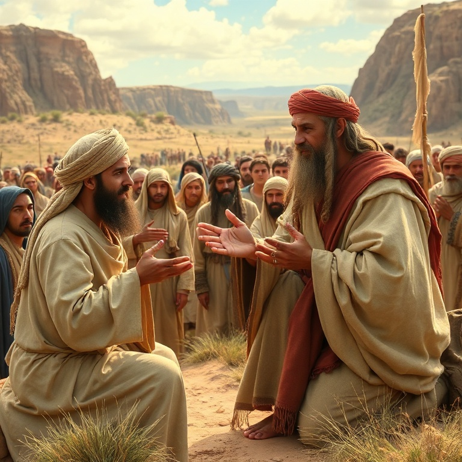
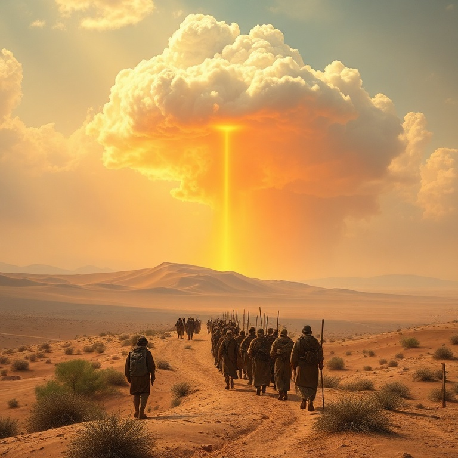
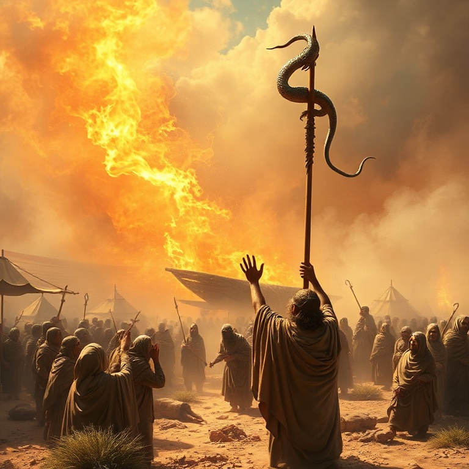
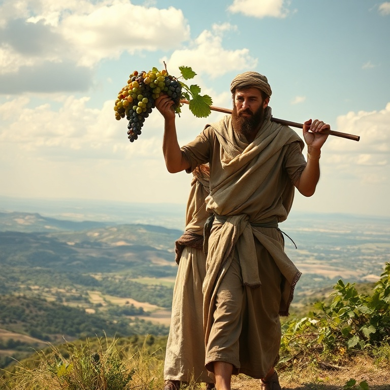

# Jornada de Fé: Um Estudo em Números

## Índice

1. [O Censo e a Organização](#1-o-censo-e-a-organizacao)
2. [A Peregrinação no Deserto](#2-a-peregrinacao-no-deserto)
3. [Rebelião e Consequências](#3-rebeliao-e-consequencias)
4. [Balaão e as Promessas](#4-balao-e-as-promessas)
5. [Preparação para a Terra Prometida](#5-preparacao-para-a-terra-prometida)

---

## Introdução

Números é o livro da peregrinação de Israel pelo deserto. O nome vem dos dois censos realizados no início e no final da jornada. O livro cobre aproximadamente quarenta anos, durante os quais uma geração inteira morreu no deserto por causa da incredulidade. Números registra não apenas a geografia da jornada, mas também as lições espirituais que Deus ensinou ao seu povo.

O livro alterna entre narrativa e legislação. As histórias revelam o coração humano em sua rebelião e o coração de Deus em sua misericórdia. As leis mostram como Deus organizou seu povo para a vida na terra prometida. Números demonstra que a jornada de fé é marcada por provações, quedas e vitórias, mas Deus permanece fiel.

A mensagem central de Números é que a incredulidade desagrada a Deus e impede o povo de desfrutar das promessas. Ao mesmo tempo, o livro mostra que os planos de Deus não são frustrados pela falha humana. A nova geração que surge no deserto é prova de que Deus cumpre suas promessas, mesmo quando somos infiéis.

---

## Capítulo 1: O Censo e a Organização

Deus ordenou que Moisés e Arão contassem todos os homens aptos para a guerra, de vinte anos para cima. O primeiro censo totalizou 603.550 homens, excluindo os levitas. Os levitas foram separados para o serviço do tabernáculo e não foram incluídos no censo militar. Cada tribo acampava ao redor do tabernáculo em uma ordem específica, com Judá à frente.

A organização das tribos não era meramente funcional, mas simbólica. O tabernáculo ficava no centro do acampamento, indicando que Deus devia estar no centro da vida de Israel. As tribos se posicionavam ao redor em uma formação quadrada, com três tribos de cada lado. Essa ordem ensinava que a vida do povo girava em torno da presença de Deus.

Os levitas foram organizados em três famílias principais: Gérson, Coate e Merari. Cada família tinha responsabilidades específicas no transporte e montagem do tabernáculo. Os coatitas carregavam os objetos sagrados, os gersonitas as cortinas e coberturas, e os meraritas as estruturas de madeira. Cada um tinha seu lugar e função no serviço de Deus.

O censo nos ensina que Deus é um Deus de ordem. Ele organiza seu povo para a batalha e para o serviço. Cada israelita tinha seu lugar, e cada levita sua função. Assim também na igreja, cada membro tem dons e ministérios específicos, e todos são importantes para o funcionamento do corpo de Cristo.

---

## Capítulo 2: A Peregrinação no Deserto

Israel partiu do monte Sinai em direção à terra prometida. A jornada era guiada pela nuvem do Senhor: quando a nuvem se movia, o povo partia; quando parava, o povo acampava. Durante o dia, a nuvem os protegia do sol escaldante; durante a noite, o fogo os aquecia e iluminava. Deus cuidava de cada detalhe da jornada.

No deserto, Deus proveu pão do céu — o maná. Cada manhã, o povo colhia o suficiente para o dia. Se tentassem guardar para o dia seguinte, o maná estragava, exceto na véspera do sábado, quando colhiam porção dobrada. O maná ensinava dependência diária de Deus e obediência à sua palavra. Jesus se identificou como o verdadeiro pão do céu.

Deus também proveu água da rocha em duas ocasiões. Moisés feriu a rocha em Meribá, e água jorrou para saciar a sede do povo. Mais tarde, em Cades, Moisés feriu a rocha novamente, mas com ira, desobedecendo à ordem de Deus. Essa desobediência custou a Moisés a entrada na terra prometida. A rocha é figura de Cristo, ferido por nós para que recebamos a água da vida.

A peregrinação no deserto foi um tempo de aprendizado. Deus provou seu povo para saber o que estava no coração dele. O deserto é lugar de aperto, mas também de encontro com Deus. Nas dificuldades da jornada, aprendemos que não só de pão vive o homem, mas de toda palavra que sai da boca de Deus.

---

## Capítulo 3: Rebelião e Consequências

A rebelião marcou a jornada de Israel no deserto. O povo reclamou多次 da falta de comida e água, murmurando contra Moisés e contra Deus. Em Taberá, o fogo do Senhor consumiu parte do acampamento. Em Quibrote-Hataavá, o povo desejou carne e Deus enviou codornizes em abundância, mas também enviou uma praga por causa da ganância.

A rebelião mais grave foi a de Corá, Datã e Abirão. Eles questionaram a autoridade de Moisés e Arão, dizendo que todo o povo era santo. A terra se abriu e engoliu os rebeldes, e fogo consumiu os duzentos e cinquenta homens que ofereciam incenso. Deus confirmou a escolha de Arão fazendo a vara de Arão florescer e dar frutos.

Os espias enviados a Canaã trouxeram um relatório misto. A terra era boa, mas as cidades eram fortificadas e os habitantes eram gigantes. Dez espias espalharam incredulidade entre o povo, mas Josué e Calebe confiaram na promessa de Deus. O povo creu nos dez espias e se rebelou, querendo voltar ao Egito. Deus os condenou a quarenta anos no deserto.

A incredulidade tem consequências graves. Aquela geração, com exceção de Josué e Calebe, morreu no deserto sem ver a terra prometida. As rebeliões em Números nos alertam sobre o perigo de endurecer o coração contra Deus. A murmuração, a inveja e a falta de fé são pecados que nos afastam das promessas divinas.

---

## Capítulo 4: Balaão e as Promessas

Balaque, rei de Moabe, ficou com medo de Israel e contratou Balaão, um profeta pagão, para amaldiçoar o povo. Balaão inicialmente recusou, mas permitiu-se ser seduzido pelo pagamento. Deus lhe permitiu ir, mas advertiu que só falaria o que Deus ordenasse. No caminho, o anjo do Senhor enfrentou Balaão, e a jumenta falou para salvar sua vida.

Três vezes Balaão tentou amaldiçoar Israel, e três vezes Deus colocou bênção em seus lábios. Em vez de maldição, Balaão profetizou bênçãos extraordinárias sobre Israel. Ele declarou que Deus não vê iniquidade em Jacó e que o povo seria como leão. A famosa profecia de Balaão sobre a estrela que sairia de Jacó aponta para o Messias vindouro.

Balaão não conseguiu amaldiçoar Israel, mas deu um conselho perverso a Balaque: seduzir Israel à idolatria e imoralidade. As mulheres moabitas atraíram os israelitas à adoração de Baal-Peor, e uma praga matou vinte e quatro mil pessoas. Balaão morreu mais tarde pela espada de Israel, colhendo o fruto de sua maldade.

A história de Balaão nos ensina que Deus cumpre suas promessas e que ninguém pode amaldiçoar quem Deus abençoou. Também mostra o perigo de tentar servir a dois senhores. Balaão sabia quem era Deus, mas amou o lucro da injustiça. A profecia sobre a estrela de Jacó aponta para Jesus, o Rei que viria para governar todas as nações.

---

## Capítulo 5: Preparação para a Terra Prometida

O segundo censo em Números mostra que a nova geração era ligeiramente menor que a anterior, mas ainda forte. As filhas de Zelofeade reivindicaram a herança do pai, que morrera sem filhos. Deus confirmou que as filhas também podiam herdar, estabelecendo um precedente de justiça. Moisés designou Josué como seu sucessor, impondo as mãos sobre ele.

Deus instruiu Moisés sobre as cidades de refúgio, onde os homicidas involuntários poderiam fugir do vingador do sangue. Essas cidades simbolizam a proteção que encontramos em Cristo. Também foram dadas regras sobre heranças, votos e a divisão da terra. Deus preparava o povo para a nova vida que os aguardava.

Antes de morrer, Moisés lembrou ao povo as jornadas desde o Egito, registrando cada etapa do caminho. Ele também instruiu sobre a conquista da terra: os israelitas deveriam expulsar os habitantes e destruir seus ídolos. Deus sabia que a tolerância ao pecado traria problemas futuros.

Números termina com Israel acampado nas planícies de Moabe, pronto para entrar na terra. Uma nova geração se levantara, treinada no deserto e pronta para confiar em Deus. A jornada de fé havia sido longa e difícil, mas Deus cumpriu sua palavra. A preparação para a terra prometida nos ensina que Deus sempre completa o que começa.

---

## Conclusão

Números é o livro da jornada e da prova. Em quarenta anos no deserto, Deus ensinou seu povo a confiar nele e a obedecer à sua palavra. A geração incrédula morreu, mas a promessa permaneceu viva. A nova geração entrou na terra, provando que a fidelidade de Deus supera a infidelidade humana.

A jornada de Israel no deserto é figura da nossa jornada de fé. Somos peregrinos neste mundo, caminhando para a pátria celestial. As provações nos ensinam a depender de Deus, e as quedas nos lembram de nossa fragilidade. Mas assim como Deus levou Israel à terra prometida, ele nos levará ao nosso destino final: a presença eterna de Cristo.
