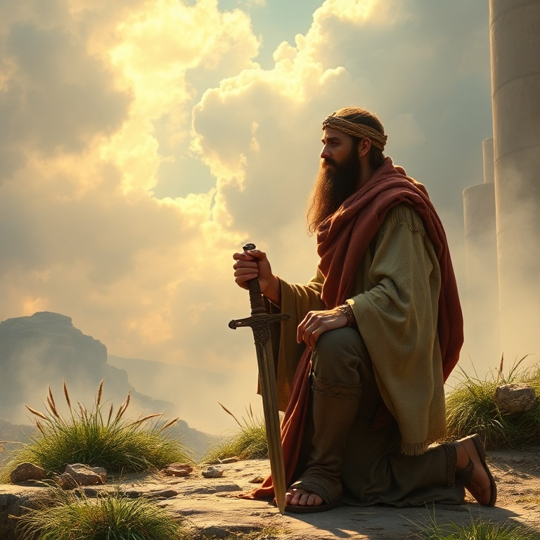
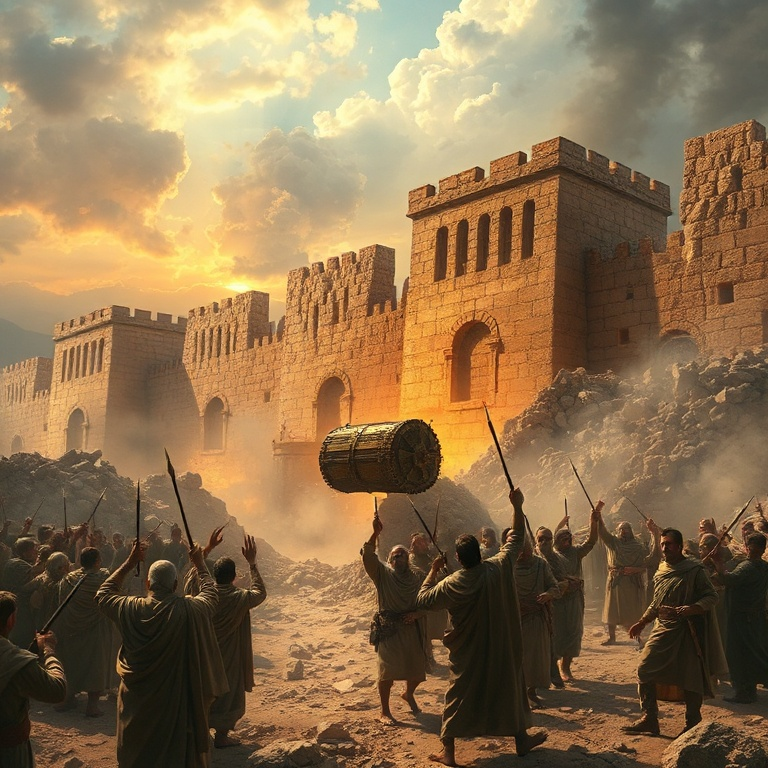
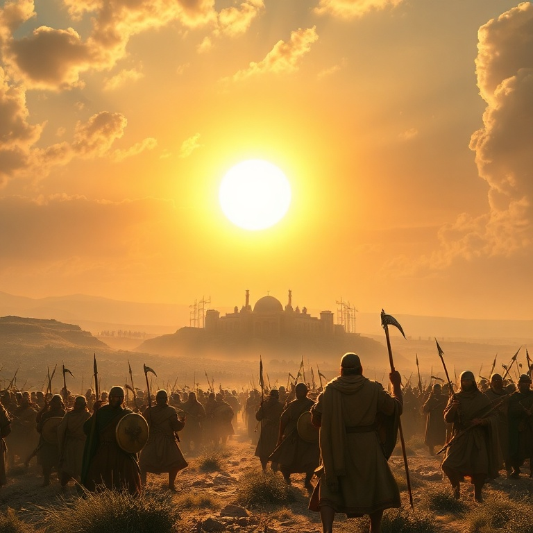
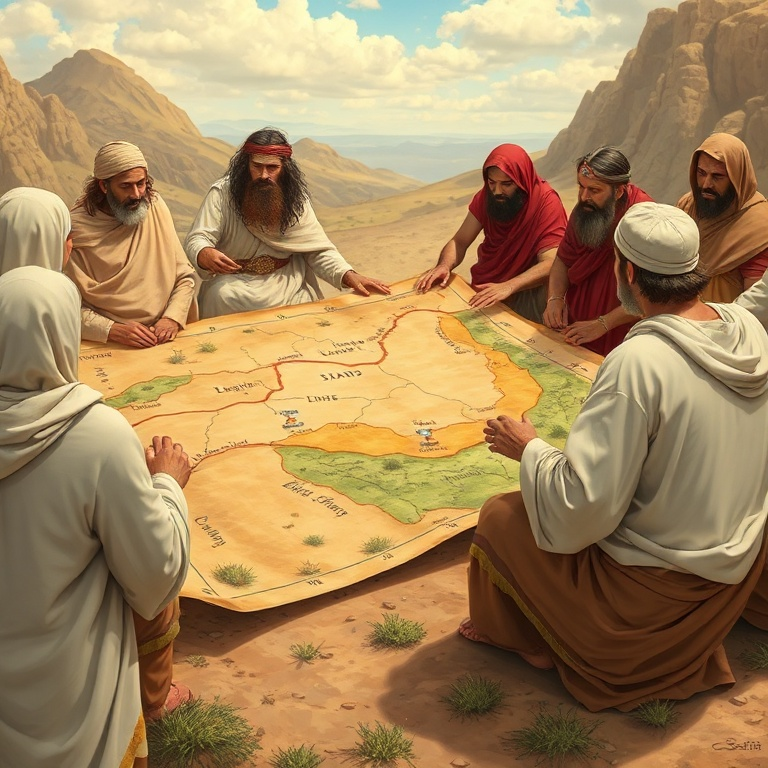
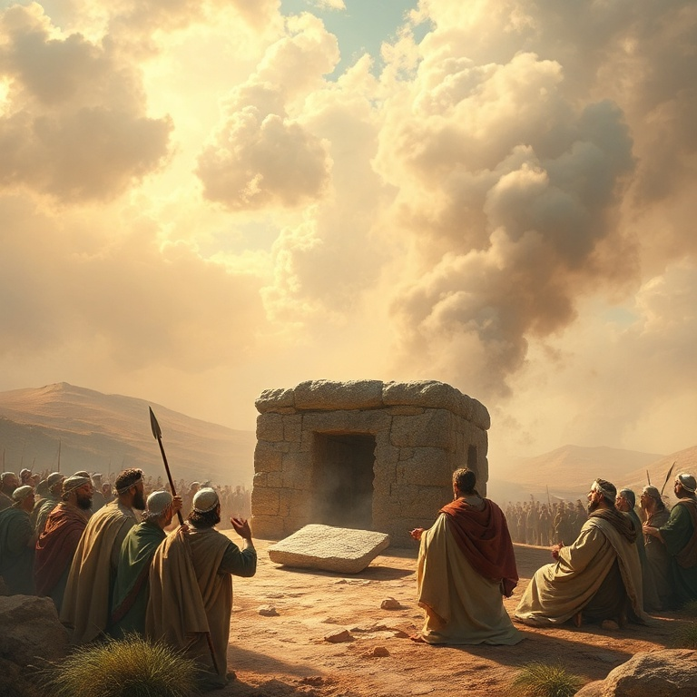

# Toma Posse: Um Estudo em Josué

---

## Introdução

Josué é o livro da conquista. Depois de quarenta anos no deserto, Israel finalmente cruza o Jordão para tomar posse da terra prometida aos patriarcas. Josué, o sucessor de Moisés, lidera o povo com coragem e fé. O livro narra as campanhas militares, a divisão da terra e a renovação da aliança.

O nome Josué significa "O Senhor salva", a mesma raiz hebraica de Jesus. Josué é um tipo de Cristo — ele lidera o povo de Deus à vitória e ao descanso na terra prometida. Assim como Josué conduziu Israel à herança terrena, Jesus conduz seu povo à herança celestial. A conquista de Canaã é figura da vida cristã de vitória pela fé.

A mensagem central de Josué é que Deus cumpre suas promessas. Cada passo de fé é recompensado com a fidelidade divina. O livro também ensina que a obediência é condição para a bênção. Quando Israel obedece, vence; quando desobedece, fracassa. A fé ativa e a obediência radical são os caminhos para experimentar as promessas de Deus.

---

## Capítulo 1: Josué Assume a Liderança

Após a morte de Moisés, Deus falou diretamente a Josué, ordenando-lhe que atravessasse o Jordão com todo o povo. Deus prometeu estar com Josué assim como estivera com Moisés, e enfatizou três vezes: "Sê forte e corajoso". A coragem de Josué não vinha de si mesmo, mas da promessa da presença de Deus.

Josué assumiu a liderança com sabedoria. Ele enviou espias a Jericó e deu instruções claras ao povo. Ordenou que preparassem provisões, pois em três dias cruzariam o Jordão. Josué também lembrou as tribos de Rúben, Gade e meia tribo de Manassés de seu compromisso de lutar ao lado dos irmãos.

A resposta do povo foi encorajadora: "Tudo quanto nos ordenaste faremos, e aonde quer que nos enviares iremos". Eles prometeram obedecer a Josué assim como obedeceram a Moisés, e declararam que qualquer um que se rebelasse seria morto. A unidade do povo era essencial para a conquista que viria.

Josué nos ensina que a liderança espiritual começa com a obediência a Deus. A coragem não é ausência de medo, mas confiança na presença de Deus. Assim como Josué foi chamado a ser forte e corajoso, somos chamados a confiar nas promessas de Deus e a avançar pela fé.

---

## Capítulo 2: A Conquista de Jericó

Jericó era uma cidade fortificada, com muros imponentes e portas fechadas. Humanamente falando, era inexpugnável. Mas Deus deu a Josué uma estratégia incomum: marchar ao redor da cidade uma vez por dia durante seis dias, e no sétimo dia, marchar sete vezes e gritar. A vitória viria pela obediência à palavra de Deus, não pela força militar.

Os sacerdotes levavam a arca da aliança, e os guerreiros marchavam em silêncio. Durante seis dias, a procissão circundou Jericó. No sétimo dia, após sete voltas, Josué ordenou: "Gritai, porque o Senhor vos deu a cidade". Os muros caíram, e Israel destruiu completamente a cidade, poupando apenas Raabe e sua família.

Raabe, a prostituta de Jericó, escondeu os espias israelitas e professou fé no Deus de Israel. Ela disse: "O Senhor vosso Deus é Deus em cima nos céus e em baixo na terra". Raabe foi poupada e entrou na linhagem do Messias. Sua história mostra que a fé salva independentemente do passado.

A conquista de Jericó nos ensina que a vitória vem pela fé e obediência, não por estratégias humanas. Os muros caíram pela fé, como Hebreus nos lembra. Jericó nos desafia a confiar em Deus para vencer batalhas impossíveis.

---

## Capítulo 3: As Campanhas Militares

Após Jericó, Israel enfrentou Ai. Dessa vez, a derrota veio por causa do pecado de Acã, que tomou objetos consagrados ao Senhor. Israel foi derrotado e trinta e seis homens morreram. Josué clamou a Deus, e o Senhor revelou o pecado no acampamento. Acã e sua família foram julgados, e a vergonha foi removida.

Com o pecado removido, Israel atacou Ai novamente, desta vez com uma estratégia de emboscada. A cidade foi conquistada e destruída. Josué construiu um altar ao Senhor no monte Ebal e escreveu ali a lei de Moisés. Ele leu todas as palavras da lei para o povo, incluindo as bênçãos e maldições.

Os gibeonitas enganaram Israel fazendo uma aliança com eles, fingindo ser de uma terra distante. Josué não consultou ao Senhor e fez um pacto que não deveria ter feito. Quando o engano foi descoberto, Josué manteve a aliança, mas os gibeonitas tornaram-se servos. Isso trouxe consequências futuras para Israel.

Josué liderou campanhas contra o sul e o norte de Canaã, derrotando uma coalizão de reis. Em Bete-Horom, Deus fez o sol parar para que Israel completasse a vitória. Nunca houve dia como aquele, em que Deus ouviu a voz de um homem. As campanhas mostraram que o Senhor pelejava por Israel.

---

## Capítulo 4: A Divisão da Terra

Depois das campanhas militares, Josué, já idoso, iniciou a distribuição da terra entre as tribos. A terra foi dividida por sorteio diante do Senhor, garantindo que a distribuição fosse dirigida por Deus. Calebe, que aos oitenta e cinco anos ainda era forte, recebeu Hebrom como herança, lutou contra os anakins e tomou posse.

As tribos de Rúben, Gade e meia tribo de Manassés receberam suas heranças a leste do Jordão. As outras nove tribos e meia receberam a oeste. Josué estabeleceu cidades de refúgio, onde os homicidas involuntários podiam buscar proteção. Essas cidades simbolizam a segurança que encontramos em Cristo.

A distribuição da terra foi minuciosa. Cada tribo recebeu seu território com fronteiras definidas. Josué também determinou que as cidades dos levitas fossem espalhadas por toda a terra, para que o ensino da lei estivesse acessível a todos. A presença dos levitas lembrava Israel de sua identidade como povo de Deus.

A terra era a herança prometida, um presente de Deus para Israel. Mais do que propriedade, era o lugar onde Israel viveria em comunhão com Deus. A terra é figura da herança celestial que temos em Cristo. Assim como Israel tomou posse pela fé, nós tomamos posse das promessas pela fé.

---

## Capítulo 5: Renovação da Aliança

Josué, já avançado em idade, convocou todo o Israel em Siquém para renovar a aliança com Deus. Ele fez um discurso de despedida, recordando toda a história de redenção desde Abraão até a conquista de Canaã. Josué destacou a fidelidade de Deus em cada etapa e chamou o povo à fidelidade.

O desafio de Josué foi direto: "Escolhei hoje a quem sirvais". Ele deixou claro que servir a Deus exigia exclusividade e sinceridade. Josué declarou pessoalmente: "Eu e a minha casa serviremos ao Senhor". O povo respondeu afirmativamente, prometendo servir ao Senhor e obedecer à sua voz.

Josué fez uma aliança com o povo naquele dia, estabeleceu estatutos e ordenanças, e escreveu tudo no livro da lei. Ele tomou uma grande pedra e a colocou debaixo do carvalho, como testemunha contra Israel, caso eles fossem infiéis. A pedra era um memorial visível do compromisso assumido.

Josué morreu com cento e dez anos e foi sepultado em Timnate-Sera. Enquanto viveram os anciãos que viram as obras de Deus, Israel serviu ao Senhor. O livro termina com a morte de Josué e dos anciãos, preparando o cenário para o período dos juízes.

---

## Conclusão

Josué é um livro de vitória e fidelidade. A conquista de Canaã demonstra que Deus cumpre suas promessas e que a obediência traz vitória. Josué liderou Israel com coragem e fé, deixando um exemplo de liderança que confia em Deus acima de tudo.

A mensagem de Josué ecoa até hoje: Deus é fiel, e podemos confiar em suas promessas. Assim como Israel tomou posse da terra, somos chamados a tomar posse das bênçãos espirituais em Cristo. A escolha de Josué permanece relevante: "Eu e a minha casa serviremos ao Senhor".
