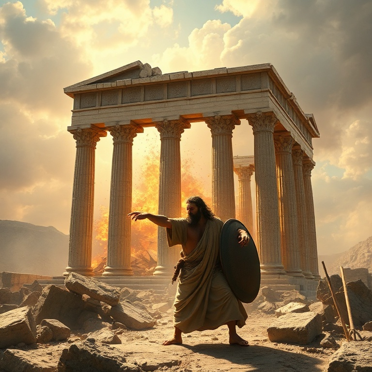

# Fidelidade e Queda: Um Estudo em Juízes

---

## Introdução

Juízes é um livro de ciclos. Após a morte de Josué, Israel entrou em um padrão repetitivo de pecado, opressão, clamor e libertação. O livro cobre aproximadamente trezentos anos da história de Israel, nos quais Deus levantou juízes para livrar o povo de seus opressores. É um período marcado pela infidelidade e pela graça.

O versículo que resume o livro é: "Naqueles dias não havia rei em Israel; cada um fazia o que parecia direito aos seus olhos". Sem liderança centralizada e sem compromisso com a aliança, Israel se afundou na idolatria e na imoralidade. Juízes mostra as consequências trágicas de abandonar a Deus.

Apesar da infidelidade de Israel, Deus permaneceu fiel. Ele levantou juízes para libertar o povo quando clamavam. O livro revela tanto a justiça de Deus que disciplina quanto a sua misericórdia que restaura. Juízes nos ensina sobre a gravidade do pecado e a abundância da graça divina.

---

## Capítulo 1: O Ciclo dos Juízes

O ciclo dos juízes segue um padrão claro: Israel fazia o mal diante de Deus, servindo a deuses estrangeiros. Deus entregava Israel nas mãos de opressores. O povo clamava ao Senhor em meio ao sofrimento. Deus levantava um juiz para libertá-los. Enquanto o juiz vivia, o povo servia a Deus, mas após sua morte, voltavam ao pecado.

O primeiro juiz foi Otniel, sobrinho de Calebe. Ele libertou Israel do domínio de Cusã-Risataim, rei da Mesopotâmia. Depois veio Eúde, que libertou Israel dos moabitas. Sangar matou seiscentos filisteus com uma aguilhada de bois. Esses primeiros juízes foram instrumentos de Deus para livrar o povo, mas o ciclo continuava.

O padrão revela a tendência humana à apostasia. Israel sabia o que era certo, mas repetidamente escolhia o errado. Os juízes eram heróis imperfeitos que Deus usava apesar de suas falhas. O ciclo nos lembra que a libertação vem de Deus, não dos homens.

Juízes nos desafia a quebrar o ciclo do pecado em nossas vidas. Não basta clamar a Deus na dificuldade; é necessário perseverar na obediência. O maior problema de Israel não eram os opressores externos, mas a infidelidade interior.

---

## Capítulo 2: Débora e Gideão

Débora foi a única juíza de Israel. Profetisa e líder, ela julgava Israel debaixo da palmeira de Débora. Quando Jabim, rei de Canaã, oprimiu Israel com novecentos carros de ferro, Débora convocou Baraque para liderar a batalha. Baraque aceitou, mas apenas se Débora fosse com ele. Débora profetizou que a honra da vitória caberia a uma mulher.

A batalha no vale de Quisom foi uma vitória miraculosa. Deus enviou chuva torrencial que transformou o vale em lama, inutilizando os carros de ferro. Sísera, o comandante cananeu, fugiu e encontrou abrigo na tenda de Jael, que o matou com uma estaca. O cântico de Débora celebra a vitória e a fidelidade de Deus.

Gideão foi chamado por Deus enquanto malhava trigo no lagar, escondendo-se dos midianitas. O anjo o saudou como "homem valoroso", e Gideão questionou: "Se o Senhor está conosco, por que nos sobreveio tudo isto?" Deus respondeu: "Vai nesta tua força, e tu livrarás Israel". Gideão pediu sinais para confirmar a palavra.

Com apenas trezentos homens, Gideão derrotou o exército midianita. Deus reduziu o exército para que Israel soubesse que a vitória vinha dele. Gideão é exemplo de como Deus usa pessoas fracas para realizar grandes feitos. Sua história nos ensina a confiar em Deus, não em números ou recursos.

---

## Capítulo 3: Sansão e a Força de Deus

Sansão foi o juiz mais conhecido, mas também o mais imperfeito. Consagrado a Deus desde o ventre, ele tinha força sobrenatural enquanto guardasse o voto nazireu. No entanto, Sansão era impulsivo, desobediente e facilmente seduzido. Ele casou com uma filisteia, visitou prostitutas e se envolveu com Dalila.

Deus usou Sansão apesar de suas falhas para confrontar os filisteus. Sansão matou mil filisteus com uma queixada de jumento, levou as portas de Gaza para o topo de um monte e agitou Israel contra seus opressores. Mas sua força era dom de Deus, não mérito pessoal. Sansão brincava com o pecado até ser descoberto.

Dalila descobriu o segredo de sua força: o cabelo não cortado, sinal de seu voto nazireu. Ela o fez dormir no colo e chamou um homem para rapar as sete tranças de sua cabeça. Sansão perdeu a força, foi preso, cegado e humilhado pelos filisteus. Sua queda foi consequência direta de sua desobediência.

No fim, Sansão clamou a Deus mais uma vez. Com suas forças renovadas, derrubou o templo de Dagom sobre si e sobre os filisteus, matando mais na morte do que em vida. Sansão é um lembrete de que Deus pode usar pessoas imperfeitas, mas o pecado sempre tem consequências. Sua história aponta para Cristo, o verdadeiro libertador que vence pela obediência.

---

## Capítulo 4: A Decadência Moral de Israel

Os capítulos finais de Juízes retratam a decadência moral profunda de Israel. A história de Mica e do levita mostra a corrupção religiosa. Mica construiu um santuário particular com ídolos e contratou um levita como sacerdote. A adoração se tornou negócio, e o sacerdócio, profissão. Cada um fazia o que parecia direito aos seus olhos.

A tribo de Dã migrou para o norte, roubou os ídolos de Mica e contratou seu sacerdote. Conquistaram Laís e estabeleceram um centro de adoração idólatra. A religião de Israel estava completamente distorcida. A ausência de liderança espiritual resultou em anarquia religiosa.

O capítulo 19 narra a história horrível do levita e sua concubina em Gibeá. A depravação sexual dos benjamitas superou a de Sodoma. Israel se uniu para julgar a tribo de Benjamim, resultando em uma guerra civil que quase exterminou uma tribo inteira. A decadência moral levou à autodestruição.

Juízes termina com um quadro sombrio. Israel havia se tornado tão corrupto quanto os cananeus que deveriam ter expulsado. A decadência moral é o resultado inevitável de abandonar a Deus. O livro mostra que, sem Deus, a sociedade se desintegra.

---

## Capítulo 5: A Necessidade de um Rei

A frase repetida "não havia rei em Israel" aponta para a necessidade de liderança. Israel precisava de um rei que os governasse segundo a vontade de Deus. O livro prepara o terreno para a monarquia que viria com Samuel, Saul e Davi. O rei ideal, porém, não seria um homem, mas o próprio Deus.

Os juízes foram libertadores temporários, mas não resolveram o problema espiritual de Israel. Cada juiz trazia alívio momentâneo, mas o ciclo continuava. Israel precisava de um líder permanente que os mantivesse fiéis à aliança. Essa necessidade aponta para Cristo, o Rei perfeito.

Apesar do fracasso de Israel, Deus nunca abandonou seu povo. Ele continuou levantando libertadores e preservando um remanescente fiel. Boaz e Rute, personagens do livro seguinte, são exemplos de pessoas justas em meio a tempos corruptos. A esperança não estava perdida.

A necessidade de um rei aponta para Cristo. Jesus é o Rei que Israel precisava e que todos nós precisamos. Ele governa com justiça, ama com misericórdia e morreu para redimir seu povo. Juízes nos prepara para entender por que precisamos de um Salvador-Rei.

---

## Conclusão

Juízes é um livro sombrio, mas profundamente realista. Ele mostra o que acontece quando o povo de Deus abandona a aliança. O ciclo de pecado, opressão, clamor e libertação se repete, revelando tanto a depravação humana quanto a fidelidade divina.

Apesar de tudo, Deus não desistiu de Israel. Os juízes apontam para o juiz perfeito, Jesus Cristo, que não apenas liberta temporariamente, mas salva definitivamente. Juízes nos ensina que nossa maior necessidade não é de um líder humano, mas de um Salvador divino que transforme nossos corações.
