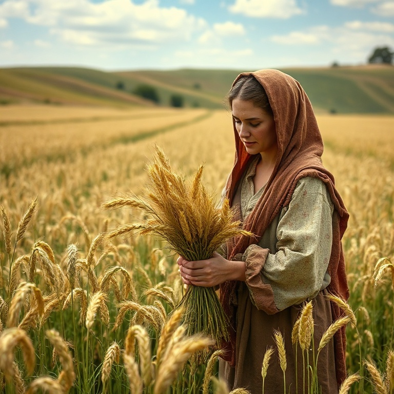
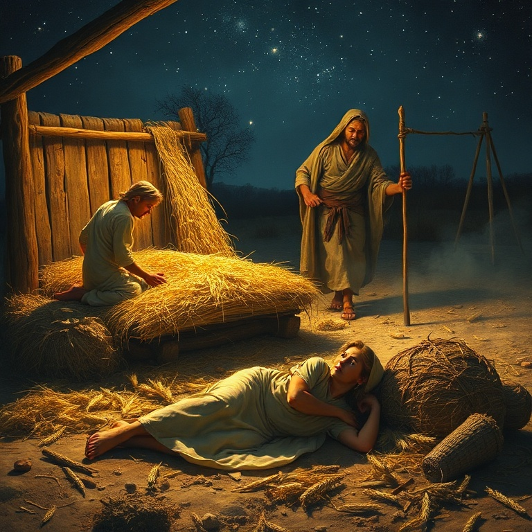
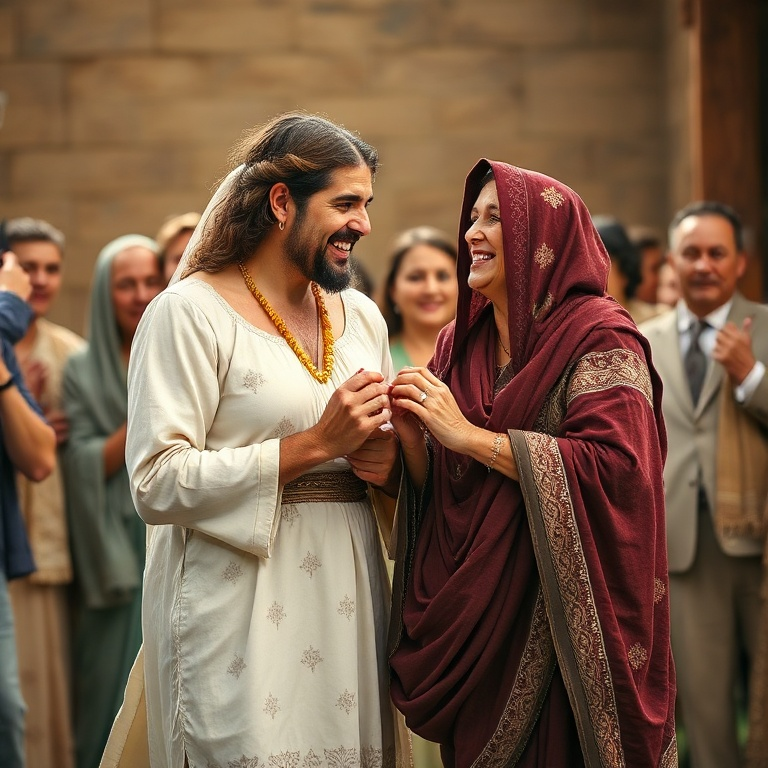

# Laço de Redenção: Um Estudo em Rute

---

## Introdução

Rute é um dos livros mais belos da Bíblia. Em apenas quatro capítulos, ele conta uma história de amor, fidelidade e redenção. Passa-se no período dos juízes, em meio à decadência moral de Israel, mas brilha como um raio de luz na escuridão. Rute mostra que Deus está trabalhando mesmo quando não o vemos.

O livro tem apenas 85 versículos, mas seu significado teológico é imenso. Ele traça a linhagem de Davi e, consequentemente, do Messias. Rute, uma moabita, entra na genealogia de Jesus Cristo, demonstrando que a graça de Deus alcança todas as nações. A história de Rute é um belo retrato do evangelho.

A mensagem central de Rute é a redenção. O livro usa o conceito do goel, o parente redentor, para ilustrar como Deus redime seu povo. Boaz, como redentor de Rute, aponta para Cristo, nosso Redentor celestial. Rute nos ensina sobre a lealdade, a providência divina e o amor que redime.

---

## Capítulo 1: A Tragédia de Noemi

A história começa com uma família de Belém fugindo da fome para Moabe. Elimeleque, Noemi e seus dois filhos, Malom e Quiliom, buscaram sustento em terra estrangeira. Ali, Elimeleque morreu, e Noemi ficou viúva. Seus filhos casaram-se com mulheres moabitas, Rute e Orfa, mas também morreram, deixando Noemi sem marido e sem filhos.

Noemi decidiu voltar a Belém ao saber que Deus havia visitado seu povo com pão. Ela despediu suas noras com bênçãos, orando para que Deus lhes desse novos lares. Orfa beijou a sogra e partiu, mas Rute se apegou a Noemi. Suas palavras são das mais belas da Escritura: "O teu povo é o meu povo, o teu Deus é o meu Deus".

Rute fez uma escolha radical. Ela deixou sua terra, sua família e seus deuses para seguir Noemi e o Deus de Israel. Não havia garantias, apenas fé. Rute não sabia o que encontraria em Belém, mas decidiu seguir. Sua lealdade a Noemi é expressão de sua fé no Deus de Israel.

Noemi chegou a Belém amargurada. Ela disse: "Não me chamem Noemi (agradável), chamem-me Mara (amarga), porque o Todo-Poderoso me encheu de amargura". Noemi não escondeu sua dor. O capítulo 1 termina com duas viúvas pobres em Belém, sem expectativas humanas, mas debaixo dos olhos de Deus.

---

## Capítulo 2: A Fidelidade de Rute

Rute foi ao campo para respigar, seguindo os ceifeiros. A lei de Moisés permitia que os pobres respigassem as sobras da colheita. Rute não ficou esperando ajuda; ela tomou iniciativa. Providencialmente, foi parar no campo de Boaz, um homem rico e parente de Elimeleque. A providência de Deus estava em ação.

Boaz chegou ao campo e saudou seus trabalhadores: "O Senhor seja convosco". Ele notou Rute e perguntou sobre ela. Informado de sua lealdade a Noemi, Boaz a tratou com bondade. Ele a protegeu, mandou que bebesse da água dos servos e ordenou que os moços não a molestassem. Boaz era um homem justo e generoso.

Rute se prostrou e perguntou por que achava graça aos olhos de Boaz. Ele respondeu que sabia de tudo o que ela havia feito por Noemi. Boaz abençoou Rute, dizendo: "O Senhor retribua o teu feito, e seja cumprida a tua recompensa". Rute voltou para casa com bastante cevada e contou tudo a Noemi.

A fidelidade de Rute foi recompensada. Ela não buscou seu próprio bem, mas serviu a Noemi. Noemi reconheceu a mão de Deus: "Bendito seja ele do Senhor, que ainda não tem deixado a sua beneficência nem para com os vivos nem para com os mortos". Deus honra aqueles que honram seus compromissos.

---

## Capítulo 3: Rute nos Campos de Boaz

Noemi, vendo a bondade de Boaz, traçou um plano. Ela instruiu Rute a se lavar, ungir e vestir suas melhores roupas, e ir à eira onde Boaz passaria a noite. Rute deveria descobrir os pés de Boaz e deitar-se, aguardando suas instruções. Era um pedido simbólico de casamento segundo o direito de resgate.

Rute obedeceu fielmente. Boaz acordou e perguntou quem era. Rute respondeu: "Sou Rute, tua serva; estende a tua capa sobre a tua serva, porque tu és o parente resgatador". Boaz reconheceu a nobreza de Rute: ela não havia ido atrás de moços ricos ou pobres, mas buscou cumprir o dever familiar.

Boaz elogiou Rute e prometeu resolver a questão. Havia, porém, um parente mais próximo que tinha o direito de resgate primeiro. Se ele não quisesse redimir Rute, Boaz o faria. Boaz agiu com integridade, não escondendo a existência de outro candidato ao resgate.

A iniciativa de Rute não foi imoral, mas piedosa. Ela agiu dentro dos costumes de Israel, buscando o direito de resgate. Boaz a louvou por sua virtude. O capítulo mostra a confiança de Rute em Boaz e a disposição de Boaz em ser o redentor. É uma figura poderosa de Cristo, nosso Redentor.

---

## Capítulo 4: O Direito de Resgate

Boaz foi à porta da cidade, onde os negócios eram legalmente tratados. Ele chamou o parente mais próximo e reuniu dez anciãos como testemunhas. Boaz apresentou a oportunidade de resgatar a terra de Elimeleque. O parente inicialmente aceitou, mas recuou quando soube que incluía casar-se com Rute e levantar o nome do falecido.

O parente mais próximo recusou, dizendo que prejudicaria sua herança. Ele tirou a sandália e a deu a Boaz, confirmando a transferência do direito de resgate. Boaz então declarou publicamente que adquiria tudo o que pertencera a Elimeleque e também Rute para ser sua esposa. Os anciãos abençoaram a união.

Boaz casou-se com Rute, e o Senhor a engravidou. Nasceu um filho, Obede. As mulheres de Belém disseram a Noemi: "Bendito seja o Senhor, que não te deixou hoje sem parente resgatador". Obede foi o avô de Davi. A história termina com a genealogia que liga Rute à linhagem real de Israel.

O direito de resgate é o conceito central do livro. Boaz pagou o preço para redimir Rute e restaurar a herança de Noemi. Ele é figura de Cristo, nosso Goel, que pagou o preço para nos redimir do pecado e nos dar uma herança eterna. Boaz não apenas resgatou Rute, mas a amou.

---

## Conclusão

Rute é uma história de redenção e graça. Uma moabita, excluída da congregação de Israel pela lei, tornou-se parte da linhagem do Messias. Deus usou uma mulher estrangeira para mostrar que seu amor transcende fronteiras. A fidelidade de Rute foi recompensada de maneiras que ela jamais imaginou.

O livro de Rute nos aponta para Jesus, o maior Redentor. Assim como Boaz resgatou Rute, Jesus nos resgatou da escravidão do pecado. A história de Rute nos lembra que Deus está sempre trabalhando nos detalhes, cumprindo seus propósitos de redenção através de pessoas comuns. Nele, encontramos nosso verdadeiro laço de redenção.
