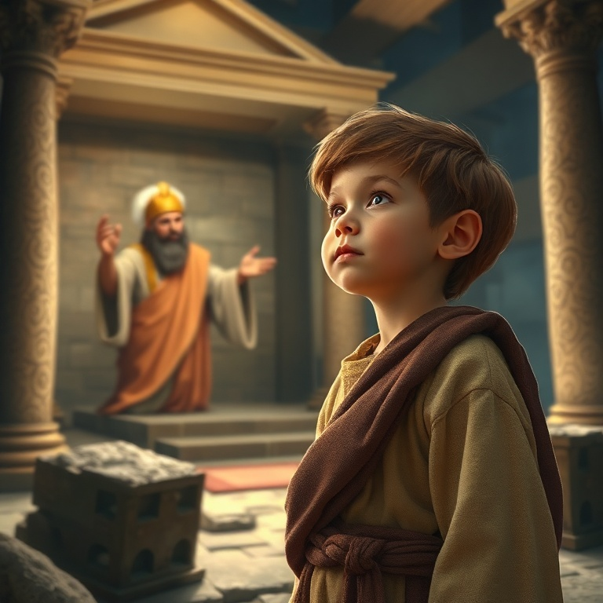
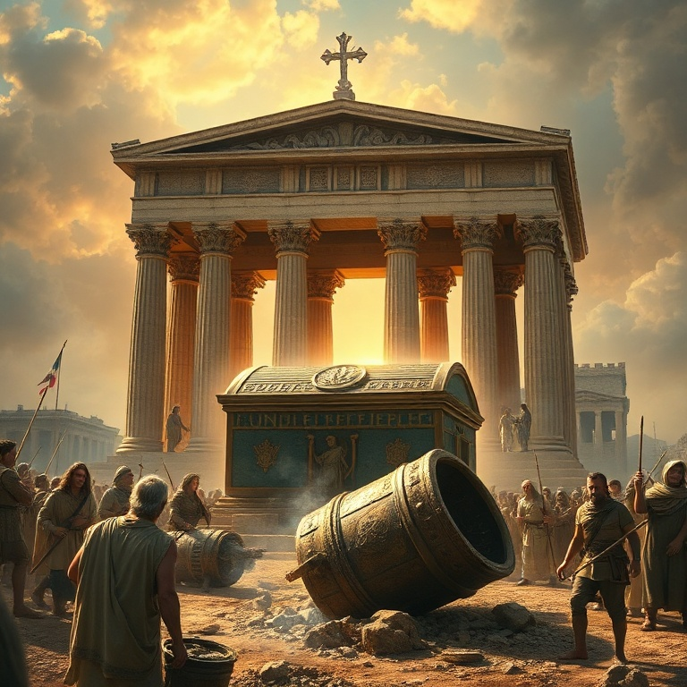
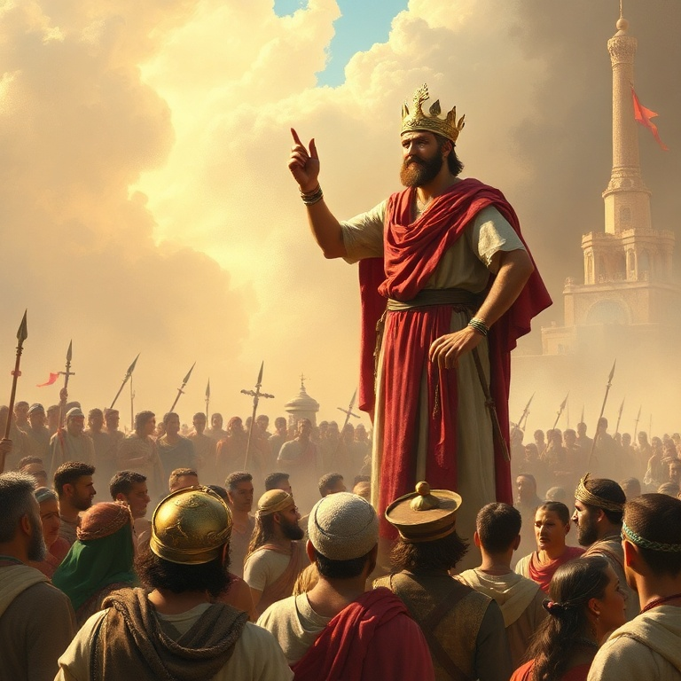

# O Coração que Deus Vê: Um Estudo em 1 Samuel

---

## Introdução

1 Samuel marca a transição de Israel de uma teocracia para uma monarquia. O livro cobre a vida de Samuel, o último juiz, a ascensão e queda de Saul, e a unção de Davi como futuro rei. É um livro de contrastes entre a obediência e a rebelião, entre a aparência exterior e o coração que Deus vê.

Samuel foi o homem que Deus usou para guiar Israel nessa transição difícil. Profeta, sacerdote e juiz, ele serviu como ponte entre o período dos juízes e o início da monarquia. Sua vida foi marcada pela fidelidade em meio a um povo infiel. Samuel ensinou Israel que a obediência é melhor que o sacrifício.

O tema central de 1 Samuel é que Deus vê o coração. Saul foi escolhido por sua aparência, mas Davi foi escolhido por seu coração. Deus não se impressiona com altura ou beleza; ele busca pessoas segundo o seu coração. O livro nos desafia a examinar nosso próprio coração diante de Deus.

---

## Capítulo 1: Samuel e a Vocação

Ana, mulher estéril de Elcana, orou amargamente ao Senhor no tabernáculo. Ela fez um voto: se Deus lhe desse um filho, ela o dedicaria ao Senhor todos os dias de sua vida. Eli, o sacerdote, a viu orar em silêncio e a abençoou. Deus se lembrou de Ana, e ela concebeu Samuel.

Ana cumpriu seu voto. Após desmamar Samuel, ela o levou ao tabernáculo em Siló e o entregou a Eli. Seu cântico de louvor é um dos grandes hinos do Antigo Testamento, celebrando o poder de Deus que exalta os humildes e abate os soberbos. O cântico de Ana influenciou o Magnificat de Maria.

Samuel cresceu na presença do Senhor. Quando menino, Deus o chamou três vezes durante a noite. Samuel pensou que era Eli, mas o sacerdote o instruiu a responder: "Fala, Senhor, que teu servo ouve". Samuel tornou-se profeta reconhecido em todo Israel, e o Senhor era com ele.

A vocação de Samuel nos ensina sobre a importância de ouvir a voz de Deus. Deus chama pessoas de todas as idades, e a resposta adequada é a disponibilidade. Samuel aprendeu a discernir a voz de Deus e a transmitir fielmente sua palavra, mesmo quando era difícil.

---

## Capítulo 2: A Arca e a Glória de Deus

Os filhos de Eli, Hofni e Fineias, eram sacerdotes corruptos. Desrespeitavam os sacrifícios, dormiam com as mulheres que serviam à porta do tabernáculo e tratavam a obra de Deus com desprezo. Eli os repreendeu superficialmente, mas não os removeu do sacerdócio. O juízo de Deus estava próximo.

Israel foi à batalha contra os filisteus e foi derrotado. Os anciãos decidiram trazer a arca da aliança para o acampamento, pensando que a presença simbólica de Deus garantiria a vitória. Mas a arca não era um talismã. Israel foi novamente derrotado, a arca foi capturada, e Hofni e Fineias morreram.

Quando a notícia chegou a Siló, Eli caiu da cadeira para trás, quebrou o pescoço e morreu. A nora de Eli, grávida, entrou em trabalho de parto ao saber da captura da arca. Antes de morrer, ela disse: "A glória se foi de Israel, porque foi tomada a arca de Deus". A glória de Deus havia se afastado.

A arca ficou sete meses na terra dos filisteus. Deus julgou os filisteus, enviando pragas e destruindo seu deus Dagom. Os filisteus devolveram a arca em um carro novo puxado por vacas que nunca haviam puxado jugo. Deus mostrou que sua glória não depende de objetos, e que ele pode proteger sua honra sozinho.

---

## Capítulo 3: Israel Pede um Rei

Samuel, já idoso, nomeou seus filhos como juízes, mas eles não andaram em seus caminhos. Aceitavam suborno e pervertiam a justiça. Os anciãos de Israel se reuniram e pediram a Samuel: "Constitui-nos um rei para nos julgar, como todas as nações". O pedido desagradou a Samuel e ao Senhor.

Deus disse a Samuel: "Não te rejeitaram a ti, mas a mim, para que eu não reine sobre eles". Israel queria ser como as outras nações, rejeitando o governo direto de Deus. Samuel advertiu o povo sobre como um rei os oprimiria, mas eles insistiram. Deus permitiu que tivessem o que pediam.

Saul era alto, bonito e impressionante. Foi escolhido por Deus e ungido por Samuel como o primeiro rei de Israel. O Espírito do Senhor veio sobre Saul, e ele profetizou. Israel se alegrou com seu novo rei. Saul iniciou bem, liderando vitórias militares contra os amonitas e filisteus.

O pedido de Israel por um rei revela a tendência humana de confiar no que vê em vez de confiar em Deus. A história de Saul mostra que a aparência exterior não garante um coração fiel. Israel queria um rei como as outras nações, mas Deus queria um rei segundo o seu coração.

---

## Capítulo 4: Saul e suas Quedas

Saul cometeu seu primeiro erro grave ao oferecer holocausto sem esperar Samuel. Quando Samuel chegou, Saul deu desculpas. Samuel disse: "Procedeste loucamente; não guardaste o mandamento que o Senhor teu Deus te ordenou". O reino de Saul não seria estabelecido para sempre. Deus já buscava outro homem.

O segundo erro foi ainda mais grave. Deus ordenou que Saul destruísse completamente os amalequitas, mas ele poupou o rei Agague e o melhor dos animais. Quando confrontado, Saul novamente justificou seu pecado. Samuel declarou: "Obedecer é melhor que sacrificar". Por rejeitar a palavra de Deus, Saul foi rejeitado como rei.

O Espírito do Senhor se retirou de Saul, e um espírito maligno o atormentava. Saul foi dominado por ciúmes, medo e paranoia. Quando Davi começou a ser exaltado, Saul tentou matá-lo várias vezes. Ele consultou uma médium em Endor, desobedecendo a Deus mais uma vez. Saul terminou seus dias em desespero.

A vida de Saul é uma tragédia de desobediência e autojustificação. Ele começou com potencial, mas terminou em ruínas. Saul nos ensina que a obediência parcial é desobediência total, e que Deus valoriza um coração submisso mais do que rituais religiosos. A queda de Saul é um alerta para todos nós.

---

## Capítulo 5: Davi, o Ungido

Deus enviou Samuel a Belém para ungir um novo rei entre os filhos de Jessé. Quando Samuel viu Eliabe, pensou que era o escolhido, mas Deus disse: "Não atentes para a sua aparência, nem para a sua altura, porque o rejeitei. O Senhor não vê como o homem vê: o homem olha para o exterior, mas o Senhor olha para o coração".

Davi, o caçula, estava pastoreando as ovelhas. Quando Samuel o viu, o Senhor disse: "Levanta-te e unge-o, porque é este". Davi foi ungido, e o Espírito do Senhor se apossou dele. Davi voltou ao campo, mas agora carregava uma unção que mudaria a história de Israel para sempre.

Davi enfrentou Golias quando ninguém mais ousava. Sem armadura, apenas com uma funda e cinco pedras, Davi declarou: "A batalha é do Senhor". Ele derrotou o gigante filisteu e se tornou herói em Israel. Davi tocou harpa para acalmar Saul, serviu em sua corte e fez amizade com Jônatas.

O coração de Davi era diferente. Ele confiava em Deus, buscava sua presença e se arrependia quando pecava. Davi não era perfeito, mas era um homem segundo o coração de Deus. Sua unção aponta para Cristo, o grande Filho de Davi, que veio para reinar para sempre com justiça e paz.

---

## Conclusão

1 Samuel termina com a morte de Saul e a transição para Davi. O livro mostra o contraste entre dois reis: Saul, que confiou em si mesmo, e Davi, que confiou em Deus. A mensagem central é clara: Deus vê o coração e busca pessoas fiéis.

O livro nos desafia a examinar nosso próprio coração. Estamos confiando em nossa aparência, habilidades ou recursos? Ou estamos buscando um coração segundo o de Deus? Davi aponta para Jesus, o Rei perfeito que veio para nos dar um novo coração e nos capacitar a viver para a glória de Deus.
