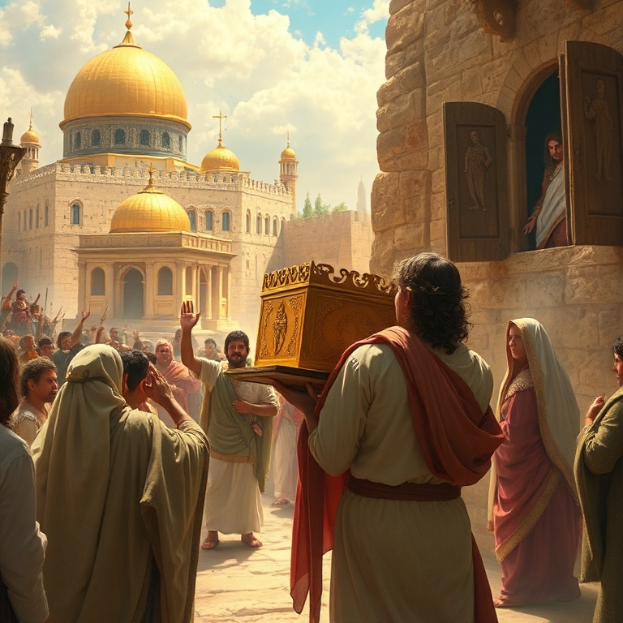
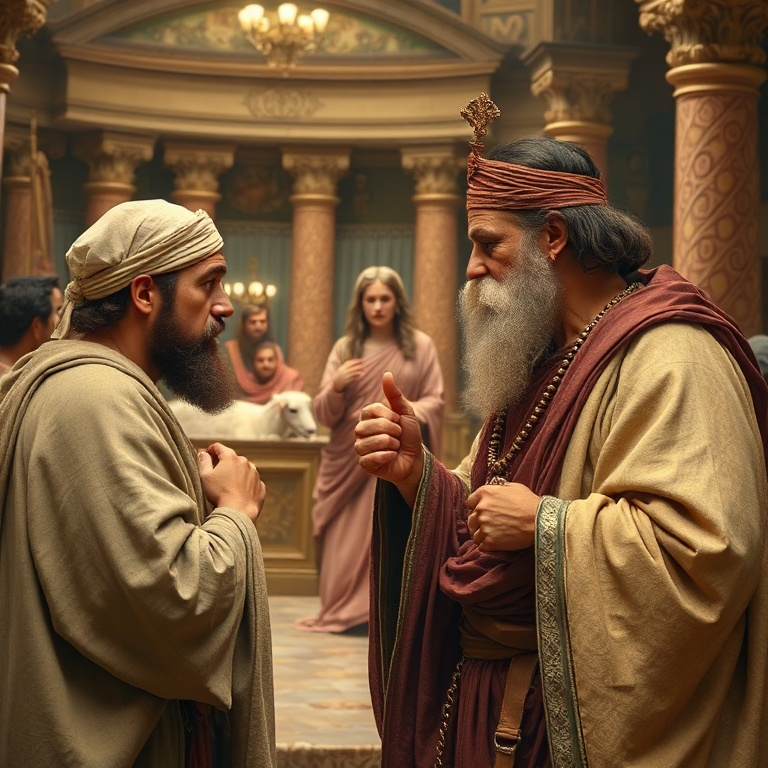
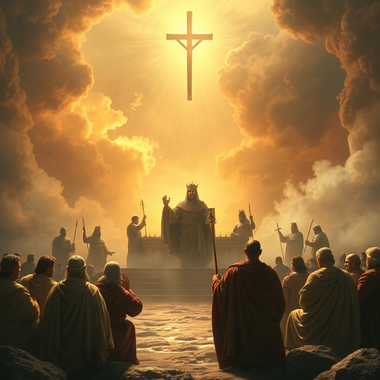

# Trono e Pecado: Um Estudo em 2 Samuel

---

## Introdução

2 Samuel narra o reinado de Davi sobre Israel. É um livro de contrastes profundos: Davi é exaltado por Deus, estabelece o reino, recebe uma aliança eterna, mas também cai em pecado grave e sofre consequências terríveis. O livro mostra a glória e a miséria de um homem segundo o coração de Deus.

O livro pode ser dividido em duas partes. A primeira descreve a ascensão de Davi e o estabelecimento de seu reino; a segunda narra seu pecado com Bate-Seba e as consequências que se seguiram. A transição ocorre no capítulo 11, que marca o ponto de virada na vida de Davi.

A mensagem central de 2 Samuel é que o pecado tem consequências, mas a misericórdia de Deus é maior. Davi pecou gravemente, mas também se arrependeu genuinamente. Deus o disciplinou, mas não retirou sua aliança. O livro aponta para Cristo, o Filho de Davi que reinaria para sempre sem pecado.

---

## Capítulo 1: Davi Estabelece o Reino

Após a morte de Saul, Davi lamentou sinceramente. Seu lamento por Saul e Jônatas é um dos mais belos poemas da Bíblia. Davi não se alegrou com a queda de seu inimigo. Ele demonstrou um coração generoso, honrando aqueles que Deus havia ungido, mesmo quando esses o perseguiram.

Davi foi ungido rei sobre Judá em Hebrom, onde reinou por sete anos e meio. Is-Bosete, filho de Saul, reinou sobre Israel sob a proteção de Abner. Houve guerra entre a casa de Saul e a casa de Davi, mas Davi se fortalecia cada vez mais. Deus estava com ele.

Abner, descontente com Is-Bosete, passou para o lado de Davi. Joabe, comandante de Davi, matou Abner por vingança pessoal. Davi se distanciou do crime, amaldiçoou Joabe e enterrou Abner com honras. Quando Is-Bosete foi assassinado, Davi executou os assassinos. Ele não permitia que seu reino fosse manchado por sangue inocente.

Finalmente, todas as tribos de Israel vieram a Davi em Hebrom e o ungiram rei sobre todo o Israel. Davi conquistou Jerusalém dos jebuseus e a tornou sua capital, trazendo para lá a arca da aliança. O reino estava estabelecido. Davi dançou diante do Senhor com toda sua força, louvando a Deus de todo o coração.

---

## Capítulo 2: A Aliança Davídica

Davi desejou construir uma casa para Deus. Ele disse ao profeta Natã: "Eis que moro numa casa de cedro, enquanto a arca de Deus está numa tenda". Natã inicialmente apoiou o plano, mas naquela mesma noite Deus revelou que Davi não construiria o templo. Em vez disso, Deus faria uma casa para Davi.

A aliança davídica é um dos momentos mais importantes do Antigo Testamento. Deus prometeu que o trono de Davi seria estabelecido para sempre, que seu descendente reinaria eternamente, e que a misericórdia de Deus não se apartaria dele. Deus seria pai para o filho de Davi, e ele seria filho para Deus.

Davi respondeu com oração e gratidão. Ele se sentou diante do Senhor e louvou a Deus por suas promessas. Davi reconheceu que tudo o que tinha vinha de Deus. Ele não merecia tais promessas, mas as recebeu com humildade e fé. A aliança davídica aponta para Cristo, o cumprimento perfeito.

A aliança com Davi é o fundamento da esperança messiânica. Os profetas se refeririam constantemente a ela, anunciando que o Messias viria da linhagem de Davi. Jesus é o Filho de Davi, o rei que se assenta no trono para sempre. Nele, a aliança davídica encontra seu cumprimento eterno.

---

## Capítulo 3: O Pecado de Davi e Bate-Seba

Na primavera, quando os reis saíam à guerra, Davi ficou em Jerusalém. Ele viu Bate-Seba se banhando e desejou-a. Sabendo que era casada com Urias, um de seus soldados, Davi a mandou buscar e se deitou com ela. Bate-Seba engravidou, e Davi tentou encobrir seu pecado chamando Urias da guerra.

Urias, porém, era um homem íntegro. Recusou-se a dormir em casa enquanto seus companheiros estavam acampados. Davi então conspirou para matar Urias, ordenando a Joabe que o colocasse na frente da batalha. Urias morreu, e Davi casou-se com Bate-Seba. O pecado de adultério levou ao assassinato.

Davi pensou que havia escapado, mas a palavra do Senhor veio a Natã. O profeta contou a parábola do cordeirinho da ovelha pobre, e Davi se indignou. Natã disse: "Tu és o homem". Davi foi confrontado com seu pecado e confessou: "Pequei contra o Senhor". Natã declarou que o pecado estava perdoado, mas as consequências viriam.

O pecado de Davi nos ensina que ninguém está acima da tentação. O maior dos reis caiu quando relaxou espiritualmente. Davi não estava onde deveria estar, e seu olhar desviado o levou a uma espiral de pecado. A queda de Davi é um alerta solene para todos que pensam estar de pé.

---

## Capítulo 4: Consequências e Conflitos Familiares

As consequências do pecado de Davi foram devastadoras. A espada não se apartou de sua casa. Amnom, seu filho, violentou Tamar, sua meia-irmã. Absalão, irmão de Tamar, matou Amnom e fugiu. Davi não disciplinou seus filhos adequadamente, e o caos tomou conta de sua família.

Absalão voltou do exílio, mas Davi não o recebeu por dois anos. Absalão então conspirou contra o pai, roubando o coração do povo. Ele se proclamou rei em Hebrom, e Davi fugiu de Jerusalém. A rebelião de Absalão foi uma das maiores dores da vida de Davi — seu próprio filho tentou matá-lo.

Davi fugiu chorando pelo monte das Oliveiras, descalço e com a cabeça coberta. Simei o amaldiçoou, e Davi não o impediu, reconhecendo que talvez Deus estivesse disciplinando-o. Absalão entrou em Jerusalém e deitou-se com as concubinas de Davi em público, cumprindo a profecia de Natã.

A batalha final resultou na morte de Absalão, preso pelos cabelos em um carvalho. Joabe o matou contra a ordem de Davi. Quando Davi soube, clamou: "Meu filho Absalão, quem me dera que eu morresse por ti!" A dor de Davi mostra que o pecado fere não apenas quem peca, mas todos ao redor.

---

## Capítulo 5: O Legado de Davi

Na velhice, Davi enfrentou novas provações. A rebelião de Sebá foi sufocada. Houve fome por causa do pecado de Saul contra os gibeonitas. Davi cometeu outro erro ao contar o povo, confiando em números em vez de confiar em Deus. Uma praga matou setenta mil homens, e Davi se arrependeu amargamente.

Davi comprou a eira de Araúna e edificou ali um altar ao Senhor. Este lugar se tornaria o local do templo. Davi preparou material para a construção que seu filho realizaria. Ele reuniu os líderes de Israel, abençoou Salomão e o instruiu a guardar os mandamentos de Deus.

O cântico de Davi em 2 Samuel 22 é um salmo de louvor que celebra a fidelidade de Deus. Davi reconheceu que sua força vinha do Senhor. Suas últimas palavras são registradas como profecia sobre o governo justo. Davi morreu em boa velhice, cheio de dias, riquezas e honra.

O legado de Davi é misto. Ele foi um homem segundo o coração de Deus, mas também um pecador que sofreu as consequências de seus atos. Seu arrependimento genuíno e sua fé inabalável em Deus são seu maior testemunho. Davi aponta para Jesus, o Filho de Davi, que reinou com perfeita justiça e não conheceu pecado.

---

## Conclusão

2 Samuel é a história de um rei que experimentou tanto a glória de Deus quanto a dor do pecado. Davi subiu ao trono pela graça divina e deixou um legado de fé, mas também nos alerta sobre os perigos do pecado e suas consequências.

O livro termina com a esperança de que o reinado de Davi não seria o fim. A aliança davídica prometia um descendente eterno. Jesus Cristo é o cumprimento dessa promessa. Nele, vemos o Rei perfeito que Davi não pôde ser. Nele, encontramos a misericórdia que Davi experimentou.
