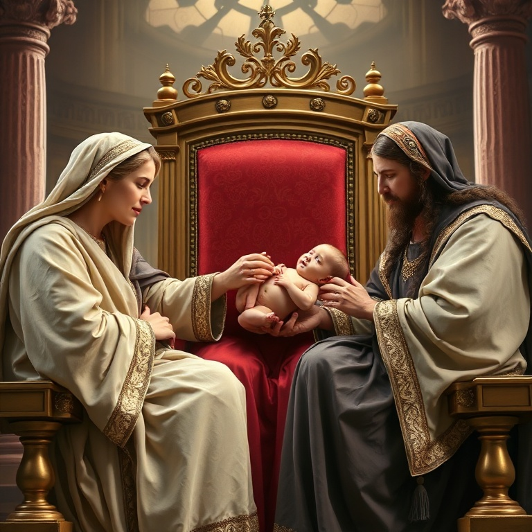
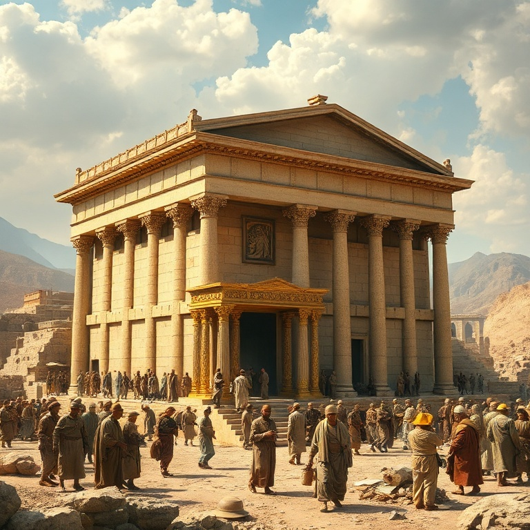
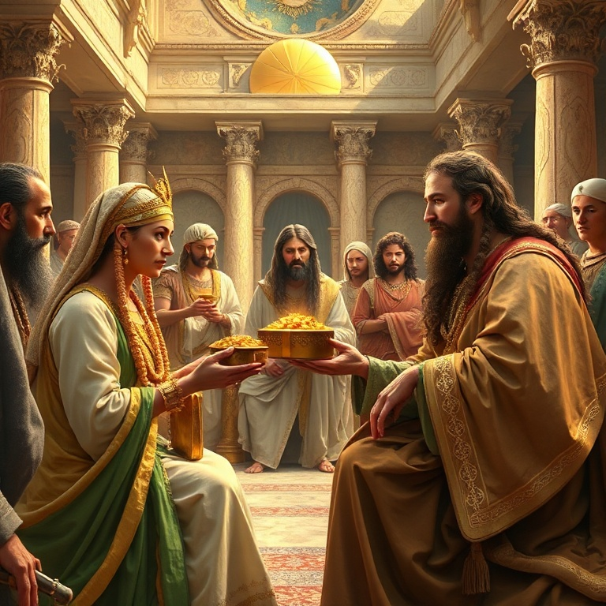
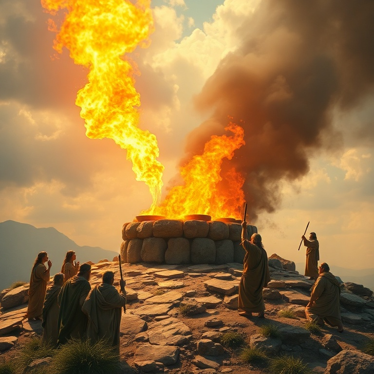
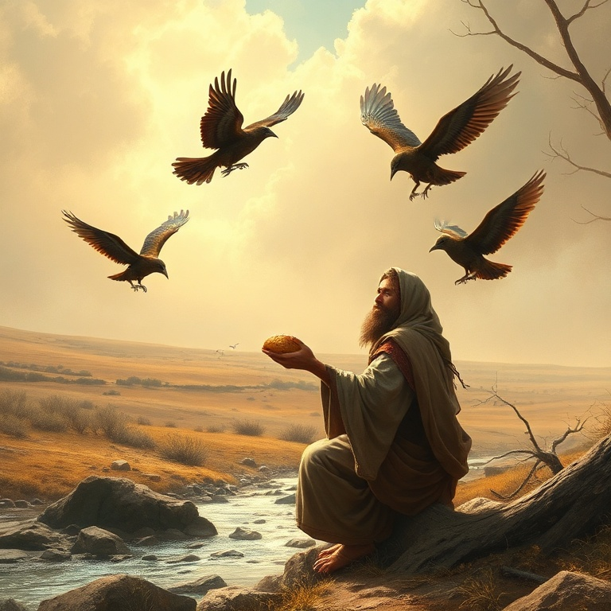

# Glória e Divisão: Um Estudo em 1 Reis

---

## Introdução

O livro de 1 Reis narra a transição de Israel de uma nação unificada sob Davi para um reino dividido após Salomão. A glória do reinado salomônico, com sua sabedoria, riqueza e a construção do Templo, contrasta fortemente com a divisão trágica que se segue. O livro mostra como a obediência a Deus traz bênçãos, enquanto a idolatria e a desobediência conduzem ao juízo.

A narrativa alterna entre os reinos do Norte (Israel) e do Sul (Judá), apresentando reis fiéis e infiéis. Os profetas Elias e Eliseu surgem como vozes de Deus em tempos de apostasia, confrontando o poder estabelecido e chamando o povo de volta à aliança. O livro nos ensina que Deus permanece soberano sobre a história, mesmo quando seu povo se desvia.

Primeiro Reis é um convite à reflexão sobre liderança, adoração verdadeira e as consequências de abandonar o Senhor. A glória humana é passageira, mas o Reino de Deus permanece para sempre. A história de Israel serve de alerta e instrução para todos que desejam andar em fidelidade.

---

## Capítulo 1: O Reinado de Salomão

Salomão ascende ao trono em meio a intrigas políticas, mas é estabelecido por Deus como sucessor de Davi. Quando o Senhor lhe oferece o que pedir, Salomão escolhe sabedoria para governar o povo. Essa escolha agrada a Deus, que lhe concede não apenas sabedoria, mas também riquezas e honra sem precedentes. O reinado de Salomão torna-se um período de paz, prosperidade e expansão territorial.

O episódio do julgamento entre as duas prostitutas revela a profundidade da sabedoria divina concedida a Salomão. Todo Israel reconhece que há em seu rei a sabedoria de Deus para julgar. Salomão organiza a administração do reino, estabelece alianças estratégicas e promove um ambiente de paz e desenvolvimento econômico. Seu reinado é visto como a idade de ouro de Israel.

No entanto, Salomão também acumula esposas estrangeiras, cavalos e riquezas, desobedecendo às instruções divinas para os reis de Israel. Seu coração começa a se desviar do Senhor à medida que sua fama e poder aumentam. A semente da divisão já está sendo plantada, mesmo no auge da glória. O exemplo de Salomão nos adverte sobre os perigos do sucesso e da complacência espiritual.

---

## Capítulo 2: A Construção do Templo

O projeto mais grandioso de Salomão é a construção do Templo em Jerusalém, a casa do Senhor. Utilizando materiais preparados por Davi e mão de obra especializada, Salomão ergue um edifício magnífico no monte Moriá. O Templo simboliza a presença de Deus no meio de seu povo e cumpre a promessa feita a Davi de que seu filho construiria uma casa para o nome do Senhor.

A dedicação do Templo é um momento solene. Salomão ora diante de todo o Israel, reconhecendo que nem os céus podem conter a Deus, quanto menos aquela casa. Ele pede que o Senhor ouça as orações feitas na direção do Templo e perdoe o pecado de seu povo. A glória de Deus enche o Templo, e o povo se prostra em adoração.

A construção do Templo nos aponta para Cristo, que é o verdadeiro Templo — Deus habitando entre os homens. Assim como a glória de Deus encheu o Templo de Salomão, a plenitude da divindade habita em Jesus. Somos chamados a ser templos do Espírito Santo, dedicados à adoração e à santidade. O Templo nos lembra que Deus deseja habitar no meio de seu povo para sempre.

---

## Capítulo 3: A Divisão do Reino

Após a morte de Salomão, seu filho Roboão assume o trono e enfrenta uma crise imediata. O povo, liderado por Jeroboão, pede alívio da carga pesada de tributos. Rejeitando o conselho dos anciãos e seguindo o conselho dos jovens, Roboão responde com dureza. Essa insensatez política leva à revolta das dez tribos do Norte, que proclamam Jeroboão como rei.

O reino unificado de Davi e Salomão se parte em dois: Israel ao Norte, com capital em Samaria, e Judá ao Sul, com capital em Jerusalém. Jeroboão, temendo que o povo volte a Jerusalém para adorar, estabelece bezerros de ouro em Dã e Betel, levando Israel à idolatria. Essa divisão é um juízo de Deus pela desobediência de Salomão, mas também revela a soberania divina sobre as nações.

A rivalidade entre os dois reinos marca todo o período seguinte. Há guerras constantes, alianças instáveis e um progressivo afastamento espiritual. A divisão nos ensina que o pecado não afeta apenas o indivíduo, mas toda a comunidade. Líderes insensatos podem destruir em dias o que levou gerações para construir. A unidade do povo de Deus é frágil e deve ser preservada com sabedoria e humildade.

---

## Capítulo 4: Elias e os Profetas de Baal

Elias, o tesbita, irrompe na cena israelita em um momento de profunda apostasia. O rei Acabe e Jezabel promovem o culto a Baal e Aserá, perseguindo os profetas do Senhor. Elias declara que não haverá chuva nem orvalho senão pela sua palavra, um juízo direto sobre a fertilidade que Baal supostamente garantia. O profeta desafia o sistema religioso de Israel em nome do Deus vivo.

No monte Carmelo, o confronto é épico. Os 450 profetas de Baal clamam, dançam e se ferem, mas nenhuma resposta vem. Elias, após reparar o altar do Senhor com doze pedras, ora e fogo desce do céu consumindo o sacrifício, a lenha, as pedras e a água. O povo se prostra e clama: "O Senhor é Deus!" O poder de Deus se manifesta de forma inegável, e os falsos profetas são executados.

Após a vitória, Elias foge por medo de Jezabel, revelando sua humanidade e fragilidade. Deus o encontra no monte Horebe, não no vento, no terremoto ou no fogo, mas numa voz mansa e suave. Essa passagem nos ensina que Deus age tanto no extraordinário quanto no silêncio. Elias é um exemplo de coragem e dependência de Deus, mas também de vulnerabilidade e cuidado divino.

---

## Capítulo 5: Acabe e Jezabel

Acabe, rei de Israel, é descrito como o pior de todos os reis, influenciado por sua esposa Jezabel, princesa sidônia. Jezabel traz consigo o culto a Baal e persegue os profetas do Senhor. O casal real representa a aliança do povo de Deus com as nações pagãs, trocando a fidelidade à aliança por conveniência política e religiosa. Seu reinado é marcado por injustiça, violência e idolatria.

O episódio da vinha de Nabote revela a corrupção do poder. Acabe deseja a vinha vizinha, mas Nabote se recusa a vendê-la por ser herança de seus pais. Jezabel arma um esquema judicial, usando falsas testemunhas para acusar Nabote de blasfêmia, e ele é apedrejado. Elias confronta Acabe: "No lugar onde os cães lamberam o sangue de Nabote, lamberão também o teu sangue."

O juízo anunciado se cumpre. Acabe morre em batalha disfarçado, e Jezabel é lançada de uma janela, devorada por cães. A história de Acabe e Jezabel demonstra que Deus não se deixa escarnecer. A injustiça e a opressão têm prazo de validade. O silêncio de Deus não é ausência, mas preparação para o juízo. Líderes que usam o poder para oprimir os fracos colherão o que plantaram.

---

## Conclusão

Primeiro Reis nos mostra a trajetória de Israel da glória à divisão. O reinado de Salomão, com toda sua sabedoria e esplendor, não pode sustentar uma nação cujo coração se afastou de Deus. A divisão do reino é consequência direta do pecado, e os profetas surgem como agentes de restauração e juízo. O livro nos convida a examinar nossa própria fidelidade à aliança com Deus.

A história de Elias, Acabe e Jezabel nos lembra que Deus é soberano sobre reis e nações. Nenhum trono terreno se compara ao trono de Deus. Em meio à apostasia e à injustiça, Deus preserva um remanescente fiel. Somos chamados a ser esse remanescente, firmes na verdade, confiando que o Senhor dos exércitos reina supremo sobre toda a terra.
