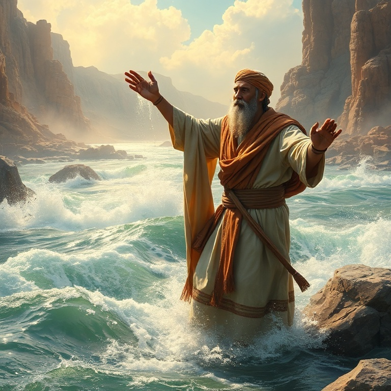
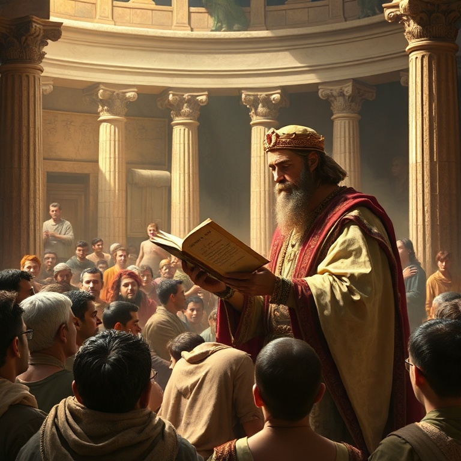

# Fogo e Exílio: Um Estudo em 2 Reis

---

## Introdução

O livro de 2 Reis dá continuidade à história dos reinos de Israel e Judá, narrando seu trágico declínio e queda. Enquanto 1 Reis termina com a morte de Acabe e o ministério de Elias, 2 Reis começa com a transição do manto profético para Eliseu. O livro cobre aproximadamente trezentos anos de história, culminando na destruição de Samaria e Jerusalém.

A mensagem central é clara: a desobediência persistente à aliança leva ao juízo. Israel (reino Norte) é levado cativo pela Assíria, e Judá (reino Sul) é levado ao exílio babilônico. No entanto, em meio ao juízo, Deus levanta reis reformadores como Ezequias e Josias, mostrando que o arrependimento genuíno pode retardar o juízo e trazer avivamento.

Segundo Reis nos lembra que Deus é paciente, mas também justo. A paciência divina tem um limite quando o pecado se torna institucionalizado. O exílio não é o fim da história, pois Deus preserva um remanescente e mantém suas promessas de restauração. O livro é um chamado urgente à fidelidade e à obediência.

---

## Capítulo 1: Eliseu e os Milagres

Eliseu sucede Elias após este ser levado ao céu num redemoinho. Pedindo porção dobrada do espírito de Elias, Eliseu recebe o manto e o poder profético. Seu ministério é marcado por numerosos milagres que demonstram o cuidado de Deus com seu povo e sua soberania sobre a natureza, a doença e até a morte. Os milagres de Eliseu são sinais do Reino de Deus em ação.

Entre os milagres estão a purificação das águas de Jericó, a multiplicação do azeite da viúva, a ressurreição do filho da sunamita, a cura de Naamã da lepra, e a multiplicação dos pães para cem homens. Cada milagre revela um aspecto do caráter de Deus: provisão, compaixão, poder sobre a morte e graça estendida até mesmo a estrangeiros. Eliseu demonstra que Deus não abandona seu povo mesmo em tempos de apostasia.

O ministério de Eliseu nos aponta para Jesus Cristo, que realizou milagres semelhantes em escala ainda maior. Assim como Eliseu trouxe vida e restauração, Jesus veio para dar vida em abundância. Os milagres de Eliseu nos encorajam a confiar no poder de Deus em meio às impossibilidades da vida. O Deus que multiplicou o azeite e ressuscitou o morto ainda opera hoje.

---

## Capítulo 2: A Queda de Israel

O reino do Norte, Israel, caminha rapidamente para o juízo. Rei após rei anda nos caminhos de Jeroboão, perpetuando a idolatria dos bezerros de ouro. Mesmo com o testemunho dos profetas Eliseu, Amós e Oseias, o povo se recusa a se arrepender. A injustiça social e a opressão dos pobres se tornam marcas da sociedade israelita.

Salmaneser, rei da Assíria, invade Samaria e a sitia por três anos. Em 722 a.C., a cidade cai, e o povo de Israel é levado cativo para a Assíria. O rei da Assíria traz povos estrangeiros para habitar Samaria, criando uma mistura étnica e religiosa que dá origem aos samaritanos. O reino do Norte desaparece como nação independente, cumprindo as advertências proféticas.

A queda de Israel é um alerta solene para todos os que ouvem a palavra de Deus mas não a obedecem. A idolatria, seja de imagens, de poder ou de riqueza, sempre leva à ruína. Deus é paciente, mas sua justiça é certa. A história de Israel nos pergunta: estamos ouvindo a voz de Deus ou repetindo os mesmos erros que levaram o povo ao exílio?

---

## Capítulo 3: Ezequias e a Reforma

Ezequias, rei de Judá, é um dos poucos reis descritos como temente a Deus. Ele promove uma reforma religiosa profunda, removendo os altos, quebrando as colunas sagradas e destruindo a serpente de bronze que Moisés havia feito, pois o povo a adorava. Ezequias restaura a celebração da Páscoa e convoca todo o Israel a voltar-se para o Senhor.

Quando Senaqueribe, rei da Assíria, ameaça Jerusalém, Ezequias busca ao Senhor em oração. O profeta Isaías traz uma palavra de livramento, e naquela noite o anjo do Senhor mata cento e oitenta e cinco mil soldados assírios. Deus defende Jerusalém por amor de Davi e por sua própria glória. A oração de Ezequias demonstra que confiar em Deus é mais eficaz que confiar em alianças políticas.

Deus também estende a vida de Ezequias em quinze anos após ele orar, dando-lhe um sinal miraculoso com a sombra no relógio de Acaz. No entanto, Ezequias falha ao mostrar suas riquezas aos embaixadores babilônios, e Isaías profetiza que um dia tudo seria levado para a Babilônia. A reforma de Ezequias nos ensina que o avivamento começa com arrependimento e retorno à Palavra de Deus.

---

## Capítulo 4: Josias e a Redescoberta da Lei

Josias torna-se rei aos oito anos e, ainda jovem, começa a buscar o Deus de Davi. Aos dezesseis anos, inicia uma reforma religiosa. Aos vinte e seis, ordena a restauração do Templo. Durante as obras, o sumo sacerdote Hilquias encontra o Livro da Lei nos escombros do Templo. A palavra de Deus havia sido tão negligenciada que foi literalmente redescoberta nas obras de restauração.

Ao ouvir a leitura da Lei, Josias rasga suas vestes em sinal de arrependimento. Ele consulta a profetisa Hulda, que confirma o juízo vindouro sobre Judá, mas promete que Josias será poupado por sua humildade. Josias reúne todo o povo e faz uma aliança solene de obedecer ao Senhor. Ele remove a idolatria de Judá e restaura a verdadeira adoração.

A redescoberta da Lei nos lembra o poder transformador da Palavra de Deus. Quando a Palavra é negligenciada, o povo se desvia. Quando é redescoberta e obedecida, o avivamento vem. Josias nos desafia a buscar a Deus de todo o coração, independentemente da idade ou das circunstâncias. A Palavra de Deus nunca perde seu poder de transformar vidas.

---

## Capítulo 5: A Queda de Judá e o Exílio

Após a morte de Josias, Judá retorna rapidamente à idolatria sob reis como Jeoaquim e Zedequias. Jeremias clama em vão por arrependimento. Nabucodonosor, rei da Babilônia, invade Jerusalém em três etapas, levando cativos os nobres, os tesouros do Templo e, finalmente, destruindo a cidade e o Templo em 586 a.C. O juízo que havia sido adiado por causa de Josias finalmente se cumpre.

Zedequias, o último rei de Judá, tenta fugir mas é capturado. Seus filhos são mortos diante dele, e depois seus olhos são vazados. O Templo é queimado, os muros de Jerusalém são derrubados, e o povo é levado cativo para a Babilônia. A terra desfruta seus anos sabáticos, conforme previsto na Lei de Moisés. O exílio parece ser o fim da história de Israel como nação.

No entanto, mesmo no juízo, Deus preserva a esperança. No último versículo do livro, o rei Joaquim é libertado da prisão na Babilônia e recebe lugar de honra na mesa do rei Evil-Merodaque. Essa pequena luz no fim do túnel aponta para a restauração futura. Deus não abandonou seu povo para sempre. O exílio é disciplina, não rejeição.

---

## Conclusão

Segundo Reis é um livro de contrastes: fogo do juízo e fogo do avivamento, exílio e esperança. A queda de Israel e de Judá demonstra a seriedade do pecado e a fidelidade de Deus à sua palavra. Cada rei, cada profeta, cada milagre aponta para a verdade de que Deus é santo e exige santidade de seu povo.

No entanto, a mensagem final não é de desespero, mas de esperança. Mesmo no exílio, Deus preserva seu povo e prepara o caminho para a restauração. O livro nos convida a levar a Palavra de Deus a sério, a buscar a reforma pessoal e comunitária, e a confiar que o Deus do juízo é também o Deus da restauração. O fogo do exílio não tem a última palavra — a glória da restauração virá.
