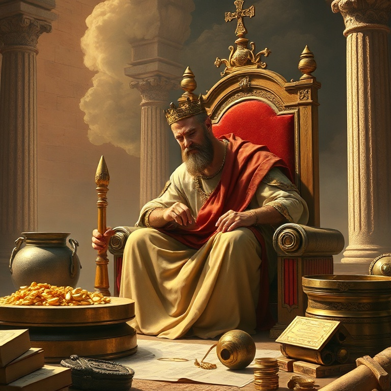
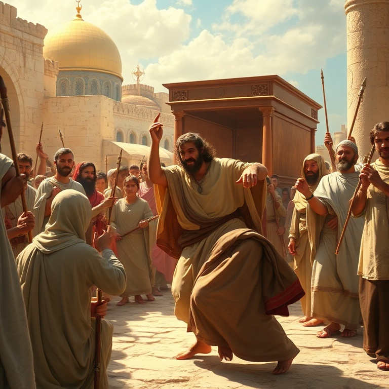
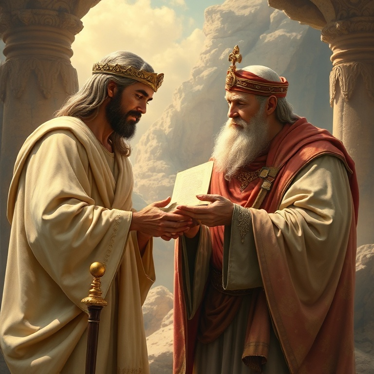
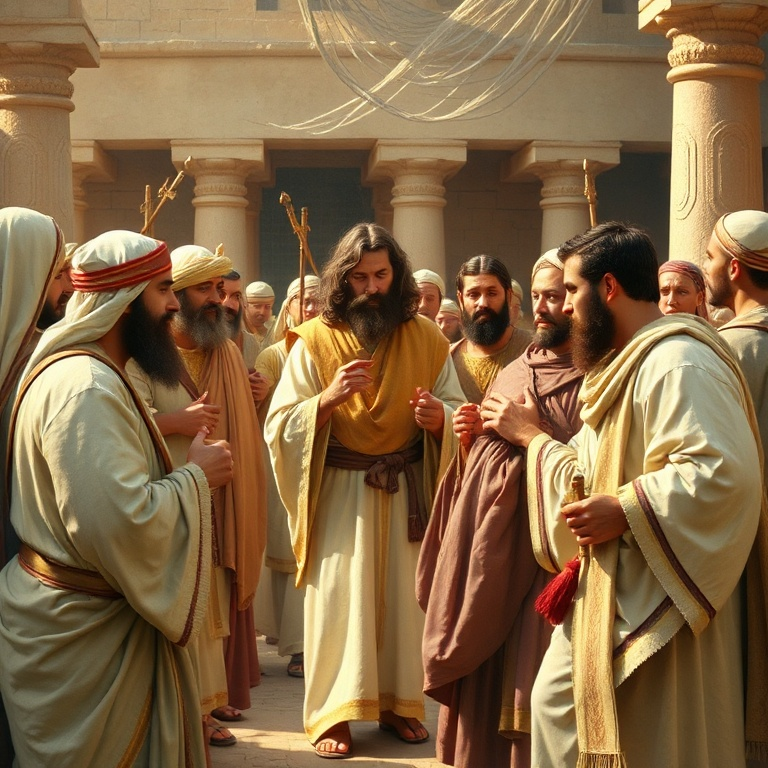
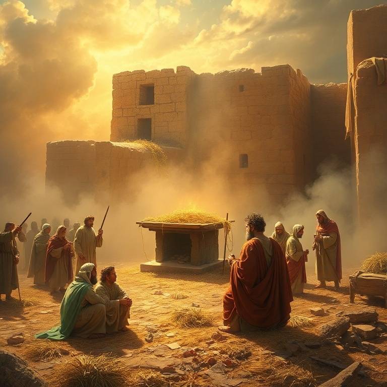

# A Aliança de Davi: Um Estudo em 1 Crônicas

---

## Introdução

O livro de 1 Crônicas não é uma mera repetição de Samuel e Reis, mas uma releitura teológica da história de Israel para uma nova geração. Escrito após o exílio babilônico, o autor (tradicionalmente Esdras) busca restaurar a identidade do povo de Deus, conectando-os às suas raízes e promessas. Davi é o personagem central, e seu reinado é apresentado sob uma luz idealizada.

Diferentemente de Reis, 1 Crônicas omite os pecados graves de Davi e foca em seu papel como fundador da adoração no Templo. O livro enfatiza a aliança davídica, a centralidade do Templo, e a importância do sacerdócio levítico. Para uma comunidade pós-exílica desanimada, Crônicas oferece esperança baseada nas promessas imutáveis de Deus.

A mensagem de 1 Crônicas é atemporal: Deus é fiel à sua aliança, e seu povo deve responder com adoração e obediência. As genealogias, que muitos leitores ignoram, são fundamentais, pois estabelecem a continuidade do povo de Deus desde Adão até o retorno do exílio. Cada nome é um testemunho da fidelidade divina através das gerações.

---

## Capítulo 1: As Genealogias

As genealogias de 1 Crônicas ocupam os primeiros nove capítulos, traçando a linhagem desde Adão até os dias do cronista. Elas não são listas áridas, mas um mapa teológico que mostra o plano redentor de Deus desde o início. A ênfase está na tribo de Judá, na casa de Davi e na tribo de Levi, preparando o cenário para o Templo e a monarquia davídica.

As genealogias incluem todas as doze tribos, demonstrando que todo o Israel é povo de Deus. A inclusão de personagens como Caim e Abel, Noé e seus filhos, e os patriarcas Abraão, Isaque e Jacó estabelece a continuidade da história da redenção. Até mesmo estrangeiros são mencionados, como a egípcia Hagar, mostrando a abrangência do plano divino.

Para a comunidade pós-exílica, essas genealogias eram uma afirmação de identidade. Elas diziam: "Você pertence a este povo, a esta história, a estas promessas." Para nós, elas nos lembram que somos parte de uma história maior, que Deus tem um plano que atravessa gerações. Cada crente é um elo na corrente da fé que começou com Adão e encontrará seu cumprimento em Cristo.

---

## Capítulo 2: A Morte de Saul e a Ascensão de Davi

O cronista trata a morte de Saul de forma breve e direta, sem os detalhes dramáticos de 1 Samuel. Saul morre por sua infidelidade, e o reino passa para Davi, o homem segundo o coração de Deus. A transição é apresentada como um ato soberano de Deus, que cumpre sua promessa de estabelecer um rei segundo sua vontade.

Davi é ungido rei sobre todo o Israel e imediatamente conquista Jerusalém, tornando-a sua capital. Ele derrota os filisteus e estabelece um reino forte e unificado. O cronista omite os conflitos entre Davi e Saul e a guerra civil com Is-Bosete, focando na unidade do povo sob o reinado de Davi. A mensagem é clara: quando o rei é fiel, o povo é abençoado.

A ascensão de Davi nos aponta para Jesus Cristo, o Filho de Davi, cujo reinado não terá fim. Assim como Davi unificou Israel sob seu governo, Cristo unifica seu povo de todas as nações. O reinado de Davi foi uma sombra do Reino perfeito que Jesus estabeleceria. Em Cristo, encontramos o rei ideal que Davi prefigurava.

---

## Capítulo 3: Davi Traz a Arca

O grande desejo de Davi é trazer a Arca da Aliança para Jerusalém. Após uma primeira tentativa frustrada — Uzá morre por tocar na Arca — Davi aprende que a adoração deve ser feita conforme Deus ordena. Na segunda tentativa, os levitas carregam a Arca corretamente, e Davi dança diante do Senhor com toda sua força, vestido com um éfode de linho.

A entrada da Arca em Jerusalém é um momento de grande alegria e adoração. Davi oferece holocaustos e sacrifícios, abençoa o povo e distribui alimento a todos. Ele nomeia levitas para ministrar diante da Arca com cânticos, instrumentos e profecia. A adoração musical no Templo tem suas raízes neste evento, e Davi é estabelecido como o organizador do culto levítico.

A dança de Davi diante da Arca humilha-o aos olhos de sua esposa Mical, que o despreza, mas ele declara que dançará diante do Senhor. Essa passagem nos ensina que a adoração verdadeira não se importa com a opinião alheia. Quando a presença de Deus está presente, a alegria transborda em expressões de louvor. A Arca aponta para Cristo, a presença perfeita de Deus entre os homens.

---

## Capítulo 4: A Aliança Davídica

Deus faz com Davi uma aliança incondicional e eterna: "Quando teus dias se cumprirem, levantarei depois de ti um descendente, e estabelecerei para sempre o seu trono" (1 Cr 17). Davi deseja construir uma casa para Deus, mas é Deus quem promete construir uma casa (dinastia) para Davi. A aliança davídica é um dos pilares da teologia bíblica.

O descendente de Davi edificará o Templo, e seu trono será estabelecido para sempre. Essa promessa tem cumprimento imediato em Salomão, mas seu cumprimento último está em Jesus Cristo, o Filho de Davi por excelência. O anúncio do anjo Gabriel a Maria ecoa essa promessa: "Deus lhe dará o trono de Davi, seu pai, e reinará eternamente."

A aliança davídica nos assegura que o Reino de Deus é seguro. Embora reinos humanos caiam, o Reino do Messias permanecerá. Em tempos de instabilidade e incerteza, podemos confiar que Deus cumpre suas promessas. A aliança com Davi é a garantia de que a história não caminha para o caos, mas para o estabelecimento do Reino eterno de Cristo.

---

## Capítulo 5: Preparação para o Templo

Embora Deus não permita que Davi construa o Templo, ele dedica seus últimos anos a preparar tudo para seu filho Salomão. Davi organiza os levitas, os sacerdotes, os músicos, os porteiros e os tesoureiros. Ele estabelece turnos de serviço e garante que tudo funcione conforme a ordem divina. A preparação é tão importante quanto a execução.

Davi também reúne materiais em abundância: ouro, prata, bronze, ferro, madeira e pedras preciosas. Ele doa de seus próprios tesouros e incentiva o povo a contribuir com alegria para a obra do Senhor. O povo responde com generosidade, e Davi os abençoa em oração, louvando a Deus por toda a provisão. A construção do Templo é um projeto coletivo, não individual.

A preparação de Davi nos ensina sobre legado e planejamento. Nem sempre veremos o cumprimento de nossos sonhos, mas podemos preparar o caminho para a próxima geração. Servimos a um Deus de gerações, e nosso trabalho hoje prepara o terreno para o que Deus fará amanhã. O Templo que Salomão construiu aponta para o Templo vivo que é a igreja de Cristo.

---

## Conclusão

Primeiro Crônicas é um livro de esperança e identidade. Para um povo que retornava do exílio desanimado, o cronista reafirma as promessas de Deus: a aliança com Abraão, a eleição de Israel, o trono de Davi e a centralidade da adoração. O passado é revisitado não por nostalgia, mas para fundamentar a fé no futuro.

Davi é apresentado como o rei ideal, cujo coração buscava a Deus. Sua aliança com Deus aponta para Jesus, o Filho de Davi, cujo Reino não terá fim. Somos convidados a nos ver como parte dessa história, membros do povo de Deus, chamados à adoração e à obediência. A fidelidade de Deus no passado é a garantia de sua fidelidade no futuro.
