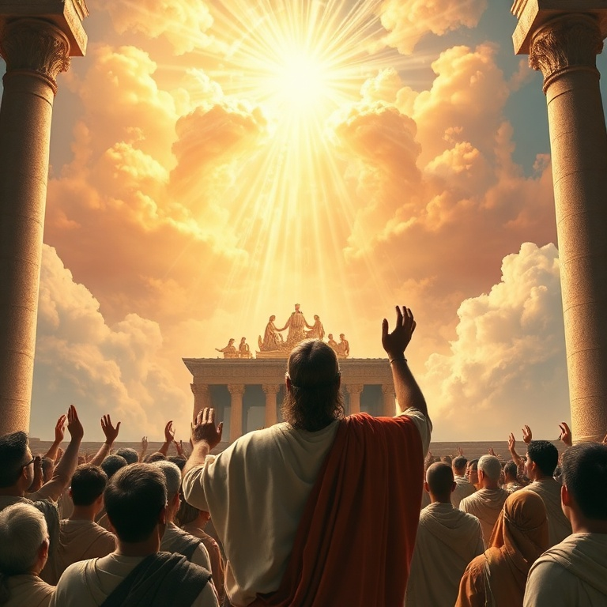
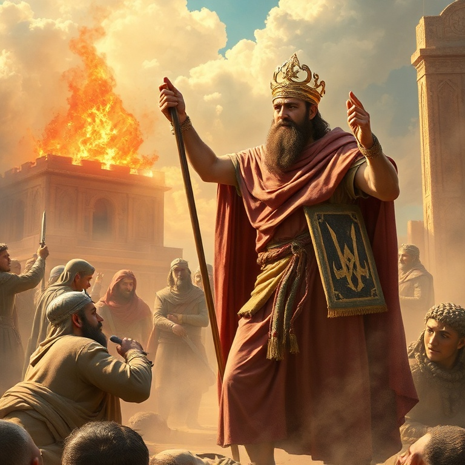
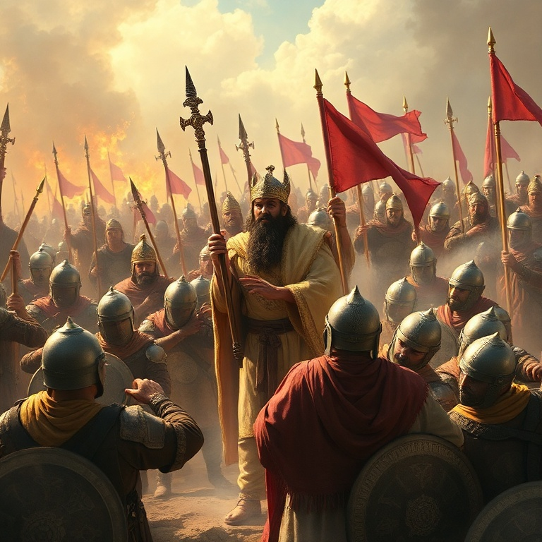
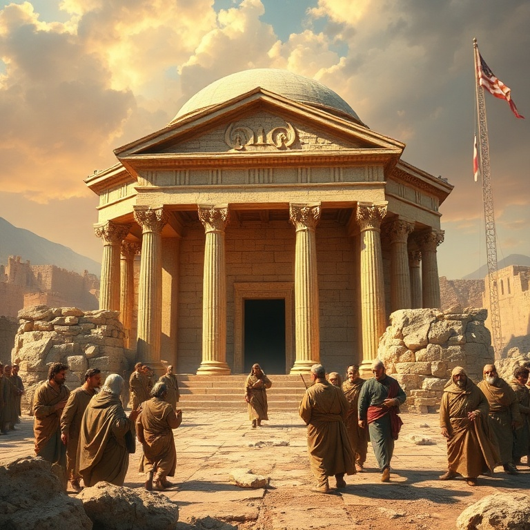
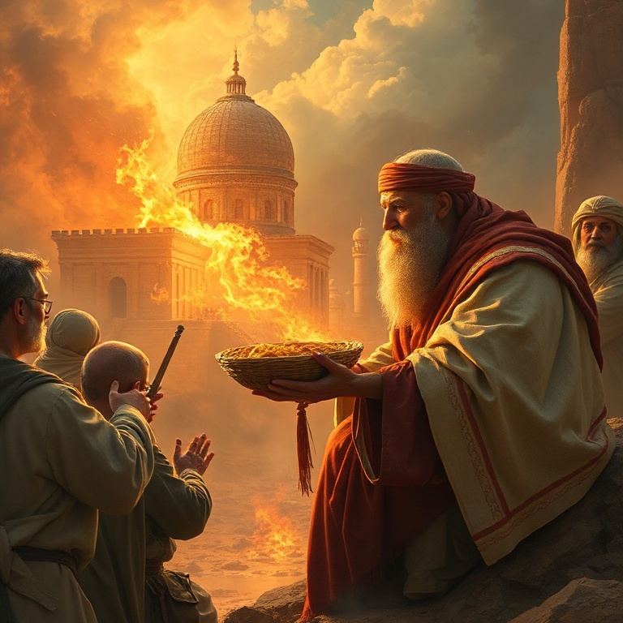

# Aviva, Senhor: Um Estudo em 2 Crônicas

---

## Introdução

O livro de 2 Crônicas continua a história do reinado de Salomão e de todos os reis de Judá até o exílio babilônico. Diferentemente de 1 e 2 Reis, que alternam entre os reinos do Norte e do Sul, o cronista foca exclusivamente em Judá. Sua perspectiva é teológica: a obediência traz bênção, e a desobediência traz juízo, mas o arrependimento sempre encontra misericórdia.

O tema central é o avivamento. Repetidas vezes, vemos reis que buscam ao Senhor e experimentam reformas espirituais e livramentos. Outras vezes, reis infiéis arrastam a nação para a idolatria e a ruína. O cronista mostra que Deus responde ao arrependimento genuíno com restauração. Não há pecado grande demais para a graça de Deus quando o coração se volta para ele.

Segundo Crônicas termina com o decreto de Ciro, permitindo o retorno dos exilados. Essa conclusão otimista aponta para a restauração futura e para a esperança messiânica. O livro nos convida a clamar: "Aviva, Senhor, a tua obra!" — crendo que Deus ainda responde com fogo do céu quando seu povo se humilha e ora.

---

## Capítulo 1: Salomão e o Templo

Salomão inicia seu reinado buscando a Deus em Gibeão, onde oferece mil holocaustos. Deus lhe aparece e oferece o que pedir. Salomão pede sabedoria e conhecimento para governar, e Deus lhe concede também riquezas e honra. O cronista enfatiza que a sabedoria de Salomão vem de Deus e é usada para o bem do povo.

A construção do Templo é descrita em detalhes gloriosos. Salomão reúne artífices habilidosos, materiais preciosos e mão de obra abundante. O Templo é dedicado com uma solene cerimônia de oração e sacrifício. Quando a glória do Senhor enche o Templo, os sacerdotes não conseguem ministrar. A presença de Deus é o verdadeiro tesouro da casa do Senhor.

Na oração de dedicação, Salomão reconhece a transcendência de Deus: "Os céus e os céus dos céus não te podem conter, quanto menos esta casa." Ele pede que Deus ouça as orações feitas na direção do Templo e perdoe o pecado do povo. A oração de Salomão nos ensina que o Templo é lugar de encontro com Deus, de arrependimento e de restauração. Em Cristo, temos acesso direto ao Pai.

---

## Capítulo 2: Reis Fiéis e Reformas

Vários reis de Judá se destacam por sua fidelidade: Asa remove a idolatria e renova o altar do Senhor. Josafá envia levitas para ensinar a Lei por todo o país. Ezequias purifica o Templo e restaura a Páscoa. Josias redescobre a Lei e promove a maior reforma da história de Judá. Cada um demonstra que líderes fiéis podem influenciar toda uma geração.

Asa enfrenta um exército etíope com oração e confiança em Deus, e o Senhor lhe dá vitória. Josafá enfrenta uma coalizão de inimigos e declara um jejum nacional; Deus envia profetas com uma palavra de livramento. Ezequias, diante da ameaça assíria, ora no Templo, e Deus envia um anjo para destruir o exército inimigo. A oração é a arma dos reis fiéis.

As reformas desses reis nos ensinam que o avivamento não é acidental. Ele requer ação intencional: remover ídolos, restaurar a Palavra, renovar a adoração e buscar a Deus em oração. O avivamento começa com líderes dispostos a se humilhar e a liderar pelo exemplo. Que possamos ser como esses reis, promovendo reformas espirituais em nossas esferas de influência.

---

## Capítulo 3: Reis Infiéis e Consequências

Infelizmente, nem todos os reis de Judá foram fiéis. Roboão abandona a Lei e é invadido pelo Egito. Jeorão mata seus irmãos e segue caminhos perversos. Acazias é influenciado por Atalia. Manassés, o pior de todos, enche Jerusalém de idolatria e violência. Cada rei infiel arrasta o povo consigo para longe de Deus.

O padrão é consistente: quando o rei abandona a Deus, o povo segue o mesmo caminho. As consequências são concretas: invasões estrangeiras, derrotas militares, pobreza e instabilidade política. O pecado tem consequências reais, não apenas espirituais. O juízo de Deus é pedagógico, destinado a trazer seu povo de volta à razão.

No entanto, o cronista também mostra que a história de Manassés tem um final surpreendente: ele se arrepende no cativeiro, e Deus o restaura ao trono. Não há pecado tão grave que o arrependimento genuíno não possa alcançar. A graça de Deus é maior que o pior dos pecados. Isso nos dá esperança para nós mesmos e para aqueles por quem oramos.

---

## Capítulo 4: Os Profetas e o Chamado ao Arrependimento

Deus não abandona seu povo sem testemunho. Profetas como Semaías, Azarias, Hanani, Jeú, Elias, Isaías, Miqueias e Jeremias são levantados para chamar Judá ao arrependimento. Eles confrontam reis e nação, muitas vezes com risco de vida. A mensagem profética é urgente: "Convertei-vos de vossos maus caminhos e guardai os mandamentos do Senhor."

O cronista registra que Deus enviou profetas continuamente, "madrugando e enviando" seus mensageiros. O povo, porém, zombava dos profetas e desprezava suas palavras. Essa rejeição sistemática é o que finalmente leva ao juízo. O sangue dos profetas clama por justiça, e Deus não pode ignorar a perseguição aos seus mensageiros.

Os profetas nos desafiam a ouvir a voz de Deus hoje. A Palavra de Deus ainda nos confronta, nos convence do pecado e nos chama ao arrependimento. Rejeitar a mensagem profética é rejeitar o próprio Deus. Somos chamados a ter corações sensíveis à voz do Senhor, prontos para nos arrepender e mudar de direção quando ele nos fala.

---

## Capítulo 5: O Decreto de Ciro e o Retorno

O livro termina com uma nota de esperança. Jerusalém é destruída, o Templo é queimado, e o povo é levado cativo para a Babilônia. A terra desfruta seus sábados por setenta anos, conforme a palavra do Senhor por Jeremias. O juízo é completo, mas não é final. Deus ainda tem um plano para seu povo.

No primeiro ano de seu reinado, Ciro, rei da Pérsia, emite um decreto permitindo que os judeus retornem a Jerusalém e reconstruam o Templo. O cronista vê nisso a mão de Deus: "O Senhor despertou o espírito de Ciro." O decreto cumpre a profecia de Isaías, que menciona Ciro pelo nome mais de cem anos antes de seu nascimento.

A conclusão de 2 Crônicas nos ensina que Deus é soberano sobre a história. Ele usa reis pagãos para cumprir seus propósitos. O exílio não é o fim — o retorno é o capítulo seguinte. Para o povo de Deus, a última palavra nunca é juízo, mas restauração. Em Cristo, temos a garantia de que o decreto de libertação já foi assinado e selado.

---

## Conclusão

Segundo Crônicas é um livro que clama por avivamento. Através de reis fiéis e infiéis, profetas e reformas, o cronista nos mostra que Deus anseia abençoar seu povo, mas não pode ignorar o pecado. A obediência traz bênção, e o arrependimento traz restauração. Deus está sempre disposto a ouvir o clamor de um coração contrito.

A mensagem de 2 Crônicas ecoa até hoje: "Se o meu povo, que se chama pelo meu nome, se humilhar, orar, buscar a minha face e se converter de seus maus caminhos, então eu ouvirei dos céus, perdoarei seus pecados e sararei sua terra" (2 Cr 7.14). Que este seja o nosso clamor: "Aviva, Senhor, a tua obra no meio dos anos!"
