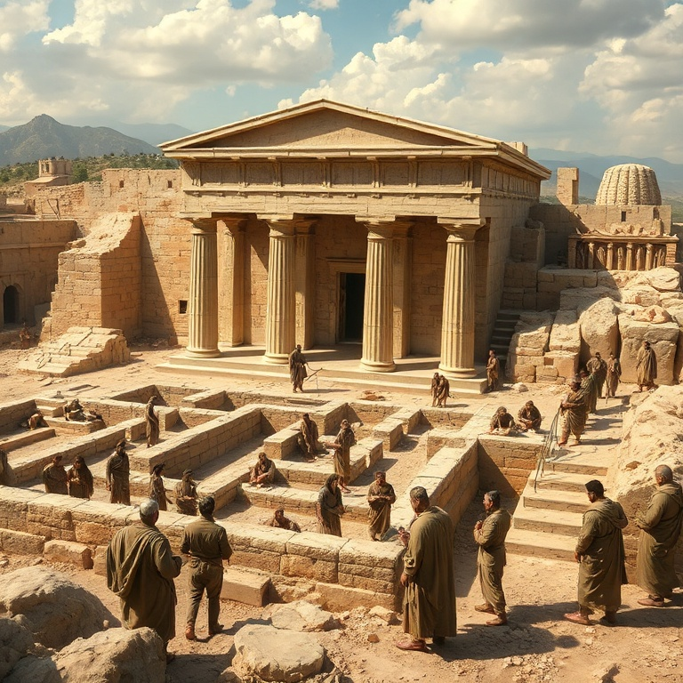
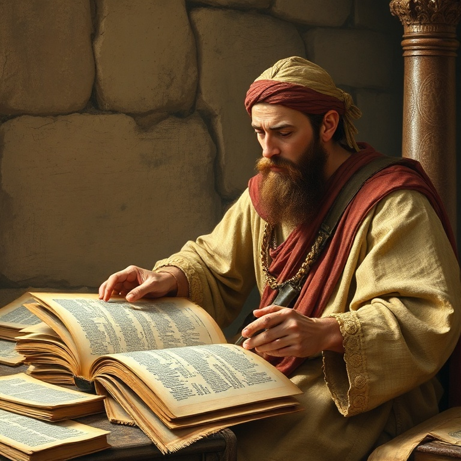
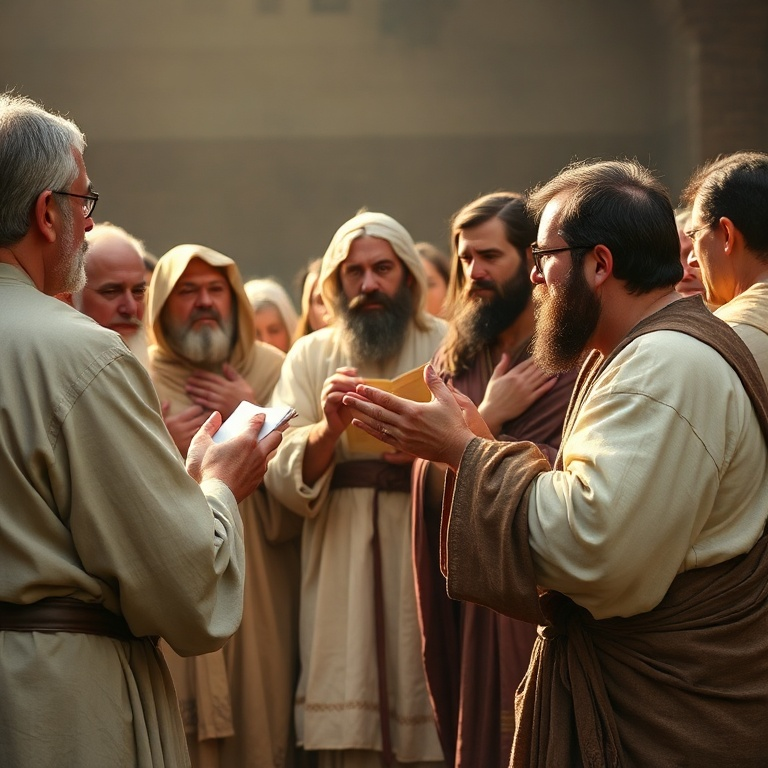
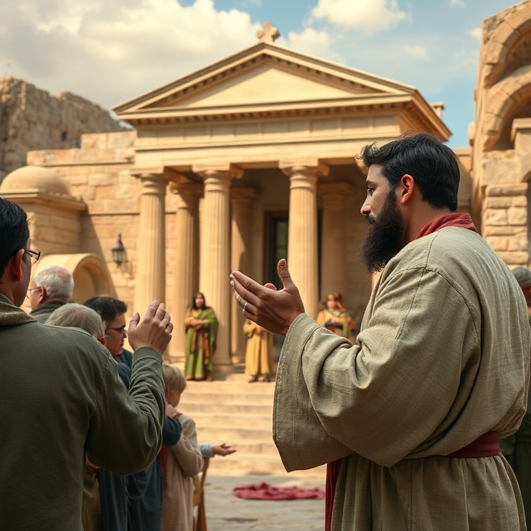

# De Volta para Casa: Um Estudo em Esdras

---

## Introdução

O livro de Esdras narra o retorno dos judeus do exílio babilônico e a reconstrução do Templo em Jerusalém. Após setenta anos de cativeiro, conforme profetizado por Jeremias, Deus desperta o espírito de Ciro, rei da Pérsia, para permitir que seu povo volte para casa. É uma história de esperança, perseverança e restauração.

Esdras, escriba e sacerdote, lidera o segundo grupo de retorno com o propósito de ensinar a Lei de Deus ao povo. O livro mostra dois movimentos principais: a reconstrução física do Templo (capítulos 1–6) e a reforma espiritual do povo (capítulos 7–10). Ambos são necessários para que o povo de Deus seja restaurado plenamente.

A mensagem central de Esdras é que Deus cumpre suas promessas. Ele havia prometido disciplina através do exílio, mas também prometeu restauração. O retorno é a prova de que Deus é fiel. Para nós, Esdras nos encoraja a confiar que Deus sempre completa o que começou, mesmo quando o caminho parece longo e difícil.

---

## Capítulo 1: O Decreto de Ciro

No primeiro ano de seu reinado, Ciro, rei da Pérsia, emite um decreto histórico: os judeus exilados podem retornar a Jerusalém e reconstruir o Templo do Senhor. Mais que permitir, Ciro devolve os utensílios do Templo que Nabucodonosor havia levado. O cumprimento da profecia de Isaías, que mencionou Ciro pelo nome, demonstra o controle soberano de Deus sobre a história.

Cerca de cinquenta mil judeus respondem ao chamado, liderados por Zorobabel e Jesua. As famílias são listadas meticulosamente, mostrando que Deus conhece cada um de seu povo. Os que ficam contribuem com ouro, prata e bens para os que partem. O retorno é um movimento comunitário, não individualista.

O decreto de Ciro nos lembra que Deus pode usar até mesmo governantes pagãos para cumprir seus propósitos. O coração do rei está nas mãos do Senhor. Quando Deus decide agir, nenhum poder terreno pode impedir. O retorno do exílio é uma prévia do que Deus faria em Cristo: libertar seu povo da escravidão e trazê-lo de volta para casa.

---

## Capítulo 2: A Reconstrução do Templo

Os retornados se estabelecem em Jerusalém e nas cidades vizinhas e logo se reúnem para reconstruir o altar do Senhor. Eles restauram os sacrifícios diários e celebram a Festa dos Tabernáculos, obedecendo à Lei de Moisés. No segundo ano, lançam os alicerces do novo Templo com grande celebração, louvando a Deus por sua bondade.

A cerimônia de lançamento dos alicerces é emocionante. Os mais velhos, que haviam visto o primeiro Templo, choram em alta voz, enquanto os mais jovens gritam de alegria. O som se mistura, mas não há confusão para Deus. Ele vê tanto a tristeza pela glória passada quanto a esperança pela restauração futura.

Quando os inimigos se oferecem para ajudar, Zorobabel recusa sabiamente. A obra de Deus deve ser feita pelo povo de Deus, com os métodos de Deus. A reconstrução nos ensina que começar é importante, mas completar a obra exige perseverança. O fundamento do Templo é Cristo, e sobre ele somos edificados como casa espiritual de Deus.

---

## Capítulo 3: Oposição e Perseverança

A obra de reconstrução enfrenta forte oposição. Os inimigos de Judá, samaritanos e outros povos da região, inicialmente tentam se infiltrar e depois usam táticas de intimidação e acusações políticas. Eles escrevem cartas ao rei persa, alegando que Jerusalém sempre foi uma cidade rebelde. A obra é interrompida por ordem real e fica parada por cerca de dezesseis anos.

Durante esse período de paralisia, o povo se desanima e se volta para seus próprios interesses. Os profetas Ageu e Zacarias são levantados por Deus para encorajar o povo a reiniciar a obra. Ageu confronta o povo por viver em casas paineladas enquanto a casa de Deus permanece em ruínas. A prioridade precisa ser restaurada.

A perseverança finalmente é recompensada. Uma nova investigação confirma o decreto original de Ciro, e Dario ordena que a obra prossiga sem impedimentos. O Templo é concluído e dedicado com alegria. A oposição nos ensina que obstáculos não são o fim da história. Deus é maior que os inimigos que se levantam contra sua obra.

---

## Capítulo 4: Esdras e a Palavra de Deus

Esdras, escriba versado na Lei de Moisés, lidera o segundo grupo de retorno. Ele é descrito como alguém que "preparou o coração para buscar a Lei do Senhor, para a cumprir e para ensinar em Israel seus estatutos e juízos". Esdras não é apenas um estudioso, mas um praticante e um mestre da Palavra de Deus.

A mão de Deus está sobre Esdras, e o rei Artaxerxes lhe concede tudo o que pede para embelezar a casa do Senhor. Esdras convoca um jejum junto ao rio Ava, buscando proteção divina para a viagem perigosa. Deus responde, e o grupo chega em segurança a Jerusalém. A prioridade de Esdras é a Palavra de Deus, não a política ou a segurança.

Esdras nos desafia a fazer da Palavra de Deus a prioridade de nossas vidas. Buscar a Lei, cumpri-la e ensiná-la são os três pilares de uma vida piedosa. Não podemos ensinar o que não praticamos, nem praticar o que não conhecemos. O avivamento verdadeiro começa com um compromisso sério com as Escrituras.

---

## Capítulo 5: Avivamento e Reforma

Ao chegar em Jerusalém, Esdras descobre que o povo, incluindo sacerdotes e levitas, se casou com mulheres estrangeiras que praticavam a idolatria. A semente santa se misturou com os povos da terra, comprometendo a pureza espiritual da comunidade. Esdras rasga suas vestes e se senta estarrecido até a hora da oferta da tarde.

Na oração de confissão, Esdras se identifica com o pecado do povo: "Meu Deus, estou envergonhado e confuso para levantar meu rosto a ti." Ele não se coloca acima dos pecadores, mas se humilha com eles. O povo é profundamente tocado e propõe uma aliança para se separar das práticas pagãs, incluindo o divórcio das esposas estrangeiras.

A reforma liderada por Esdras é radical e dolorosa, mas necessária para a pureza espiritual. Ela nos ensina que o avivamento genuíno sempre envolve arrependimento e mudança de comportamento. Não há avivamento sem confissão de pecados. A tristeza segundo Deus produz arrependimento que leva à salvação e não precisa ser remediada.

---

## Conclusão

Esdras é um livro de recomeço. O retorno do exílio mostra que Deus dá novas chances ao seu povo. As promessas de Deus não falham, mesmo quando seu povo falha. A reconstrução do Templo e a reforma espiritual apontam para a restauração completa que Deus tem em mente para seu povo.

O livro nos ensina que a Palavra de Deus é o fundamento de todo avivamento. Esdras preparou seu coração para buscar a Lei, cumpri-la e ensiná-la. Que esse seja também o nosso alvo. Deus está sempre disposto a nos receber de volta, a reconstruir o que está quebrado e a reformar o que está errado. De volta para casa — essa é a jornada do povo de Deus.
