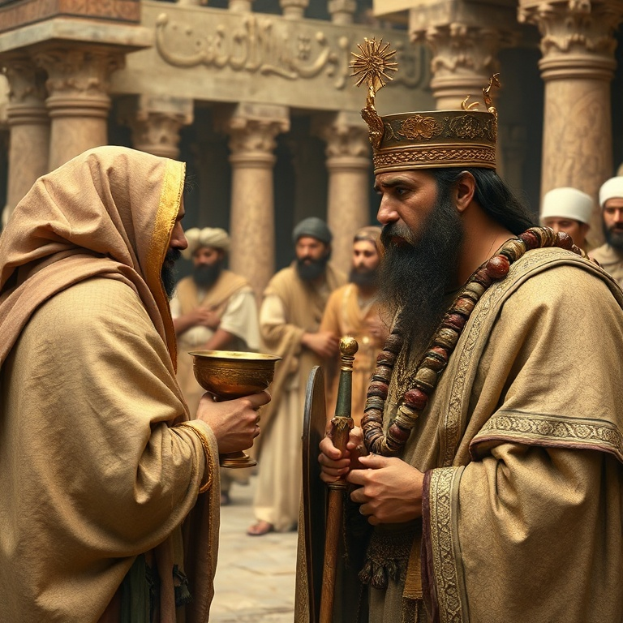
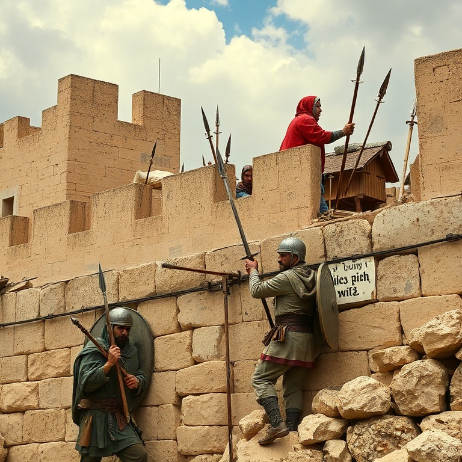
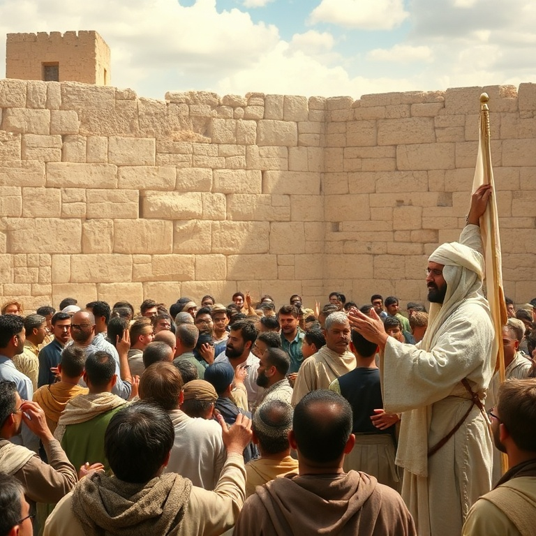

# Levanta-te e Edifica: Um Estudo em Neemias

---

## Introdução

O livro de Neemias narra a reconstrução dos muros de Jerusalém e o avivamento espiritual do povo de Deus após o exílio. Neemias, copeiro do rei Artaxerxes, recebe a notícia de que Jerusalém está em ruínas e seu coração se quebranta. Ele combina oração e ação, demonstrando que a fé genuína se traduz em atitudes concretas.

Embora Esdras e Neemias sejam livros separados na Bíblia, eles formam uma única narrativa no original hebraico. Esdras foca no Templo e na Palavra, enquanto Neemias foca nos muros e na reforma social. Ambos são necessários: a adoração e a Palavra precisam de proteção prática. O livro nos ensina que Deus se importa tanto com o espiritual quanto com o material.

Neemias é um exemplo notável de liderança: ele ora, planeja, age, enfrenta oposição, motiva o povo e busca a Deus em cada etapa. Sua história nos inspira a nos levantar e edificar o que está destruído ao nosso redor. O que está em ruínas em sua vida, família ou comunidade? Deus nos chama a reconstruir.

---

## Capítulo 1: Neemias Ora e Age

Ao ouvir que os muros de Jerusalém estão quebrados e as portas, queimadas, Neemias se senta, chora, lamenta, jejua e ora. Sua oração é um modelo de intercessão: ele começa louvando a Deus, confessa os pecados do povo, lembra as promessas de Deus e apresenta seu pedido específico. Neemias não apenas ora — ele se dispõe a ser parte da resposta.

Quando o rei Artaxerxes percebe a tristeza de Neemias e pergunta o que ele deseja, Neemias ora instantaneamente antes de responder. Ele pede permissão para ir a Jerusalém e reconstruir os muros. O rei concede não apenas a permissão, mas também cartas de salvaguarda e madeira para as portas. A mão de Deus está claramente sobre Neemias.

A história de Neemias nos ensina que a oração e a ação andam juntas. Neemias orou por quatro meses antes de agir, mas quando a porta se abriu, ele estava pronto. A fé não é passividade — é confiar em Deus e dar o primeiro passo. Deus honra aqueles que combinam súplica com estratégia.

---

## Capítulo 2: A Reconstrução dos Muros

Neemias chega a Jerusalém e, durante a noite, inspeciona secretamente os muros para avaliar a situação. Ele não faz anúncios grandiosos antes de entender a realidade. Depois, convoca o povo: "Vinde, edifiquemos o muro de Jerusalém, para que não fiquemos mais em opróbrio." O povo responde com entusiasmo: "Levantemo-nos e edifiquemos."

O capítulo 3 é fascinante: lista cada família e cada grupo que trabalhou em uma seção específica do muro. Sacerdotes, ourives, perfumistas, comerciantes e governantes — todos trabalharam lado a lado. Até mesmo as mulheres se envolveram. A reconstrução foi um esforço coletivo, cada um fazendo sua parte diante de sua própria casa.

A reconstrução dos muros nos ensina sobre trabalho em equipe e responsabilidade individual. Cada seção do muro precisava ser construída, e cada pessoa tinha sua parte. Na igreja de Cristo, cada membro tem um papel essencial. Não somos chamados a fazer tudo, mas a fazer nossa parte. Quando cada um contribui, o muro se levanta.

---

## Capítulo 3: Oposição e Perseverança

Sambalate, Tobias e Gesém lideram a oposição à reconstrução. Eles usam zombaria, intimidação, ameaças e conspirações para parar a obra. Sambalate zomba: "Que é isso que vocês estão construindo? Se uma raposa subir, derrubará esse muro." Neemias responde com oração e ação, mantendo o povo focado no trabalho.

A oposição se intensifica com ameaças de ataque armado. Neemias organiza o povo, metade trabalhando e metade vigiando. Cada trabalhador carrega uma espada em um lado e uma ferramenta no outro. Neemias os encoraja: "Não temais; lembrai-vos do Senhor, grande e temível, e pelejai por vossos irmãos, vossos filhos e vossas filhas."

A perseverança de Neemias diante da oposição nos inspira. Obras de Deus sempre enfrentam resistência. A chave não é evitar a oposição, mas enfrentá-la com oração, vigilância e trabalho árduo. Neemias não cedeu ao medo nem se distraiu com provocações. Ele respondeu: "Estou fazendo uma grande obra, não posso descer."

---

## Capítulo 4: A Leitura da Lei e Avivamento

Com os muros reconstruídos, o povo se reúne na praça para ouvir a leitura da Lei. Esdras, sobre um púlpito de madeira, lê desde o amanhecer até o meio-dia. Os levitas explicam a Lei ao povo, ajudando-os a entender o significado. O povo chora ao ouvir as palavras de Deus, convicto de seus pecados.

Neemias e Esdras os encorajam: "Não choreis, nem vos entristeçais, porque a alegria do Senhor é a vossa força." O choro de arrependimento se transforma em alegria pela restauração. O povo celebra a Festa dos Tabernáculos com grande alegria, obedecendo a uma festa que não era celebrada adequadamente havia séculos.

O avivamento é marcado por três elementos: a Palavra de Deus é lida e explicada, o povo responde com arrependimento e adoração, e a obediência à Palavra é restaurada. O avivamento não é emocionalismo superficial, mas um retorno profundo à verdade de Deus. A alegria do Senhor sustenta o arrependimento genuíno.

---

## Capítulo 5: Renovação da Aliança

O avivamento leva a uma renovação formal da aliança com Deus. O povo se compromete por escrito a andar na Lei do Senhor, a não se casar com povos estrangeiros, a guardar o sábado e a sustentar a casa de Deus com seus dízimos e ofertas. A aliança é selada com a assinatura dos líderes e a participação de todo o povo.

Neemias também enfrenta problemas sociais graves: os ricos exploravam os pobres com juros usurários. Neemias confronta a elite, ordena a devolução das terras e estabelece a justiça social. A reforma espiritual não pode ignorar a injustiça social. A verdadeira espiritualidade se manifesta no cuidado com os menos favorecidos.

O livro termina com Neemias pedindo: "Lembra-te de mim, Deus meu, para o bem." Ele dedicou sua vida ao serviço de Deus e do povo. A renovação da aliança nos desafia a um compromisso sério e duradouro com Deus. Não basta um momento de avivamento — precisamos de uma vida de fidelidade.

---

## Conclusão

Neemias é um manual de liderança e avivamento. A história mostra que a oração, o planejamento, a ação, a perseverança e a dependência de Deus são ingredientes essenciais para reconstruir o que está destruído. Neemias combinou fé prática com visão estratégica, sensibilidade espiritual com coragem moral.

O livro nos chama a nos levantar e edificar. Que muros precisam ser reconstruídos em nossas famílias, igrejas e comunidades? A mesma mão de Deus que estava sobre Neemias está sobre nós. Levanta-te e edifica — Deus está contigo nesta obra.
