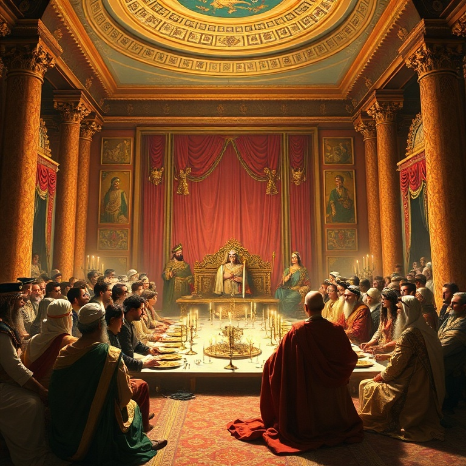
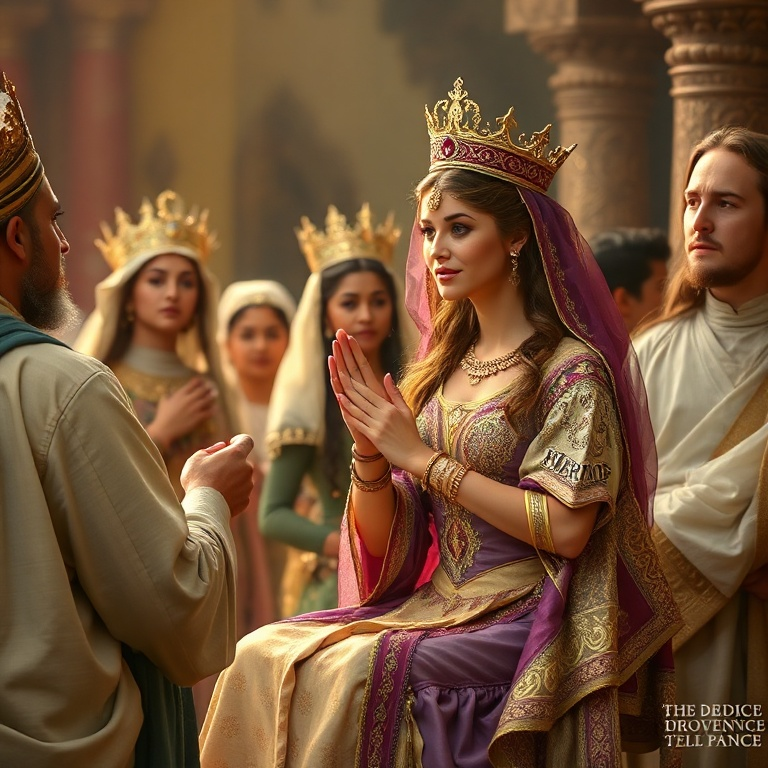
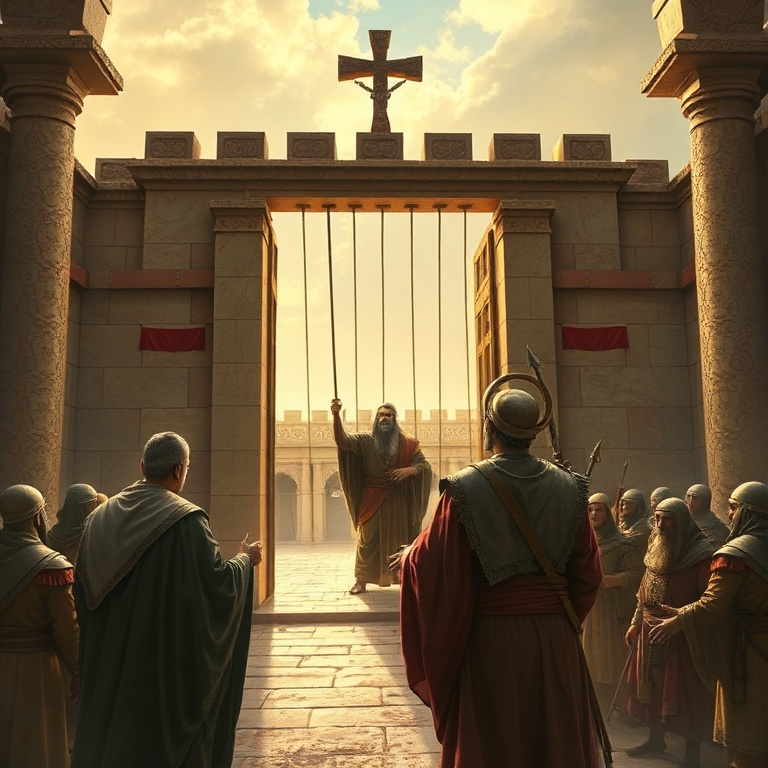
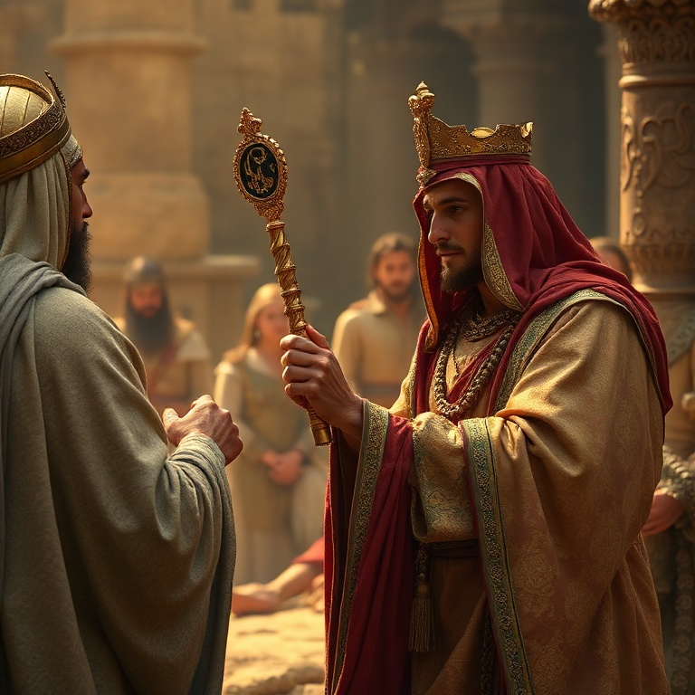
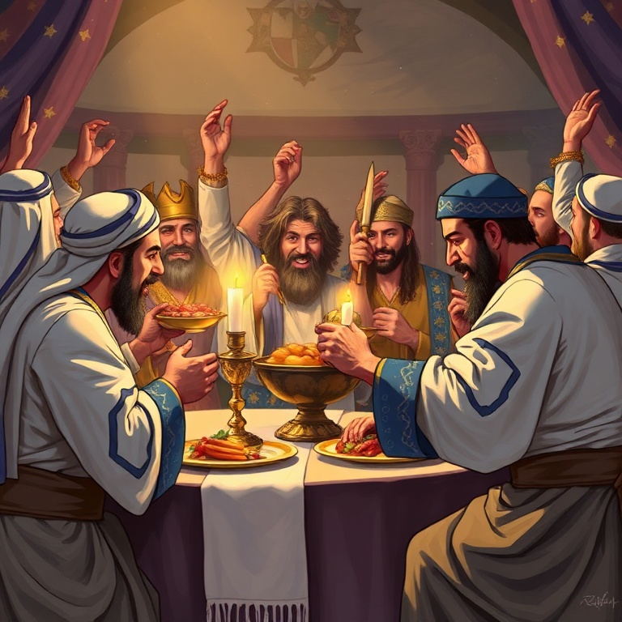

# Para Tal Momento: Um Estudo em Ester

---

## Introdução

O livro de Ester é singular na Bíblia: Deus nunca é mencionado diretamente, e não há orações, milagres ou referências a alianças. No entanto, a mão de Deus está evidente em cada reviravolta da história. O livro demonstra que Deus age soberanamente nos bastidores, usando pessoas comuns para cumprir seus propósitos.

Ambientado no império persa, Ester narra como uma jovem judia se torna rainha e salva seu povo do extermínio. A história é repleta de ironia, suspense e justiça poética. Hamã, o inimigo dos judeus, é enforcado na mesma forca que preparou para Mardoqueu. O dia planejado para a destruição se torna dia de vitória.

O tema central é a providência divina. Nada acontece por acaso: Ester estava no lugar certo, no momento certo, por um propósito específico. A pergunta de Mardoqueu ecoa através dos séculos: "Quem sabe se não foi para um momento como este que você chegou à posição de rainha?" Esta é a pergunta que Deus faz a cada um de nós.

---

## Capítulo 1: Vasti e Ester

O rei Assuero (Xerxes I) realiza um banquete suntuoso de cento e oitenta dias para exibir suas riquezas. No último dia, embriagado, ele ordena que a rainha Vasti se apresente diante dos convidados para exibir sua beleza. Vasti se recusa, e o rei, enfurecido, a depõe. O gesto de Vasti é interpretado como insubordinação, mas também pode ser visto como um ato de dignidade.

Após a deposição de Vasti, buscam-se jovens virgens em todo o império para encontrar uma nova rainha. Ester, uma judia órfã criada por seu primo Mardoqueu, é levada ao harém real. Ela conquista o favor de Hegai, o eunuco responsável, e mais tarde o favor do rei, tornando-se rainha. Ester não revela sua identidade judaica, seguindo o conselho de Mardoqueu.

A história de Vasti e Ester nos mostra que Deus prepara os caminhos. Ester não buscava o poder, mas foi colocada no palácio por providência divina. Vasti perdeu o trono por sua recusa, mas Ester ganhou o trono para um propósito maior. Deus está trabalhando mesmo quando não vemos.

---

## Capítulo 2: Hamã e o Complô

Hamã, o agagita, é promovido ao cargo mais alto do império persa. Todos se curvam diante dele, exceto Mardoqueu, que se recusa a prestar homenagem. Hamã fica furioso e decide não apenas punir Mardoqueu, mas exterminar todo o povo judeu. Ele lança sortes (purim) para determinar o dia do massacre e convence o rei a assinar o decreto de extermínio.

O decreto é assinado e enviado a todas as províncias. Os judeus entram em luto profundo, jejuando e chorando. Hamã prepara uma forca de vinte e cinco metros para pendurar Mardoqueu. O plano parece impecável, e a situação dos judeus parece desesperadora. O inimigo está no auge de seu poder.

O complô de Hamã representa todos os inimigos do povo de Deus que tentaram destruí-lo ao longo da história. Do faraó a Hamã, de Hitler a todos os perseguidores modernos, o ódio contra Israel e contra a igreja é real. Mas a história de Ester nos assegura que Deus nunca perde o controle. O inimigo pode planejar, mas Deus soberanamente dirige.

---

## Capítulo 3: O Jejum e a Coragem de Ester

Mardoqueu envia uma mensagem a Ester, contando sobre o decreto e pedindo que ela interceda junto ao rei. Ester hesita — aproximar-se do rei sem ser chamada significa morte certa, a menos que ele estenda o cetro de ouro. Mardoqueu responde com palavras que ecoam na eternidade: "Não imagine que, por estar no palácio, você escapará. Se você ficar calada, a libertação virá de outro lugar, mas você e sua família perecerão."

Ester toma uma decisão corajosa: "Vá, reúna todos os judeus e jejuem por mim. Eu e minhas servas também jejuaremos. Depois, irei ao rei, mesmo contra a lei. Se eu perecer, pereci." Ester demonstra uma fé notável. Ela não sabe o resultado, mas sabe que deve agir. O jejum precede a ação, e a coragem vem da dependência de Deus.

A coragem de Ester nos inspira a sair de nossa zona de conforto. Quantas vezes sabemos o que deve ser feito mas hesitamos por medo? Ester nos lembra que fomos colocados em nossa posição para um propósito. O momento de agir é agora. Se perecermos, pereçamos — mas não podemos ficar em silêncio.

---

## Capítulo 4: A Queda de Hamã

Ester se aproxima do rei, e ele estende o cetro de ouro. Em vez de fazer seu pedido imediatamente, ela convida o rei e Hamã para um banquete. Durante o banquete, ela convida ambos para outro banquete no dia seguinte. Hamã sai eufórico, mas sua alegria se transforma em fúria ao ver Mardoqueu novamente recusando-se a curvar-se.

Naquela noite, o rei não consegue dormir e pede que leiam os anais do reino. Descobre que Mardoqueu havia salvado sua vida ao denunciar um complô de assassinato, mas nunca foi recompensado. O rei pergunta a Hamã: "O que se deve fazer ao homem que o rei deseja honrar?" Hamã, pensando que é ele, sugere uma honra extravagante — e descobre que é para Mardoqueu.

No segundo banquete, Ester revela sua identidade judaica e acusa Hamã de conspirar para exterminar seu povo. O rei sai furioso para o jardim e, ao voltar, vê Hamã caído sobre o leito de Ester, implorando por sua vida. O rei ordena que Hamã seja enforcado na forca que ele preparou para Mardoqueu. A justiça poética é perfeita — o que o inimigo planejou contra os justos cai sobre ele mesmo.

---

## Capítulo 5: A Vitória dos Judeus

Hamã é morto, mas o decreto de extermínio ainda está em vigor. O rei autoriza Mardoqueu e Ester a emitir um novo decreto permitindo que os judeus se defendam. Mardoqueu é exaltado ao lugar de Hamã, e os judeus têm luz, alegria e honra. Muitos persas se tornam judeus, temendo o poder que os judeus agora possuem.

No dia marcado, os judeus se reúnem para se defender. Eles derrotam seus inimigos, mas não tomam seus despojos, mostrando que sua motivação não é ganância. Em Susã, os judeus matam quinhentos homens e os dez filhos de Hamã. Nas províncias, matam setenta e cinco mil inimigos. A vitória é completa e celebrada com festa.

A Festa do Purim é instituída para celebrar a libertação. É uma festa de alegria, banquetes e presentes, especialmente para os pobres. O Purim nos lembra que Deus transforma luto em dança. O dia que seria de destruição se torna dia de vitória. Em Cristo, temos a vitória final sobre todos os inimigos — o pecado, a morte e o inferno são derrotados.

---

## Conclusão

O livro de Ester nos ensina que Deus nunca está ausente, mesmo quando não é mencionado. Sua providência silenciosa guia cada detalhe da história. Ester foi colocada no palácio real para um momento específico — e ela teve a coragem de agir. Cada um de nós também está onde está por um propósito divino.

A pergunta que Ester enfrenta é a mesma que enfrentamos: teremos coragem de agir quando chegar nosso momento? Deus nos coloca em posições de influência não para nosso benefício, mas para seus propósitos. Que possamos ter a fé e a coragem de Ester, crendo que fomos chamados para tal momento como este.
