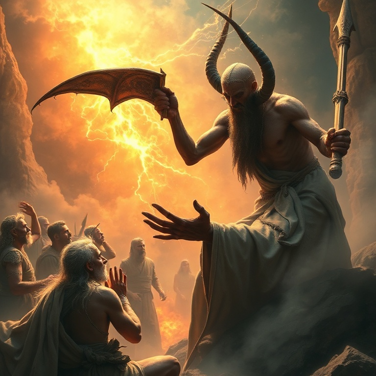
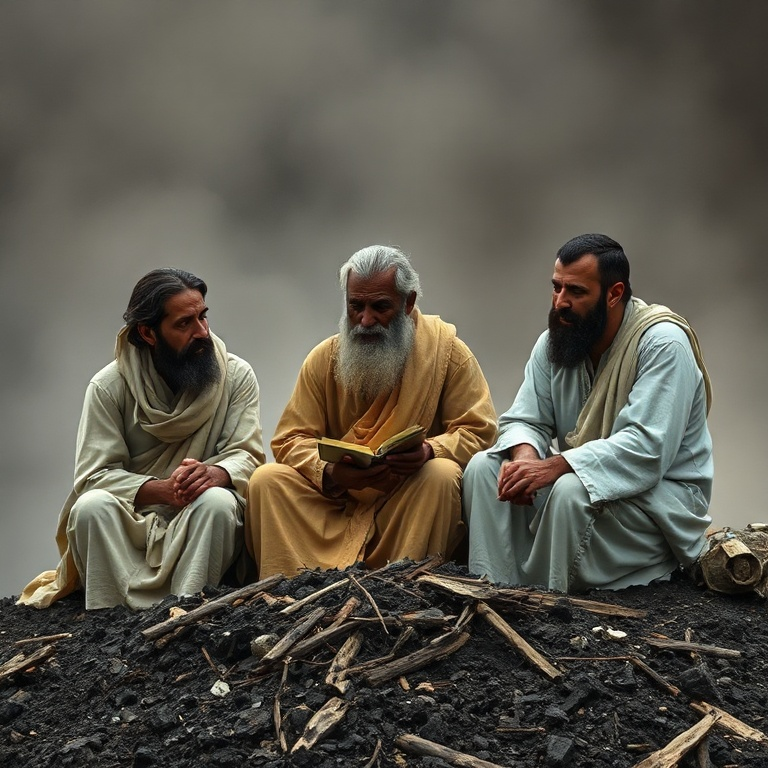
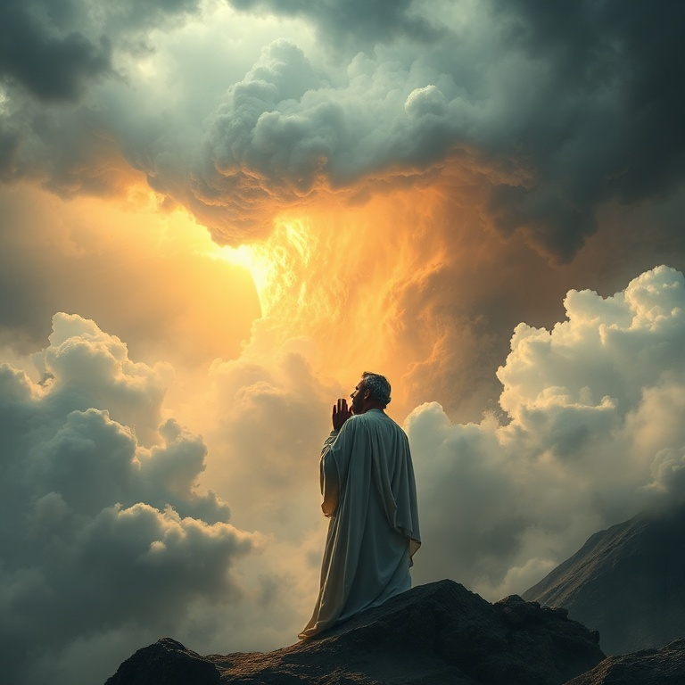
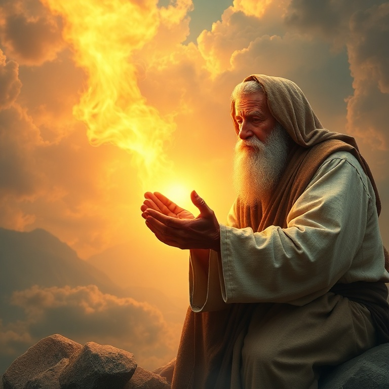

# Meu Redentor Vive: Um Estudo em Jó

---

## Introdução

O livro de Jó é uma das obras mais profundas da literatura mundial, abordando a questão mais antiga da humanidade: por que os justos sofrem? Jó é descrito como um homem íntegro, temente a Deus e que se desviava do mal. No entanto, ele perde tudo — riquezas, filhos e saúde — em uma série de tragédias inexplicáveis.

O livro não oferece respostas fáceis. Os amigos de Jó insistem que seu sofrimento é resultado de pecado oculto, mas Deus mesmo declara Jó inocente. O drama se desenrola em diálogos poéticos intensos, onde Jó luta com Deus, questiona sua justiça e clama por um mediador. No final, Deus responde, não com explicações, mas com uma revelação de sua glória.

A mensagem central de Jó é que Deus é soberano e digno de confiança, mesmo quando não entendemos seus caminhos. A declaração de Jó — "Eu sei que o meu Redentor vive" — é uma das maiores afirmações de fé em toda a Escritura. O sofrimento não tem a última palavra; a redenção sim.

---

## Capítulo 1: A Integridade de Jó

Jó é apresentado como um homem excepcionalmente íntegro: "Sincero, reto, temente a Deus e que se desviava do mal." Ele é rico e abençoado, mas também zeloso em sua vida espiritual, oferecendo sacrifícios por seus filhos. Jó é um patriarca modelo, e sua vida parece ser um exemplo clássico da bênção divina sobre os justos.

No céu, Satanás desafia a motivação de Jó: "Por acaso Jó teme a Deus de graça? Não tens proteção ao redor dele?" Ele acusa Jó de servir a Deus apenas por interesse, e Deus permite que Satanás teste Jó, mas estabelece limites claros: "Não estendas a mão sobre ele." O sofrimento de Jó não é castigo, mas um teste celestial.

Em um único dia, Jó perde seus bois, jumentos, ovelhas, camelos e — o mais doloroso — todos os seus dez filhos. Sua resposta é notável: "Nu saí do ventre de minha mãe e nu voltarei. O Senhor deu e o Senhor tirou; bendito seja o nome do Senhor." Jó não peca nem atribui loucura a Deus. Sua integridade resiste ao primeiro e mais violento golpe.

---

## Capítulo 2: O Debate com os Amigos

Três amigos — Elifaz, Bildade e Zofar — vêm visitar Jó. Eles ficam chocados com sua aparência e sentam-se com ele em silêncio por sete dias. Esse silêncio inicial é um dos atos mais compassivos da Bíblia. Infelizmente, quando começam a falar, a compaixão dá lugar a acusações teológicas rígidas e insensíveis.

Os amigos operam com uma teologia simplista de retribuição: todo sofrimento é consequência de pecado específico. Elifaz apela à experiência mística, Bildade à tradição dos ancestrais, e Zofar à razão moral. Todos concluem que Jó deve ter pecado para merecer tamanha desgraça. Jó refuta cada argumento, mantendo sua inocência.

O debate se torna cada vez mais acalorado. Jó acusa os amigos de "médicos que não servem para nada" e declara que seu verdadeiro problema não é com eles, mas com Deus. Ele deseja um árbitro, um mediador que possa colocar a mão sobre ambos. Jó não questiona a existência de Deus, mas clama por um encontro pessoal para apresentar seu caso.

---

## Capítulo 3: O Silêncio de Deus

O silêncio de Deus é um dos aspectos mais angustiantes do livro. Durante trinta e cinco capítulos de diálogo, Deus não fala. Jó clama, questiona, lamenta e acusa — mas o céu parece de bronze. Esse silêncio é familiar a todos que já sofreram sem entender o porquê. O silêncio de Deus não significa ausência, mas teste de fé.

Jó chega a amaldiçoar o dia de seu nascimento e a desejar a morte. Ele questiona por que Deus permite que os justos sofram enquanto os ímpios prosperam. Ele desafia Deus a aparecer e responder. Jó não é um exemplo de paciência estoica, como muitas vezes se diz, mas de honestidade radical diante de Deus. Ele prefere o confronto ao fingimento.

O silêncio de Deus nos ensina que a fé não depende de respostas imediatas. Jó não recebeu explicações, mas continuou buscando a Deus. A verdadeira fé não é a que entende tudo, mas a que confia mesmo sem entender. Jó nos mostra que podemos trazer nossas dúvidas e dores a Deus — ele é grande o suficiente para suportar nossas perguntas.

---

## Capítulo 4: A Resposta de Deus

Finalmente, Deus responde a Jó de um redemoinho. Mas sua resposta não é uma explicação sobre o sofrimento — é uma série de perguntas que revelam a majestade e soberania divinas. "Onde estavas tu quando eu lançava os fundamentos da terra? Quem recolheu o mar com portas? Já ordenaste a manhã? Sabes as leis dos céus?"

Deus leva Jó a um tour pelo cosmos e pela criação: as estrelas, o mar, a chuva, o relâmpago, os animais selvagens. Beemote e Leviatã, criaturas poderosas que só Deus pode domar, ilustram que há mistérios na criação que Jó não pode compreender, quanto mais nos caminhos da providência divina. A resposta de Deus não satisfaz a curiosidade, mas satisfaz a alma.

Jó responde: "Eu te conhecia só de ouvir, mas agora os meus olhos te veem. Por isso me abomino e me arrependo no pó e na cinza." Jó não recebeu uma resposta lógica, mas recebeu a Deus. E isso foi suficiente. A teodicéia de Jó não é uma teoria, mas um encontro. Quando vemos a glória de Deus, nossas perguntas se tornam secundárias.

---

## Capítulo 5: A Restauração de Jó

Deus repreende os amigos de Jó por não falarem corretamente sobre ele e instrui que ofereçam holocaustos, com Jó intercedendo por eles. Jó ora por seus amigos, e Deus aceita sua intercessão. Este é um momento crucial: Jó perdoa aqueles que o acusaram, e sua restauração começa. O perdão é parte integrante da cura.

Deus restaura a sorte de Jó, dando-lhe o dobro do que tinha antes. Ele recebe sete filhos e três filhas — as filhas são nomeadas, o que é incomum na cultura antiga, indicando seu status especial. Jó vive mais cento e quarenta anos e vê seus descendentes até a quarta geração. Sua restauração é completa, tanto material quanto familiar.

A restauração de Jó não apaga o sofrimento passado, mas mostra que Deus é redentor. A perda de seus primeiros filhos não é substituída, mas Deus lhe dá nova alegria. A declaração de Jó — "Eu sei que o meu Redentor vive" — encontra cumprimento não apenas em sua vida, mas em Jesus Cristo, o Redentor que vive e nos redime de todo sofrimento.

---

## Conclusão

O livro de Jó nos ensina que o sofrimento não é sempre consequência de pecado pessoal. Jó é justo, mas sofre. Seus amigos estão errados em sua acusação. Deus não nos deve explicações, mas se revela a nós em meio à dor. A fé verdadeira não é a que entende tudo, mas a que confia no caráter de Deus.

A resposta de Jó é a nossa esperança: "Eu sei que o meu Redentor vive e que por fim se levantará sobre a terra." Em Cristo, temos a certeza de que o sofrimento não tem a última palavra. A morte é vencida, a dor passará, e o Redentor vivo nos aguarda. Até lá, confiamos, mesmo sem entender.
