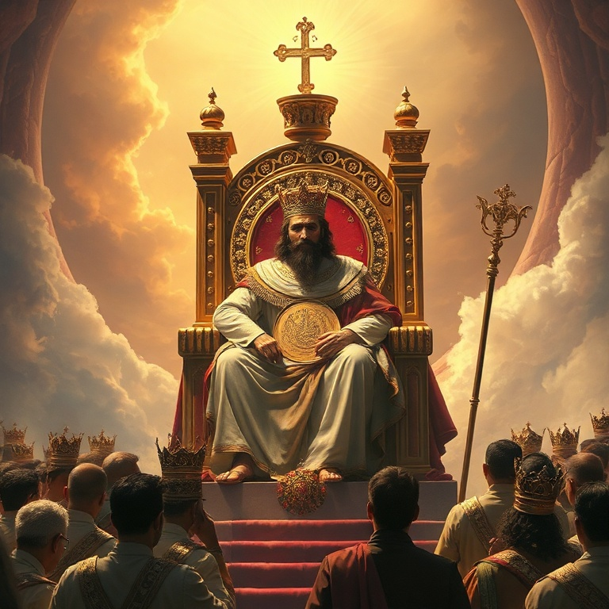

# Louvor em Todas as Estações: Um Estudo em Salmos

---

## Introdução

O livro de Salmos é a hinário de Israel, uma coleção de cento e cinquenta cânticos que expressam toda a gama da experiência humana diante de Deus. Os salmos cobrem alegria e tristeza, vitória e derrota, louvor e lamento, ação de graças e arrependimento. Não há emoção humana que não encontre eco nos salmos.

Davi é o principal autor, mas os salmos foram escritos por diversos autores ao longo de séculos: Asafe, os filhos de Corá, Moisés, Salomão e outros. Eles foram compostos para o culto público no Templo e também para a devoção pessoal. Jesus citou os salmos extensamente, e a igreja primitiva os usou como base de sua liturgia.

Os salmos nos ensinam a orar e a adorar. Eles nos dão palavras quando não sabemos o que dizer. Nos momentos de alegria, elevamos louvores. Nos momentos de dor, derramamos lamentos. Os salmos nos mostram que todas as estações da vida são ocasiões para nos voltarmos para Deus. Louvor em todas as estações — essa é a vida de fé.

---

## Capítulo 1: Salmos de Louvor e Adoração

Os salmos de louvor celebram quem Deus é e o que ele faz. Salmos como 8, 19, 24, 29, 33, 47, 95–100, 145–150 convocam toda a criação a adorar ao Senhor. "Louvai ao Senhor!" é o chamado que ecoa em todo o saltério. O louvor é a resposta adequada à grandeza, bondade e poder de Deus.

O Salmo 8 exalta a majestade de Deus revelada na criação: "Ó Senhor, Senhor nosso, quão magnífico em toda a terra é o teu nome!" O Salmo 19 declara que os céus proclamam a glória de Deus. O Salmo 150 encerra o saltério com uma orquestra completa de louvor: tudo quanto tem fôlego louve ao Senhor. O louvor é o destino final de toda a criação.

A adoração nos tira do centro e coloca Deus em seu devido lugar. Quando louvamos, nossas preocupações se relativizam e nossa visão se amplia. O louvor não é apenas uma atividade, mas um estilo de vida. Somos criados para adorar, e nossa maior realização é render glória a Deus. O louvor transforma nossa perspectiva e renova nossa esperança.

---

## Capítulo 2: Salmos de Lamento

Cerca de um terço dos salmos são lamentos — orações de angústia, dor e sofrimento. Os salmos de lamento (como 3, 13, 22, 42–43, 69, 88, 137) nos ensinam que podemos trazer nossas dores mais profundas diante de Deus. Eles não escondem a dor, mas a expressam com honestidade brutal diante do Senhor.

O Salmo 22 começa com as palavras que Jesus citou na cruz: "Deus meu, Deus meu, por que me desamparaste?" O salmista descreve seu sofrimento físico e emocional com detalhes vívidos. No entanto, o salmo não termina no lamento — ele se volta para a confiança e o louvor. O padrão do lamento bíblico é: dor honesta + confiança renovada = adoração.

Os salmos de lamento nos dão permissão para lamentar. Muitas vezes sentimos que a tristeza é falta de fé, mas a Bíblia nos mostra que o lamento é parte da vida de fé. Jesus lamentou, e os salmistas lamentaram. O problema não é lamentar, mas lamentar sem esperança. O lamento cristão é sempre marcado pela esperança da redenção futura.

---

## Capítulo 3: Salmos de Confiança

Os salmos de confiança (como 4, 16, 23, 27, 31, 46, 62, 91, 121, 131) expressam uma fé serena e inabalável em Deus, mesmo em meio às circunstâncias adversas. "O Senhor é o meu pastor, nada me faltará" (Sl 23) é talvez o mais conhecido de todos os salmos, uma declaração de confiança total na provisão e cuidado de Deus.

O Salmo 46 declara: "Deus é o nosso refúgio e fortaleza, socorro bem presente na angústia." O Salmo 121 afirma: "O meu socorro vem do Senhor, que fez o céu e a terra." O Salmo 91 promete proteção divina para os que habitam no esconderijo do Altíssimo. A confiança dos salmistas não é ingênua, mas baseada na experiência do caráter fiel de Deus.

A confiança em Deus não elimina os problemas, mas nos dá ânimo para enfrentá-los. O Salmo 23 termina com certeza: "Certamente que a bondade e a misericórdia me seguirão todos os dias da minha vida." A confiança bíblica não é otimismo baseado em circunstâncias, mas fé baseada no caráter de Deus. Ele é fiel, mesmo quando não vemos.

---

## Capítulo 4: Salmos Reais e Messiânicos

Os salmos reais (2, 18, 20, 21, 45, 72, 89, 101, 110, 132, 144) celebram o rei davídico como ungido do Senhor. Esses salmos foram compostos originalmente para coroações e ocasiões reais, mas transcendem seu contexto imediato para apontar para o grande Rei, o Messias. O Novo Testamento cita esses salmos como profecias de Jesus Cristo.

O Salmo 2 fala sobre o Filho de Deus que herda as nações: "Beijai o Filho, para que não se ire." O Salmo 110 declara: "Disse o Senhor ao meu Senhor: Assenta-te à minha direita." Jesus cita este salmo para afirmar sua divindade. O Salmo 72 descreve um rei ideal que julgará com justiça e abençoará todas as nações.

Os salmos messiânicos apontam para Jesus como o cumprimento das promessas davídicas. O trono de Davi seria estabelecido para sempre, e Jesus é o herdeiro eterno. Os salmos nos ensinam que a história não é um ciclo sem sentido, mas uma linha reta em direção ao Reino de Deus. O Rei está vindo, e seu reinado será perfeito.

---

## Capítulo 5: Salmos de Ação de Graças

Os salmos de ação de graças (18, 30, 32, 34, 40, 66, 92, 100, 107, 116, 118, 136, 138) agradecem a Deus por livramentos e bênçãos específicos. O Salmo 100 é um convite jubiloso: "Entrai pelas portas dele com gratidão e em seus átrios com louvor." O Salmo 107 narra as maravilhas de Deus em salvar seu povo de diversas situações de perigo.

O Salmo 136 é um salmo litúrgico com o refrão repetitivo "Porque a sua benignidade dura para sempre." Cada versículo lembra um ato de Deus na criação, no êxodo e na história de Israel. A gratidão não é apenas um sentimento, mas uma prática que deve ser cultivada. Lembrar as obras de Deus fortalece nossa fé.

A ação de graças é a resposta natural à bondade de Deus. Em tudo devemos dar graças, não porque tudo é bom, mas porque Deus é bom. A gratidão nos protege contra a amargura e o esquecimento. Os salmos de ação de graças nos convidam a cultivar um coração grato, reconhecendo que cada boa dádiva vem do Pai das luzes.

---

## Conclusão

O livro de Salmos nos oferece palavras para todas as estações da vida. Na alegria, louvamos. Na tristeza, lamentamos. No perigo, confiamos. Na espera, esperamos. Na vitória, agradecemos. Os salmos nos ensinam que não há emoção que não possa ser levada diante de Deus. Ele nos acolhe em nossa honestidade e nos transforma com sua presença.

Jesus é o cumprimento último dos salmos. Ele é o Rei messiânico, o Pastor que guia, o Justo que sofre, o Ressurreto que vence a morte. Os salmos nos apontam para Cristo e nos ensinam a viver cada estação da vida com fé e adoração. Que os salmos sejam nosso hinário e nossa oração, guiando-nos em louvor em todas as estações.
