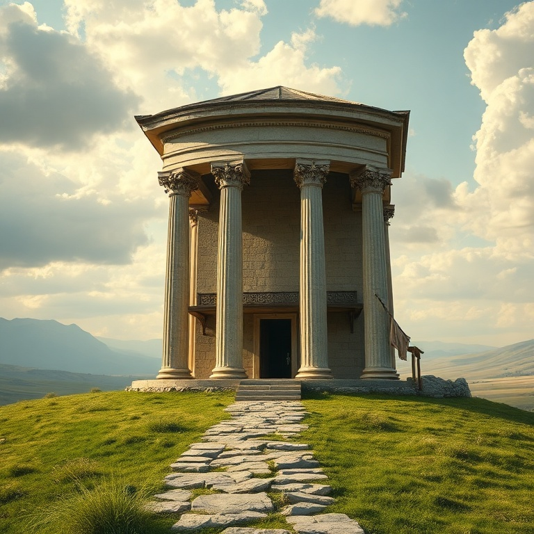
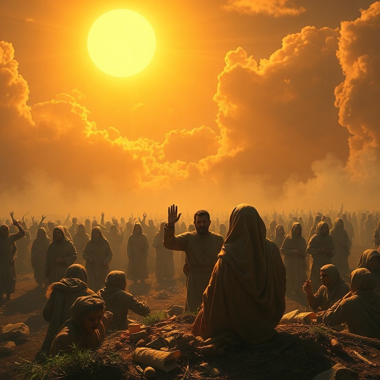
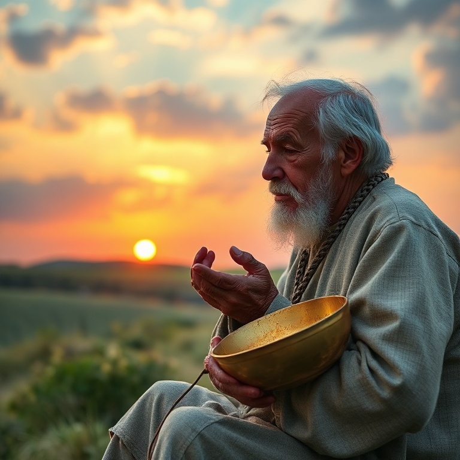

# Debaixo do Sol: Um Estudo em Eclesiastes

---

## Introdução

Eclesiastes é um dos livros mais intrigantes da Bíblia. Atribuído a Salomão, o rei que teve riqueza, sabedoria e prazer em abundância, o livro apresenta a reflexão de alguém que experimentou tudo que a vida debaixo do sol podia oferecer e concluiu que tudo é vaidade. A palavra hebraica *hevel*, repetida ao longo do texto, sugere não apenas futilidade, mas algo passageiro, efêmero, como um sopro.

O pregador, como se autodenomina o autor, conduz o leitor por uma jornada filosófica que questiona o sentido da vida, o valor do trabalho, a justiça e o propósito humano. Longe de ser um livro pessimista, Eclesiastes nos convida a reconhecer as limitações da existência humana e a encontrar alegria nos simples dons de Deus. O livro nos ensina a viver com os pés no chão, sabendo que a vida é breve e que devemos temer a Deus.

Neste estudo, exploraremos cinco temas centrais que percorrem o livro. Cada capítulo nos ajudará a compreender melhor a mensagem de Eclesiastes e a aplicá-la em nossa jornada de fé. Afinal, reconhecer que tudo é vaidade debaixo do sol nos leva a buscar aquilo que está acima do sol.

---

## Capítulo 1: A Vaidade da Vida

O livro começa com uma declaração poderosa: "Vaidade de vaidades, tudo é vaidade". Salomão observa o ciclo interminável da natureza — o sol nasce e se põe, os rios correm para o mar, mas o mar nunca se enche — e conclui que nada realmente muda. Há uma monotonia na existência que faz o pregador questionar: "O que é que o homem ganha com todo o seu trabalho?".

A busca por significado através das realizações humanas é um tema central neste capítulo. Salomão testou a sabedoria, o prazer, as obras grandiosas e as riquezas, e em cada uma encontrou vazio. Ele percebeu que o muito saber traz muito pesar, e que o conhecimento humano, por si só, não pode preencher o vazio existencial que carregamos. O problema não está nas coisas em si, mas em esperar que elas deem sentido à vida.

No entanto, a conclusão de Salomão não é um convite ao niilismo. Ao reconhecer a vaidade de tudo, ele nos prepara para buscar algo maior. A vida debaixo do sol é limitada, mas isso nos lembra que fomos feitos para algo além do sol. A insatisfação com as coisas terrenas aponta para nossa necessidade de Deus, que colocou a eternidade em nossos corações.

---

## Capítulo 2: O Tempo para Tudo

Um dos textos mais conhecidos de Eclesiastes é o poema do tempo em seu terceiro capítulo. "Tudo tem o seu tempo determinado, e há tempo para todo propósito debaixo do céu". Salomão lista catorze pares de opostos — nascer e morrer, plantar e arrancar, chorar e rir — mostrando que a vida é marcada por estações. Cada fase tem seu propósito, e Deus está no controle de todas elas.

O pregador observa que Deus fez tudo formoso em seu devido tempo, mas também nota que o homem não pode compreender plenamente as obras divinas. Há um mistério na soberania de Deus que nossa mente finita não pode abarcar. Isso nos chama à humildade e à confiança. Não podemos controlar o tempo, mas podemos confiar naquele que o criou.

A aplicação prática deste ensino é libertadora. Em vez de lutar contra as estações da vida, somos convidados a abraçá-las. Há tempo para trabalhar e tempo para descansar, tempo para falar e tempo para calar. A sabedoria está em discernir o tempo certo para cada coisa e viver cada momento com alegria e gratidão, reconhecendo que tudo vem das mãos de Deus.

---

## Capítulo 3: Sabedoria e Loucura

Salomão dedica boa parte de Eclesiastes a contrastar sabedoria e loucura. Ele reconhece que a sabedoria é melhor que a insensatez, assim como a luz é melhor que as trevas. O sábio vê onde pisa, enquanto o tolo tropeça na escuridão. No entanto, o pregador também observa que tanto o sábio quanto o tolo morrem, e ambos são esquecidos com o tempo. Essa constatação o leva a refletir sobre os limites da sabedoria humana.

A sabedoria que Salomão descreve não é meramente intelectual, mas prática e temerosa a Deus. Ele observa que a sabedoria pode proteger o sábio, mas não pode garantir imortalidade ou justiça perfeita neste mundo. O sábio pode ser ignorado, e o tolo pode ser exaltado. Há uma aparente injustiça na forma como a sabedoria é tratada na sociedade.

Apesar dessas limitações, Salomão não descarta a sabedoria. Pelo contrário, ele a recomenda como um bem precioso. A verdadeira sabedoria consiste em reconhecer nossas limitações e viver cada dia com temor de Deus. É melhor ouvir a repreensão do sábio do que a canção dos tolos. No final, a sabedoria que realmente importa é aquela que nos ensina a temer a Deus e a guardar seus mandamentos.

---

## Capítulo 4: As Injustiças da Vida

Eclesiastes não romantiza a vida. Salomão observa com olhos abertos as injustiças que permeiam a existência humana. Ele vê o justo que perece em sua justiça e o ímpio que vive muito em sua maldade. Vê lágrimas dos oprimidos sem consolo, poder nas mãos de opressores e o pobre sendo explorado. O pregador não oferece respostas fáceis para o problema do mal; ele simplesmente descreve a realidade como ela é.

O que fazer diante de tanta injustiça? Salomão sugere algumas atitudes sábias. Primeiro, não se indignar excessivamente, pois a indignação não muda a realidade e consome quem a alimenta. Segundo, lembrar que Deus julgará todas as obras, incluindo as ocultas. Terceiro, aproveitar os dias bons que Deus concede, reconhecendo que são dons, não direitos. A justiça plena pode não vir neste mundo, mas virá no juízo final.

Esta honestidade brutal sobre as injustiças da vida faz de Eclesiastes um livro profundamente pastoral. Ele não oferece respostas simplistas, mas valida nossa dor e nossa perplexidade. Ao mesmo tempo, nos aponta para a esperança de que Deus endireitará todas as coisas no tempo certo. Até lá, somos chamados a viver com integridade, confiando na justiça divina mesmo quando não a vemos.

---

## Capítulo 5: Lembra-te do Teu Criador

O capítulo final de Eclesiastes é um dos mais poéticos e comoventes da Bíblia. Salomão usa a alegoria do envelhecimento — os guardas da casa tremem, os fortes se curvam, as moageiras param, as janelas se escurecem — para descrever a fragilidade da vida humana. Em meio a essa realidade inevitável, o pregador faz um apelo urgente: "Lembra-te do teu Criador nos dias da tua mocidade".

O chamado para lembrar de Deus antes que venham os dias maus é uma exortação à prioridade espiritual. Salomão sabia que a juventude é tempo de vigor, mas também de tentações e distrações. Ele nos exorta a não adiar nosso compromisso com Deus. A velhice chega, e com ela as limitações físicas que nos lembram nossa mortalidade. Melhor é buscar a Deus enquanto podemos fazê-lo com todas as nossas forças.

A conclusão de Eclesiastes é direta e poderosa: "Teme a Deus e guarda os seus mandamentos, porque isto é todo o dever do homem". Depois de explorar todos os caminhos debaixo do sol, o pregador chega ao único destino que realmente importa. A vida pode ser cheia de mistérios, injustiças e vaidades, mas o temor de Deus dá sentido a tudo. Deus trará a juízo todas as obras, e esse é o fundamento da nossa esperança.

---

## Conclusão

Eclesiastes nos convida a uma honestidade radical sobre a vida. Não há promessas de prosperidade fácil ou de justiça imediata. O que o livro oferece é a liberdade de reconhecer nossas limitações e, paradoxalmente, encontrar sentido na simplicidade. Comer, beber e desfrutar do trabalho são dons de Deus para serem recebidos com gratidão.

Ao final da jornada, o pregador nos lembra que debaixo do sol tudo passa, mas acima do sol está aquele que dá significado a tudo. A verdadeira sabedoria não está em acumular riquezas ou fama, mas em temer a Deus e viver cada dia como presente. Que possamos aprender com Eclesiastes a viver com os olhos abertos para a realidade e o coração voltado para a eternidade.
