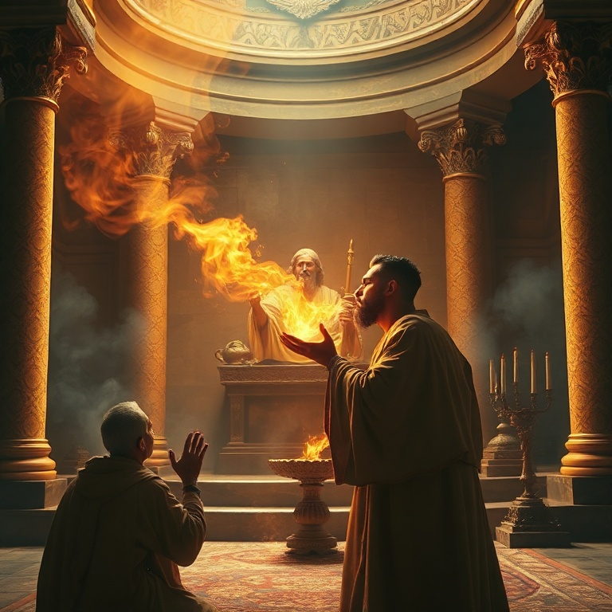
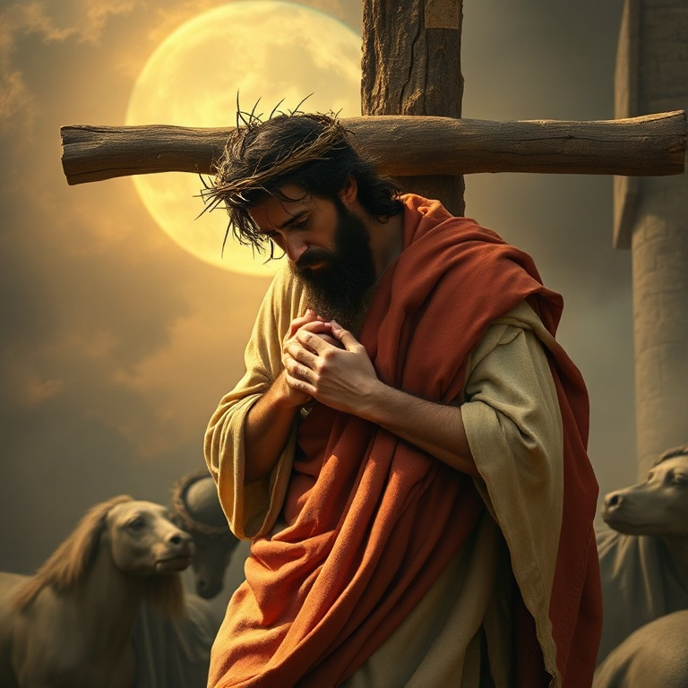

# Eis o Cordeiro: Um Estudo em Isaías

---

## Introdução

Isaías é um dos livros mais majestosos da Bíblia. Com 66 capítulos, ele abrange desde o julgamento iminente sobre Judá até a visão gloriosa de novos céus e nova terra. O profeta Isaías, filho de Amoz, ministrou durante os reinados de Uzias, Jotão, Acaz e Ezequias, em um período de grande turbulência política e espiritual. Sua mensagem combinava anúncios de juízo com promessas de restauração, sempre apontando para o reinado soberano de Deus sobre a história.

O livro é frequentemente dividido em duas grandes seções: Proto-Isaías (capítulos 1-39), que trata do julgamento de Judá e das nações, e Dêutero-Isaías (capítulos 40-66), que anuncia consolo, redenção e a glória futura de Sião. No centro de tudo está a figura do Messias, o Servo Sofredor, que levaria sobre si os pecados do povo. Isaías nos apresenta Jesus Cristo de forma tão clara que alguns chamam o livro de "o quinto evangelho".

Neste estudo, exploraremos cinco temas fundamentais que percorrem o livro de Isaías. Cada capítulo nos revela um aspecto diferente da grande narrativa da redenção, desde a santidade de Deus até a promessa de um novo céu e uma nova terra.

---

## Capítulo 1: A Visão de Isaías

O chamado de Isaías é um dos relatos mais impressionantes de toda a Escritura. No ano da morte do rei Uzias, Isaías viu o Senhor assentado sobre um alto e sublime trono, e a orla de suas vestes enchia o templo. Os serafins clamavam: "Santo, santo, santo é o Senhor dos Exércitos; toda a terra está cheia da sua glória". Diante dessa visão avassaladora, Isaías reconheceu sua condição: "Ai de mim, pois estou perdido! Porque sou homem de lábios impuros".

A resposta de Deus ao clamor de Isaías é reveladora. Um dos serafins voou até ele com uma brasa viva do altar e tocou seus lábios, purificando seu pecado. Então Isaías ouviu a voz do Senhor: "A quem enviarei, e quem há de ir por nós?" E o profeta respondeu: "Eis-me aqui, envia-me a mim". O chamado profético begin com uma visão da santidade de Deus, seguida pelo reconhecimento do pecado, a purificação divina e a comissão.

A visão de Isaías nos ensina que o verdadeiro ministério começa com uma experiência profunda da santidade de Deus. Antes de falar em nome de Deus, precisamos ser confrontados por sua glória e purificados por sua graça. Isaías foi enviado a um povo de coração endurecido, mas sua autoridade vinha do fato de que ele havia estado na presença do Rei dos reis.

---

## Capítulo 2: Julgamento e Esperança

Os primeiros 39 capítulos de Isaías são dominados por mensagens de julgamento. O profeta denuncia o pecado de Judá e Israel — a idolatria, a opressão dos pobres, a confiança em alianças políticas estrangeiras em vez de confiar em Deus. Ele anuncia que o povo escolhido seria levado ao cativeiro por sua rebelião. O julgamento de Deus é real e inevitável, pois ele é santo e não pode ignorar o pecado.

No entanto, mesmo nas mensagens mais severas de juízo, Isaías introduz notas de esperança. O conhecido oráculo do "Ramíssimo que sairá do tronco de Jessé" (capítulo 11) aponta para um rei vindouro que governará com justiça e retidão. A imagem do lobo que habitará com o cordeiro descreve um futuro de paz e restauração sob o governo do Messias.

O equilíbrio entre julgamento e esperança é característico de Isaías. Deus não julga por crueldade, mas para purificar e restaurar. O juízo é o caminho para a redenção. Isaías nos ensina que o Deus santo é também o Deus Salvador, e que seu amor disciplinar tem como objetivo final nos trazer de volta a ele.

---

## Capítulo 3: O Messias e o Reino

Isaías contém algumas das profecias messiânicas mais importantes do Antigo Testamento. Em Isaías 7, lemos sobre o sinal da virgem que conceberia e daria à luz um filho chamado Emanuel, "Deus conosco". Em Isaías 9, o profeta anuncia: "Porque um menino nos nasceu, um filho se nos deu; o governo está sobre os seus ombros; e o seu nome será Maravilhoso Conselheiro, Deus Forte, Pai da Eternidade, Príncipe da Paz".

O Messias descrito por Isaías é tanto humano quanto divino. Ele viria da linhagem de Davi, mas seu reinado seria eterno. Ele traria justiça aos pobres e oprimidos, e seu governo seria caracterizado pela paz e pela retidão. A expectativa messiânica em Isaías não é apenas política, mas profundamente espiritual: o Messias traria reconciliação entre Deus e a humanidade.

Estas profecias encontram seu cumprimento em Jesus Cristo, que é o Emanuel prometido, o Príncipe da Paz. Isaías prepara o caminho para o evangelho ao descrever um rei que não viria apenas para governar, mas para servir e salvar. A esperança messiânica de Isaías é a âncora da fé de todos os que aguardam a consumação do reino de Deus.

---

## Capítulo 4: O Servo Sofredor

O clímax teológico de Isaías está nos chamados Cânticos do Servo, especialmente no capítulo 53. Aqui, o profeta descreve o Servo do Senhor que seria "desprezado e rejeitado pelos homens, homem de dores e experimentado no sofrimento". Ele levaria sobre si as nossas enfermidades e sobre si carregaria as nossas dores. "Mas ele foi traspassado por nossas transgressões e esmagado por nossas iniquidades".

O Servo Sofredor é uma figura singular. Diferente dos reis conquistadores que Israel esperava, este Servo triunfaria através do sofrimento vicário. Ele morreria pelos pecados do povo, e por sua ferida seríamos curados. Isaías descreve sua morte e sepultamento, mas também profetiza sua vindicação: "Ele verá o fruto do trabalho de sua alma e ficará satisfeito".

O cumprimento desta profecia em Jesus Cristo é notável. Os evangelhos mostram que Jesus entendeu seu ministério à luz de Isaías 53. Ele veio não para ser servido, mas para servir e dar sua vida em resgate por muitos. O Servo Sofredor nos ensina que a maior vitória de Deus se dá através do sacrifício amoroso, não do poder político.

---

## Capítulo 5: Novos Céus e Nova Terra

Os últimos capítulos de Isaías (65-66) se elevam a alturas celestiais. O profeta contempla a criação de novos céus e nova terra, onde as coisas passadas não serão lembradas. Nessa nova criação, não haverá mais choro nem dor. O lobo e o cordeiro pastarão juntos, e a serpente se alimentará de pó. A paz será completa e universal.

Deus promete habitar com seu povo de forma permanente. Todas as nações virão adorar diante dele. A visão de Isaías transcende a restauração política de Israel e aponta para a redenção final de toda a criação. O projeto de Deus não é apenas salvar almas, mas renovar todas as coisas, restaurando o mundo à sua intenção original.

Esta visão escatológica é o fundamento da esperança cristã. Vivemos entre o já e o ainda não — o reino já foi inaugurado por Cristo, mas aguardamos sua consumação. Isaías nos convida a olhar para frente com esperança, sabendo que o Deus que criou os céus e a terra está fazendo todas as coisas novas. Maranata, ora vem, Senhor Jesus.

---

## Conclusão

Isaías é um livro de contrastes impressionantes: juízo e graça, trevas e luz, sofrimento e glória. Em cada página, vemos a santidade de Deus e seu amor redentor. O profeta nos apresenta Jesus Cristo de forma tão vívida que séculos antes de seu nascimento, já podíamos vê-lo como o Cordeiro de Deus que tira o pecado do mundo.

A mensagem de Isaías é tão relevante hoje quanto foi no século VIII a.C. Continuamos precisando ouvir que Deus é santo, que o pecado tem consequências, que há esperança para os arrependidos e que o reino de Deus virá em toda sua plenitude. Que possamos, como Isaías, responder ao chamado de Deus com um coração disposto: "Eis-me aqui, envia-me a mim".
