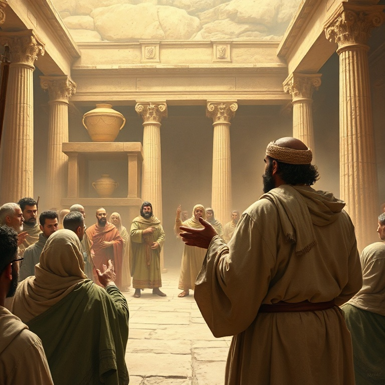

# Nova Aliança: Um Estudo em Jeremias

---

## Introdução

Jeremias é conhecido como o profeta chorão, e com razão. Durante mais de quarenta anos, ele ministrou em meio à decadência espiritual de Judá, testemunhando a destruição de Jerusalém e o exílio do povo. Sua mensagem era impopular — ele anunciava juízo quando todos queriam ouvir paz. Mas no coração de Jeremias havia um amor profundo por seu povo e uma fidelidade inabalável ao chamado de Deus.

O livro de Jeremias não segue uma ordem cronológica estrita. É uma coleção de profecias, narrativas biográficas, lamentos e símbolos proféticos. Apesar dessa diversidade, há um fio condutor que atravessa o livro: o Deus que julga seu povo por sua infidelidade, mas que também promete uma nova aliança escrita no coração. Jeremias olha para o desastre iminente e, paradoxalmente, para a esperança futura.

Neste estudo, examinaremos cinco aspectos centrais do ministério e da mensagem de Jeremias. Veremos o chamado do profeta, suas mensagens de julgamento, seu lamento pessoal, a promessa da nova aliança e a queda de Jerusalém. Em cada tema, descobriremos verdades que ainda ressoam em nossos dias.

---

## Capítulo 1: O Chamado de Jeremias

O chamado de Jeremias é marcado por uma revelação poderosa: "Antes que eu te formasse no ventre, te conheci; e antes que saísses da madre, te santifiquei e te constituí profeta às nações". Deus conhecia Jeremias antes mesmo de seu nascimento. O chamado profético não era uma opção de carreira, mas uma predestinação divina. A resposta de Jeremias foi de hesitação: "Ah, Senhor Deus, eis que não sei falar, porque ainda sou um menino".

Deus, porém, não aceitou a desculpa do profeta. Ele tocou a boca de Jeremias e pôs suas palavras na boca dele. A comissão foi clara: Jeremias seria posto sobre nações e reinos, para arrancar, derrubar, destruir, edificar e plantar. Havia um aspecto duplo em seu ministério — juízo e restauração. O profeta seria uma voz solitária em meio à corrupção generalizada.

O chamado de Jeremias nos ensina que Deus capacita aqueles a quem chama. Nossa insuficiência não é obstáculo para o propósito divino; pelo contrário, é o cenário onde o poder de Deus se aperfeiçoa. Jeremias foi fiel não por sua própria força, mas porque Deus estava com ele. A certeza da presença divina sustentou o profeta em meio a todas as dificuldades.

---

## Capítulo 2: Mensagens de Julgamento

A maior parte do ministério de Jeremias foi dedicada a anunciar o julgamento iminente sobre Judá. O pecado do povo era grave: idolatria generalizada, opressão dos pobres, confiança em alianças políticas estrangeiras e falsa segurança baseada na presença do templo. Jeremias denunciou a hipocrisia religiosa de forma contundente, declarando que o templo não era um amuleto de proteção.

O profeta usou diversos símbolos para comunicar sua mensagem. O cinto de linho apodrecido ilustrava como Judá se tornara inútil para Deus. O oleiro e o vaso de barro mostravam a soberania divina sobre as nações. O jugo de madeira e ferro simbolizava a submissão à Babilônia que Deus estava usando como instrumento de juízo. Cada símbolo tornava a mensagem concreta e inescapável.

O julgamento anunciado por Jeremias não era um fim em si mesmo. Deus disciplinava seu povo para trazê-lo de volta à aliança. O profeta constantemente oferecia a oportunidade de arrependimento. Mesmo nos momentos mais sombrios, havia uma porta aberta para o retorno. O juízo de Deus é sempre redentor em seu propósito, mesmo quando severo em sua execução.

---

## Capítulo 3: O Lamento do Profeta

Jeremias é conhecido como o profeta chorão, e seu livro contém alguns dos lamentos mais comoventes da Escritura. Ele chorou não apenas por seu próprio sofrimento — foi perseguido, preso, jogado numa cisterna e acusado de traição — mas principalmente pelo destino de seu povo. Suas lamentações revelam a profundidade de seu amor e sua identificação com o sofrimento alheio.

O profeta chegou a questionar Deus sobre a aparente prosperidade dos ímpios e o sofrimento dos justos. Em suas horas mais escuras, Jeremias amaldiçoou o dia de seu nascimento. Essa honestidade brutal na presença de Deus é uma das marcas de seu ministério. Ele não escondeu suas dúvidas, suas dores e suas lutas. Sua fé foi forjada no crisol do sofrimento.

O lamento de Jeremias nos ensina que a fé genuína não exige fingimento. Podemos levar nossas dores, dúvidas e frustrações a Deus. Ele é grande o suficiente para suportar nossas perguntas mais difíceis. Ao mesmo tempo, Jeremias não permaneceu em desespero. No meio de suas lamentações, ele encontrou esperança: "As misericórdias do Senhor são a causa de não sermos consumidos; as suas misericórdias não têm fim".

---

## Capítulo 4: A Nova Aliança

A profecia mais importante de Jeremias está no capítulo 31, onde Deus anuncia uma nova aliança com seu povo. Diferente da aliança feita no Sinai, que foi quebrada por Israel, esta nova aliança seria escrita no coração, não em tábuas de pedra. "Porei a minha lei no seu interior e a escreverei no seu coração. Eu serei o seu Deus, e eles serão o meu povo."

A novidade desta aliança é impressionante. O conhecimento de Deus não seria mais mediado por instituições externas, mas seria uma realidade interior e pessoal. O perdão dos pecados seria completo e definitivo: "Porque perdoarei a sua maldade e nunca mais me lembrarei dos seus pecados". A nova aliança seria caracterizada pela graça, transformação interior e relacionamento íntimo com Deus.

Jeremias apontou para algo que se cumpriria plenamente em Jesus Cristo. Na última ceia, Jesus tomou o cálice e disse: "Este cálice é a nova aliança no meu sangue, derramado em favor de vocês". A nova aliança prometida por Jeremias é a base do evangelho. Pela fé em Cristo, somos inseridos nessa aliança, recebendo perdão completo e um coração transformado pelo Espírito Santo.

---

## Capítulo 5: A Queda de Jerusalém

O livro de Jeremias culmina com o relato da queda de Jerusalém nas mãos dos babilônios em 586 a.C. Todas as advertências do profeta se cumpriram. O cerco foi longo e terrível, resultando em fome, destruição e morte. O templo de Salomão foi queimado, os muros da cidade foram derrubados, e o povo foi levado cativo para a Babilônia. Foi um dos dias mais sombrios da história de Israel.

Jeremias testemunhou tudo isso. Ele viu seus compatriotas morrerem à espada e à fome. Viu a cidade santa em ruínas. Mas em meio à destruição, o profeta fez algo notável: comprou um campo em Anatote, demonstrando sua fé na promessa de restauração de Deus. Enquanto todos vendiam suas propriedades, Jeremias investiu no futuro, crendo que Deus cumpriria sua palavra.

A queda de Jerusalém nos lembra que o pecado tem consequências reais e devastadoras. Mas também nos lembra que Deus é fiel à sua aliança. O exílio não foi o fim da história. Deus preservou um remanescente e, no tempo determinado, trouxe seu povo de volta. A esperança de Jeremias não estava nas circunstâncias, mas no caráter imutável de Deus.

---

## Conclusão

Jeremias nos apresenta um Deus que ama profundamente, mas que não ignora o pecado. O profeta chorou as lágrimas de Deus por um povo rebelde, mas também proclamou a esperança de uma nova aliança. Sua vida e mensagem nos desafiam a considerar a seriedade do pecado e a maravilha da graça divina.

A nova aliança prometida por Jeremias é hoje uma realidade para todos os que estão em Cristo. Temos a lei de Deus escrita em nossos corações pelo Espírito Santo. Temos perdão completo e gratuito. Temos um relacionamento pessoal e íntimo com o Deus vivo. Que possamos viver à altura desta aliança, amando a Deus e ao próximo com todo o coração.
