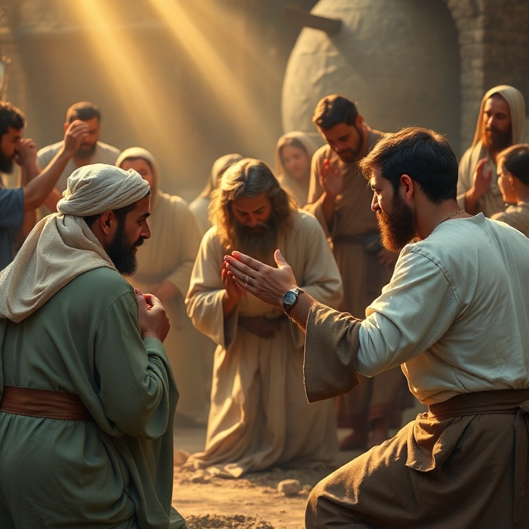

# Renascer das Cinzas: Um Estudo em Lamentações

---

## Introdução

Lamentações é um livro de poesia fúnebre, composto por cinco poemas que choram a destruição de Jerusalém em 586 a.C. Tradicionalmente atribuído a Jeremias, o livro expressa a dor de um povo que viu sua cidade santa reduzida a cinzas, seu templo queimado e seu povo levado ao exílio. Cada poema é uma elegia, um lamento coletivo que dá voz ao sofrimento de toda uma nação.

Mas Lamentações não é apenas um livro de tristeza. Em meio às lágrimas, há uma chama de esperança que não se apaga. O autor, conhecido como o Profeta Chorão, olha para as ruínas e ainda assim consegue declarar: "As misericórdias do Senhor são a causa de não sermos consumidos". O livro nos ensina que o lamento pode ser um ato de fé, e que a esperança pode brotar das cinzas.

Neste estudo, percorreremos os cinco poemas de Lamentações, cada um correspondendo a um capítulo do livro. Veremos a cidade desolada, a ira de Deus, a esperança na misericórdia, a confissão do pecado e o clamor por restauração. Em cada tema, descobriremos verdades sobre a dor, o arrependimento e a graça restauradora de Deus.

---

## Capítulo 1: A Cidade Desolada

O primeiro poema descreve Jerusalém como uma viúva solitária que perdeu seus filhos. A cidade que antes era cheia de povo agora está deserta. A que era grande entre as nações agora tornou-se tributária. O profeta personifica Jerusalém como uma mulher que chora amargamente durante a noite, sem ninguém para consolá-la. O contraste entre o passado glorioso e o presente sombrio é devastador.

O lamento descreve o caminho doloroso do exílio. Os sacerdotes gemem, as virgens estão aflitas, e a própria cidade estende as mãos sem encontrar socorro. Os adversários triunfam, e os santuários de Deus são profanados. Não há escape, não há alívio. A descrição é tão vívida que o leitor quase pode ouvir o choro e ver as lágrimas escorrendo pelas ruas empoeiradas.

Este poema nos ensina que o lamento tem um lugar legítimo na vida de fé. Não precisamos esconder nossa dor ou fingir que está tudo bem quando não está. Deus acolhe nosso choro e nossas perguntas mais difíceis. A cidade desolada nos lembra que o sofrimento é real, mas também que Deus está presente mesmo em meio às ruínas.

---

## Capítulo 2: A Ira de Deus

O segundo poema é o mais sombrio de Lamentações. Aqui, o profeta descreve a destruição como um ato direto de Deus. "O Senhor, na sua ira, cobriu de nuvens a filha de Sião". Deus é descrito como um guerreiro que peleja contra seu próprio povo. Ele derrubou as fortalezas, profanou o santuário, destruiu o altar e rejeitou o rei e o sacerdote. Não há pedra sobre pedra.

A linguagem é teologicamente carregada. O profeta não atribui a destruição ao acaso ou à força militar da Babilônia. Por trás do exército caldeu, ele vê a mão soberana de Deus executando juízo. O povo escolhido experimentou a ira divina por sua infidelidade à aliança. O templo, símbolo da presença de Deus, foi destruído porque o povo havia abandonado o Deus do templo.

Este capítulo nos confronta com a doutrina bíblica do juízo divino. Deus é santo e não pode ignorar o pecado. A ira de Deus não é um acesso de raiva descontrolada, mas sua resposta justa e santa à rebelião humana. Reconhecer a seriedade do juízo nos ajuda a compreender a profundidade da graça. Só podemos apreciar plenamente o evangelho quando entendemos o horror do pecado.

---

## Capítulo 3: Esperança na Misericórdia

O terceiro poema é o coração teológico de Lamentações. Após dois capítulos de lamento e juízo, o profeta faz uma pausa e declara sua esperança: "Quero trazer à memória o que me pode dar esperança. As misericórdias do Senhor são a causa de não sermos consumidos, porque as suas misericórdias não têm fim; renovam-se cada manhã. Grande é a tua fidelidade."

Esta declaração é notável pelo contexto. O profeta está sentado sobre as cinzas de Jerusalém, cercado por destruição e morte. Humanamente falando, não havia motivo para esperança. Mas ele escolheu lembrar-se do caráter de Deus. A salvação não vem das circunstâncias favoráveis, mas da fidelidade de Deus que se renova a cada manhã, independentemente do que vemos ao nosso redor.

O profeta extrai dessa confiança uma determinação renovada: "Bom é o Senhor para os que esperam por ele, para a alma que o busca". Ele reconhece que o sofrimento pode ser um instrumento pedagógico nas mãos de Deus. A esperança não elimina a dor, mas a coloca em perspectiva. Deus não nos abandonou; ele está trabalhando em meio ao nosso sofrimento para nos refinar e nos restaurar.

---

## Capítulo 4: O Pecado Confessado

O quarto poema retoma a descrição do cerco e da queda de Jerusalém, mas desta vez com um foco maior na confissão do pecado. O profeta contrasta a condição anterior do povo com sua situação atual. Os nobres que antes se vestiam de escarlate agora jazem em montes de lixo. As crianças pedem pão, e não há quem as alimente. O sofrimento é descrito em detalhes chocantes.

A causa de todo esse sofrimento é claramente identificada: "Maior é a iniquidade da filha do meu povo do que o pecado de Sodoma". Os líderes religiosos e políticos são particularmente culpados. Os profetas profetizavam mentiras, os sacerdotes praticavam violência, e o sangue dos justos foi derramado. O pecado não era apenas individual, mas sistêmico e institucional.

A confissão do pecado é o caminho para a restauração. Enquanto o povo negasse sua culpa, o juízo continuaria. Mas quando o pecado é trazido à luz e confessado, abre-se a porta para a misericórdia. Lamentações nos ensina que o arrependimento genuíno começa com o reconhecimento honesto de nossa condição diante de Deus.

---

## Capítulo 5: O Clamor por Restauração

O quinto e último poema é uma oração coletiva do povo que sobreviveu ao desastre. "Lembra-te, Senhor, do que nos tem sucedido; considera e olha para o nosso opróbrio". O povo reconhece que sua herança foi entregue a estrangeiros, suas casas a forasteiros. Há fome, humilhação e opressão. O jugo do exílio pesa sobre seus ombros, e eles clamam por libertação.

O poema termina com uma pergunta angustiante: "Por que te esquecerias de nós para sempre?" e um apelo final: "Converte-nos a ti, Senhor, e seremos convertidos; renova os nossos dias como dantes". O livro não oferece uma resposta fácil. Termina em suspense, com o povo ainda no exílio, mas confiante de que Deus ouve o clamor de seus filhos.

O clamor por restauração é o grito de todo coração que experimentou a disciplina de Deus e anseia por sua graça. Lamentações nos ensina que a esperança cristã não é otimismo superficial, mas confiança radical no Deus que ressuscita os mortos e faz brotar vida das cinzas. O choro pode durar uma noite, mas a alegria vem pela manhã.

---

## Conclusão

Lamentações é um livro surpreendente. Em meio ao lamento mais profundo, encontramos algumas das declarações mais belas sobre a fidelidade de Deus em toda a Escritura. O profeta não negou a dor, não minimizou o pecado e não fingiu que estava tudo bem. Mas ele escolheu esperar em Deus.

Este livro nos ensina que o lamento é uma forma legítima de oração. Podemos levar a Deus nossas perguntas mais difíceis e nossas dores mais profundas. E, ao fazê-lo, descobrimos que ele está conosco nas ruínas. As misericórdias do Senhor se renovam a cada manhã, e a esperança renasce das cinzas.
