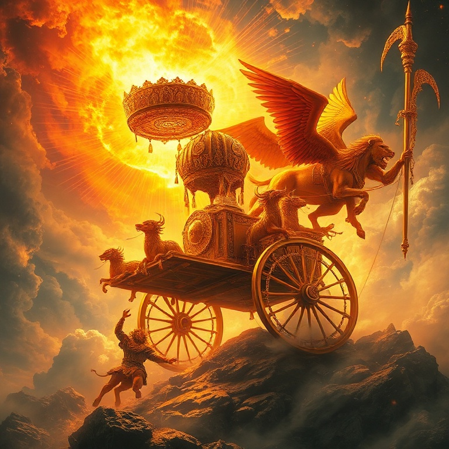
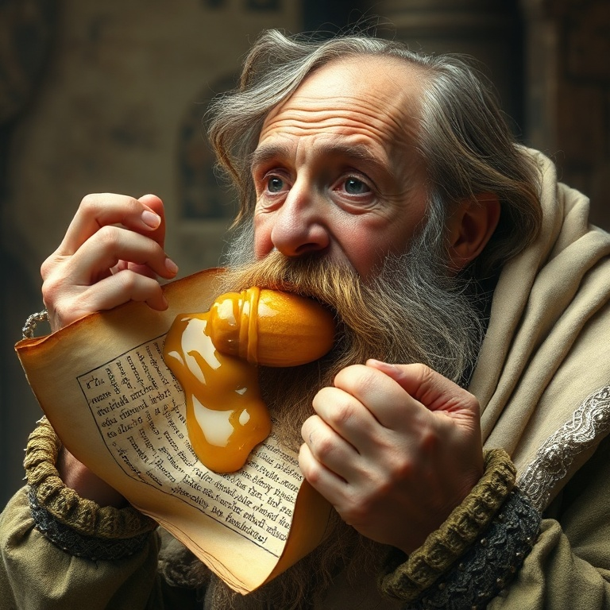
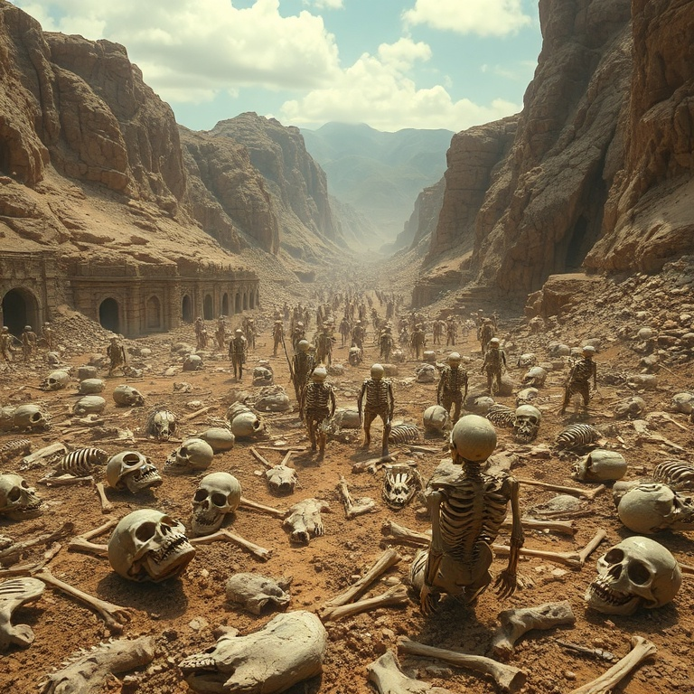
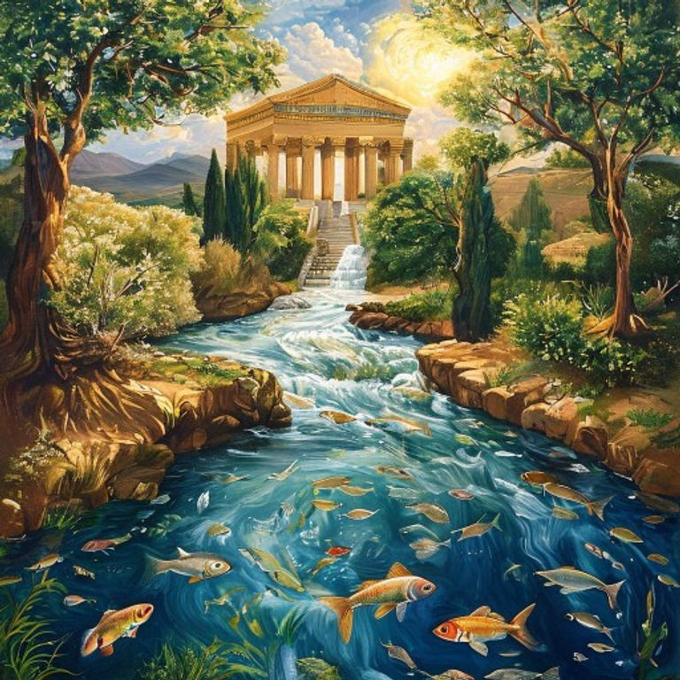

# Vale de Ossos Secos: Um Estudo em Ezequiel

---

## Introdução

Ezequiel é um dos livros mais visionários e complexos da Bíblia. O profeta, que foi levado cativo para a Babilônia junto com Joaquim em 597 a.C., ministrou aos exilados às margens do rio Quebar. Sua mensagem combinava denúncias severas contra o pecado de Israel com visões gloriosas da restauração futura. Ezequiel era ao mesmo tempo sentinela e pastor, anunciando juízo e esperança.

O livro se caracteriza por suas visões elaboradas e ações simbólicas. Ezequiel jejuou, deitou-se sobre um lado por meses, comeu pão assado sobre esterco e cavou um buraco no muro — cada ação era uma mensagem viva para o povo. Sua visão do vale de ossos secos é uma das passagens mais poderosas de toda a Escritura, demonstrando o poder de Deus para trazer vida onde só há morte.

Neste estudo, exploraremos cinco temas centrais do livro de Ezequiel: a visão da glória de Deus, o julgamento de Israel, o julgamento das nações, o vale de ossos secos e a visão do novo templo. Cada tema revela um aspecto da santidade de Deus e de seu plano redentor para o mundo.

---

## Capítulo 1: A Visão da Glória de Deus

O livro de Ezequiel começa com uma visão avassaladora da glória de Deus. O profeta viu um vento tempestuoso vindo do norte, uma grande nuvem com fogo envolvido, e no meio do fogo algo como metal brilhante. Quatro seres viventes — cada um com quatro faces e quatro asas — moviam-se como relâmpagos, conduzindo rodas dentro de rodas cheias de olhos. Acima de tudo, havia um trono de safira.

Sobre o trono estava uma figura com aparência de homem, radiante como fogo e cercada por um arco-íris. Era a glória do Senhor. Ezequiel caiu com o rosto em terra, completamente dominado pela majestade divina. Esta visão estabeleceu o fundamento de todo o seu ministério: antes de tudo, Ezequiel precisava conhecer a glória de Deus.

A visão nos ensina que Deus é transcendente e santo, mas também se revela ao seu povo. As rodas dentro de rodas simbolizam a onipresença divina — Deus não está confinado ao templo em Jerusalém, mas está presente mesmo na Babilônia. Os olhos nas rodas falam da onisciência de Deus, que tudo vê e tudo sabe. A glória de Deus é o tema central de Ezequiel.

---

## Capítulo 2: O Julgamento de Israel

Grande parte do livro de Ezequiel é dedicada ao julgamento de Israel. O profeta denunciou a idolatria, a violência, a opressão dos pobres e a profanação do sábado. Ele descreveu Jerusalém como uma esposa infiel que se prostituiu com outros deuses. O pecado de Israel não era apenas uma falha ética, mas uma traição à aliança com Deus.

O julgamento é descrito em termos terríveis. A glória de Deus se retira do templo gradualmente — primeiro da porta, depois do meio da cidade, e finalmente para o monte das Oliveiras. Deus abandona seu santuário porque o povo o abandonou primeiro. Esta é uma das imagens mais tristes de toda a Escritura: a presença de Deus deixando seu povo.

Mesmo no julgamento, porém, há esperança. Deus promete reunir seu povo disperso entre as nações, dar-lhes um coração novo e um espírito novo, e fazer com que andem em seus estatutos. O julgamento não é o fim; é o meio pelo qual Deus purifica seu povo para restaurá-lo. A disciplina divina é sempre redentora.

---

## Capítulo 3: Julgamento das Nações

Ezequiel também profetizou contra as nações vizinhas que se alegraram com a queda de Israel. Amom, Moabe, Edom, Filístia, Tiro, Sidom e Egito — todas receberam oráculos de juízo. Estas nações eram culpadas de orgulho, crueldade e de se aproveitarem da desgraça do povo de Deus. O juízo divino não se limitava a Israel; Deus é o Senhor de todas as nações.

O julgamento sobre Tiro é particularmente detalhado. O profeta descreve a queda do rei de Tiro em linguagem que ecoa a queda de Satanás. Tiro, com sua riqueza e comércio, confiava em sua própria sabedoria e poder. Mas Deus derrubaria os orgulhosos para que todos soubessem que ele é o Senhor.

As profecias contra as nações nos lembram que Deus é o juiz de toda a terra. Ele não apenas disciplina seu povo, mas também julga os ímpios. A história não está fora de controle; Deus está trabalhando seu plano redentor em meio ao juízo das nações. No final, todo joelho se dobrará e toda língua confessará que Jesus Cristo é o Senhor.

---

## Capítulo 4: Vale de Ossos Secos

O capítulo 37 de Ezequiel contém uma das visões mais poderosas de toda a Bíblia. O profeta é levado pelo Espírito a um vale cheio de ossos secos e espalhados. Deus pergunta: "Filho do homem, poderão viver estes ossos?" Ezequiel responde com sabedoria: "Senhor Deus, tu o sabes". O profeta reconhece seus limites e coloca a questão nas mãos de Deus.

Deus ordena que Ezequiel profetize aos ossos. Enquanto ele profetiza, ouve-se um ruído, e os ossos se juntam, tendões e carne os cobrem, e a pele os reveste. Mas ainda não há vida. Então Deus ordena que o profeta clame pelo Espírito. O vento sopra, e os ossos secos se tornam um exército vivo. O que era morte se transforma em vida pela palavra e pelo Espírito de Deus.

Esta visão é uma promessa de restauração para Israel no exílio, mas também aponta para a ressurreição futura e para o poder transformador do evangelho. O vale de ossos secos representa a condição espiritual de toda a humanidade sem Deus — morta em pecados. Mas o Espírito de Deus pode trazer vida onde há morte. Onde a palavra de Deus é proclamada e o Espírito sopra, a vida acontece.

---

## Capítulo 5: O Novo Templo e a Restauração

Os últimos nove capítulos de Ezequiel descrevem uma visão detalhada de um novo templo e de uma nova terra. O profeta é levado a uma alta montanha, onde um anjo mede o templo com uma cana de medir. As medidas são simbólicas, apontando para a perfeição e a santidade do novo santuário de Deus. Mais importante que a arquitetura é o que acontece no templo: a glória de Deus retorna.

A visão culmina com um rio que sai do templo e flui para o leste, crescendo de água no tornozelo até água para nadar. Onde o rio passa, a vida floresce. Árvores frutíferas crescem em suas margens, dando frutos mensalmente e folhas para cura. Até o Mar Morto é curado por este rio. A presença de Deus traz vida e restauração a toda a criação.

A visão do novo templo aponta para a presença permanente de Deus com seu povo na nova criação. Em Cristo, somos o templo do Espírito Santo. No fim dos tempos, a glória de Deus encherá toda a terra, e não haverá mais necessidade de templo porque o próprio Deus habitará conosco. Ezequiel nos dá um vislumbre da glória que nos aguarda.

---

## Conclusão

Ezequiel nos apresenta um Deus de glória incomparável, justiça inflexível e graça restauradora. O profeta viu a glória de Deus partir do templo, mas também a viu retornar. Ele anunciou juízo, mas também proclamou esperança. O vale de ossos secos se tornou um exército vivo porque o Espírito de Deus sopra onde quer.

A mensagem de Ezequiel ecoa através dos séculos: Deus pode trazer vida onde há morte. Ele pode restaurar o que está quebrado e reconstruir o que foi destruído. Para todos os que se sentem como ossos secos em um vale árido, a palavra de Ezequiel é uma promessa: o Espírito de Deus está soprando, e a vida está chegando.
