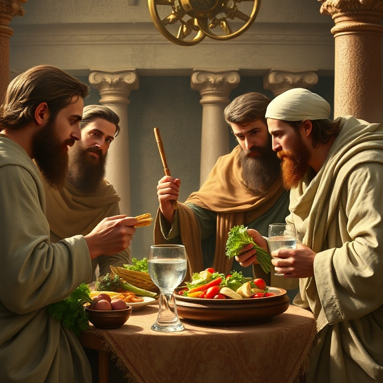
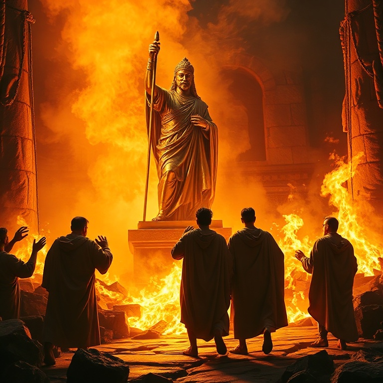
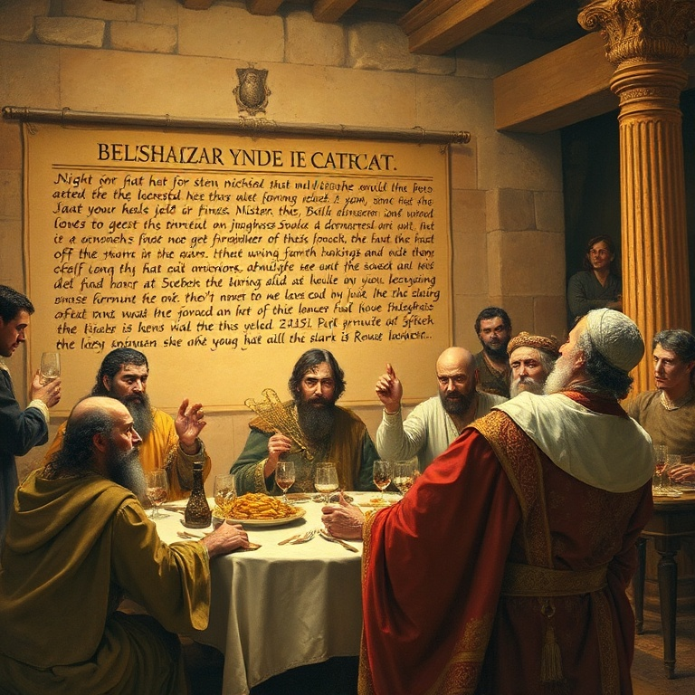
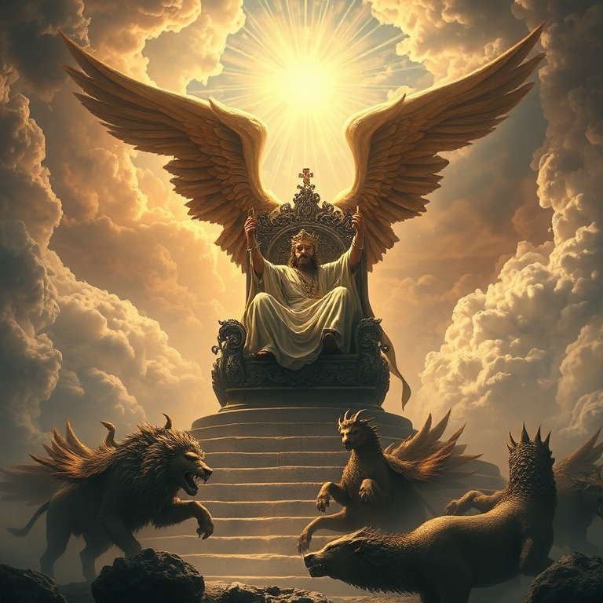
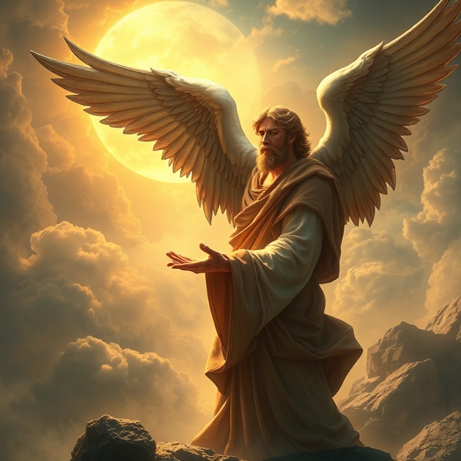

# O Reino Eterno: Um Estudo em Daniel

---

## Introdução

O livro de Daniel é uma das obras mais fascinantes do Antigo Testamento. Dividido entre narrativas históricas e visões apocalípticas, o livro nos apresenta um jovem judeu levado cativo para a Babilônia que se torna um dos principais conselheiros do império mais poderoso de seu tempo. Daniel viveu no centro do poder mundial, mas manteve sua fidelidade a Deus em meio a todas as tentações e pressões.

A mensagem central de Daniel é clara: Deus é soberano sobre todos os reinos da terra. Os impérios humanos se levantam e caem, mas o reino de Deus é eterno. Em cada narrativa — a fornalha de fogo, o banquete de Belsazar, a cova dos leões — vemos que Deus está no controle da história. Nenhum decreto humano pode frustrar seus propósitos.

Neste estudo, exploraremos cinco momentos-chave do livro de Daniel. Veremos Daniel na corte babilônica, o sonho de Nabucodonosor, a fornalha de fogo, a queda de Belsazar e as visões apocalípticas. Em cada um, descobriremos verdades sobre a soberania de Deus e o triunfo final do seu reino.

---

## Capítulo 1: Daniel na Corte da Babilônia

O livro começa com a deportação de jovens judeus para a Babilônia. Entre eles estavam Daniel, Hananias, Misael e Azarias. O rei Nabucodonosor ordenou que fossem ensinados na língua e na cultura dos caldeus, recebendo comida da mesa real. O objetivo era claro: absorver aqueles jovens no sistema imperial, apagando sua identidade israelita.

Daniel resolveu não se contaminar com a comida do rei. Ele propôs ao chefe dos eunucos um teste: durante dez dias, ele e seus amigos comeriam apenas legumes e beberiam água. No final do período, sua aparência era melhor que a dos outros jovens. Deus honrou a fidelidade de Daniel, dando-lhe sabedoria e entendimento superiores.

Esta história nos ensina que a fidelidade a Deus começa em pequenas escolhas. Daniel não esperou uma grande crise para demonstrar sua lealdade; ele foi fiel na questão da comida. A sabedoria e a posição que ele alcançou foram consequências de sua integridade. Deus exalta aqueles que o honram nas pequenas coisas.

---

## Capítulo 2: O Sonho de Nabucodonosor

No segundo ano de seu reinado, Nabucodonosor teve um sonho perturbador. Convocou todos os sábios da Babilônia para interpretá-lo, mas exigiu que primeiro lhe dissessem o conteúdo do sonho. Ninguém podia fazê-lo, e o rei decretou a morte de todos os sábios. Daniel e seus amigos oraram, e Deus revelou a Daniel o segredo do sonho.

O sonho era de uma grande estátua com cabeça de ouro, peito e braços de prata, ventre e coxas de bronze, pernas de ferro e pés de ferro misturado com barro. Uma pedra cortada sem mãos atingiu a estátua e a despedaçou, tornando-se uma grande montanha que encheu toda a terra. Daniel interpretou: a estátua representava impérios sucessivos — Babilônia, Medo-Pérsia, Grécia e Roma — e a pedra era o reino eterno de Deus.

A interpretação de Daniel revela que Deus está no controle da história. Os impérios humanos são passageiros, mas o reino de Deus é eterno. Nabucodonosor reconheceu que o Deus de Daniel é "o Deus dos deuses e o Senhor dos reis". A soberania divina sobre as nações é o fundamento da esperança de Daniel e de todo o povo de Deus.

---

## Capítulo 3: A Fornalha de Fogo

Nabucodonosor ergueu uma estátua de ouro e ordenou que todos se prostrassem diante dela. Os três amigos de Daniel — Sadraque, Mesaque e Abedenego — recusaram-se a adorar a imagem. O rei, irado, mandou aquecer a fornalha sete vezes mais e ordenou que os jovens fossem lançados nela. A pressão para se conformar era imensa, mas eles permaneceram firmes.

A resposta dos três jovens ao rei é um modelo de fé: "Se o nosso Deus a quem servimos pode nos livrar da fornalha de fogo ardente, ele nos livrará, ó rei. Mas, se não, fica sabendo, ó rei, que não serviremos a teus deuses nem adoraremos a estátua de ouro que levantaste". Eles não exigiam que Deus os livrasse; estavam dispostos a morrer por sua fé.

Deus honrou sua fidelidade de forma espetacular. Uma quarta pessoa, com aparência de um filho dos deuses, apareceu com eles na fornalha. O fogo não queimou seus corpos nem seus cabelos, e nem cheiro de fumaça havia neles. Nabucodonosor reconheceu o poder do Deus Altíssimo. Esta história nos lembra que Deus está conosco no fogo, e sua presença é suficiente.

---

## Capítulo 4: A Queda de Belsazar

Anos se passaram, e Nabucodonosor foi sucedido por Belsazar, seu neto. Em uma grande festa, Belsazar trouxe os vasos de ouro do templo de Jerusalém e bebeu vinho neles, louvando deuses de ouro, prata, bronze, ferro, madeira e pedra. Na mesma hora, apareceram dedos de mão humana escrevendo na parede. O rei ficou aterrorizado.

Daniel foi chamado para interpretar a escrita. Ele leu as palavras: "Mene, Mene, Tequel, Parsim". A interpretação era um veredito de juízo: Deus havia contado os dias do reino de Belsazar e posto fim a ele; o rei havia sido pesado na balança e achado em falta; seu reino seria dividido entre medos e persas. Naquela mesma noite, Belsazar foi morto.

A queda de Belsazar nos ensina que o orgulho e a profanação do sagrado não ficam sem resposta. Deus exalta os humildes e abate os soberbos. A mão que escreveu na parede nos lembra que Deus está avaliando nossas vidas. Somos pesados em sua balança. A pergunta que fica é: seremos achados em falta ou seremos encontrados em Cristo?

---

## Capítulo 5: As Visões Apocalípticas

A segunda metade do livro de Daniel contém quatro visões apocalípticas que traçam o curso da história desde o tempo de Daniel até o fim dos tempos. Os capítulos 7 e 8 descrevem quatro bestas que representam impérios sucessivos, culminando no Filho do Homem que recebe domínio eterno. O capítulo 9 contém a profecia das setenta semanas, apontando para a vinda do Messias.

Os capítulos 10-12 oferecem uma visão detalhada dos conflitos entre o norte e o sul (Selêucidas e Ptolemeus), culminando na abominação desoladora e na ressurreição final. Daniel é informado de que estas palavras estão seladas até o tempo do fim. Ele não compreende tudo, mas confia no Deus que conhece o fim desde o princípio.

As visões de Daniel apontam para Jesus Cristo, o Filho do Homem que recebeu domínio eterno. Elas nos asseguram que, apesar dos conflitos e tribulações deste mundo, Deus está no controle. Os justos ressuscitarão para a vida eterna, e os sábios brilharão como o firmamento. O reino eterno de Deus triunfará sobre todos os reinos humanos.

---

## Conclusão

Daniel nos apresenta uma visão majestosa da soberania de Deus sobre a história. Em meio ao exílio e à opressão, o profeta manteve sua fé inabalável. Ele serviu a reis pagãos com integridade, mas nunca comprometeu sua lealdade a Deus. Sua vida e suas visões nos apontam para o Rei dos reis, cujo reino é eterno.

O livro de Daniel nos desafia a viver com coragem em meio a um mundo que muitas vezes se opõe a Deus. Somos chamados a ser fiéis nas pequenas escolhas, a não nos curvar diante dos ídolos do poder, a confiar que Deus está no controle. O reino eterno está vindo, e aqueles que forem achados fiéis reinarão com Cristo para sempre.
