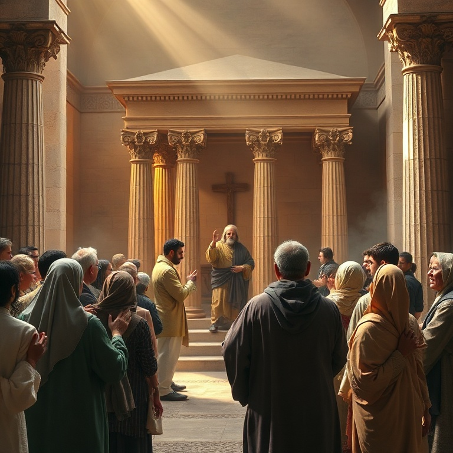

# Derramarei do Meu Espírito: Um Estudo em Joel

---

## Introdução

O livro de Joel é curto, mas sua mensagem é poderosa e seu impacto teológico é imenso. O profeta Joel, filho de Petuel, escreveu em um contexto de crise nacional: uma praga devastadora de gafanhotos havia destruído todas as colheitas, mergulhando Judá em fome e desespero. Mas por trás dessa catástrofe natural, Joel enxergava um julgamento divino e um chamado ao arrependimento.

O livro se estrutura em torno de dois grandes temas: o Dia do Senhor como juízo iminente e a promessa do derramamento do Espírito Santo sobre toda a carne. Joel é o profeta do Pentecostes. Foi sua profecia que Pedro citou no dia em que a igreja nasceu, quando o Espírito Santo desceu sobre os discípulos em línguas de fogo. Joel conecta juízo e bênção, arrependimento e restauração.

Neste estudo, exploraremos cinco temas centrais do livro de Joel: a praga dos gafanhotos, o Dia do Senhor, o chamado ao arrependimento, a promessa do Espírito e o julgamento das nações. Em cada um, veremos como Deus usa a crise para chamar seu povo de volta a si e para derramar sua graça.

---

## Capítulo 1: A Praga dos Gafanhotos

Joel começa com uma descrição vívida de uma praga de gafanhotos que devastou a terra de Judá. O profeta descreve quatro estágios da praga: o gafanhoto cortador, o gafanhoto migrador, o gafanhoto devorador e o gafanhoto destruidor. Eles vieram como um exército organizado, transformando o jardim do Éden em um deserto desolado. Não sobrou videira, figueira, trigo ou cevada.

As consequências foram terríveis. Os sacerdotes choravam porque não havia ofertas para a casa do Senhor. Os lavradores se lamentavam porque a colheita estava perdida. Os animais do campo gemiam porque as pastagens estavam secas. A terra toda estava de luto. Joel usa esta crise concreta para despertar o povo de sua letargia espiritual.

A praga dos gafanhotos nos lembra que Deus pode usar eventos naturais para chamar nossa atenção. Muitas vezes, só acordamos para nossa necessidade de Deus quando as circunstâncias nos forçam a isso. A crise pode ser o instrumento que Deus usa para nos trazer de volta a ele. A pergunta é: responderemos com murmuração ou com arrependimento?

---

## Capítulo 2: O Dia do Senhor

Joel expande a imagem da praga dos gafanhotos para descrever o Dia do Senhor — um tema central em sua profecia. O Dia do Senhor é um tempo de juízo divino, descrito como "grande e terrível". É um dia de trevas e escuridão, de nuvens e sombras espessas. Um exército poderoso, como nunca houve nem haverá, avança sob o comando de Deus.

A descrição do exército é apocalíptica. Eles correm como valentes, sobem os muros como soldados, marcham em ordem sem quebrar fileiras. Diante deles a terra treme e os céus se abalam. O sol e a lua escurecem, e as estrelas retiram seu brilho. O Senhor faz ouvir sua voz diante de seu exército, porque grande é o seu acampamento.

O Dia do Senhor não é apenas uma realidade futura; Joel o apresenta como iminente para Judá. O juízo de Deus é real e próximo. No entanto, mesmo nesta passagem de juízo, Joel introduz uma nota de esperança: "Ainda assim, convertei-vos a mim de todo o vosso coração". O Dia do Senhor é terrível, mas há tempo para se arrepender.

---

## Capítulo 3: O Chamado ao Arrependimento

No centro do livro de Joel está um chamado urgente ao arrependimento. "Ainda assim, agora mesmo diz o Senhor: Convertei-vos a mim de todo o vosso coração, com jejuns, com choro e com pranto". O profeta não pede apenas um arrependimento superficial, mas uma transformação radical que envolve o coração inteiro. Rasgar o coração, não as vestes.

O arrependimento que Joel prega é acompanhado de ações concretas. Ele convoca uma assembleia solene, reunindo anciãos, crianças, noivos e sacerdotes. Todos devem clamar ao Senhor. O profeta pede que os sacerdotes chorem entre o pórtico e o altar, intercedendo pelo povo: "Poupa o teu povo, Senhor, e não entregues a tua herança ao opróbrio".

Deus responde ao arrependimento com compaixão. "Então o Senhor se mostrou zeloso da sua terra e se compadeceu do seu povo". Ele promete restaurar os anos que os gafanhotos consumiram. O arrependimento genuíno abre a porta para a bênção de Deus. Joel nos ensina que nunca é tarde para voltar para Deus. Sua graça é maior que nosso pecado.

---

## Capítulo 4: A Promessa do Espírito

A profecia mais conhecida de Joel está no capítulo 2, versículos 28-32: "E acontecerá, depois disso, que derramarei do meu Espírito sobre toda a carne. Vossos filhos e vossas filhas profetizarão, vossos jovens terão visões, e vossos velhos sonharão sonhos". Esta promessa revolucionária anunciava que o Espírito de Deus não seria mais limitado a profetas e líderes, mas seria derramado sobre todo o povo de Deus.

A promessa do Espírito quebra barreiras de idade, gênero e classe social. Filhos e filhas profetizam. Servos e servas recebem o Espírito. O acesso a Deus e aos dons espirituais é democratizado. Joel aponta para uma nova era na história da redenção, onde Deus habitaria em seu povo por meio do Espírito Santo.

Esta profecia se cumpriu no dia de Pentecostes, quando Pedro citou Joel para explicar o que estava acontecendo. O derramamento do Espírito marca o início da era da igreja. Hoje, todo crente em Cristo tem o Espírito Santo habitando em si. Somos templos do Deus vivo, capacitados para viver e testemunhar.

---

## Capítulo 5: O Julgamento das Nações

O livro de Joel termina com um oráculo de julgamento sobre as nações que oprimiram Israel. Deus convoca todas as nações para o vale de Josafá, onde serão julgadas por sua hostilidade contra o povo de Deus. Tiro, Sidom e Filístia são mencionadas por terem vendido os filhos de Judá como escravos aos gregos.

O julgamento das nações é descrito como uma colheita. "Lançai a foice, porque já a colheita está madura; vinde, descei, porque o lagar está cheio". A imagem agrícola aponta para a separação final entre justos e ímpios. As nações que se levantaram contra Deus e seu povo serão julgadas com justiça.

Em contraste, Judá e Jerusalém serão habitação de Deus para sempre. O Senhor habitará em Sião, e Jerusalém será santa. Os estrangeiros não passarão mais por ela. O livro termina com uma nota de bênção e segurança para o povo de Deus. O juízo das nações resulta na vindicação e na paz do povo redimido.

---

## Conclusão

Joel é um livro de contrastes poderosos: juízo e misericórdia, crise e esperança, gafanhotos e Espírito. O profeta nos mostra que Deus usa as crises para nos chamar de volta a ele, e que sua maior dádiva é o derramamento do Espírito Santo sobre toda a carne.

A promessa de Joel não se esgotou no Pentecostes. O Espírito Santo continua sendo derramado sobre a igreja, capacitando-nos para viver e testemunhar. Vivemos no tempo entre o primeiro e o segundo advento, aguardando o grande e terrível Dia do Senhor. Até lá, somos chamados ao arrependimento, à santidade e à plenitude do Espírito.
