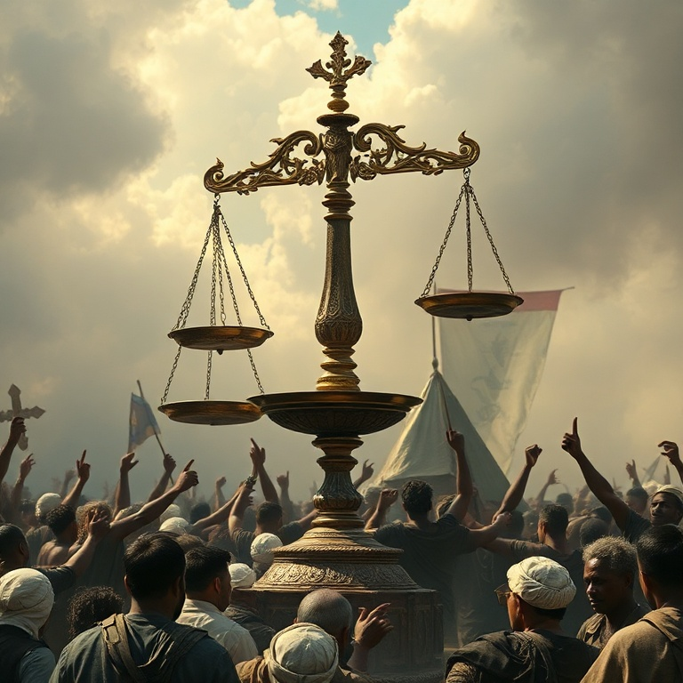

# Corra a Justiça: Um Estudo em Amós

---

## Introdução

Amós é um dos profetas mais impactantes do Antigo Testamento. Diferente dos profetas urbanos e instruídos, Amós era um pastor de ovelhas e cultivador de sicômoros de Tecoa, uma pequena cidade em Judá. Deus o chamou das pastagens para profetizar ao reino do norte, Israel, durante o reinado de Jeroboão II. Ele não tinha credenciais religiosas, mas tinha uma mensagem direta de Deus.

O contexto do ministério de Amós era de prosperidade material e decadência espiritual. Israel experimentava paz e riqueza, mas os ricos oprimiam os pobres, a justiça era pervertida nos tribunais e a adoração era hipócrita. Amós denunciou tudo isso sem medo, chamando o povo de volta à retidão e anunciando o juízo iminente de Deus.

Neste estudo, exploraremos cinco temas centrais do livro de Amós: o pastor chamado por Deus, o julgamento sobre as nações, o julgamento sobre Israel, a justiça que Deus requer e a restauração final. Em cada tema, veremos que Deus se importa profundamente com a justiça social e a pureza do coração.

---

## Capítulo 1: O Pastor Chamado por Deus

Amós começa seu livro declarando sua origem humilde: "Eu não era profeta, nem filho de profeta, mas boieiro e cultivador de sicômoros. Mas o Senhor me tirou de após o gado e me disse: Vai, profetiza ao meu povo Israel". Deus não chamou um homem treinado nas escolas de profetas; chamou um pastor simples para entregar sua mensagem ao reino do norte.

O chamado de Amós nos ensina que Deus não se limita por nossas credenciais. Ele capacita quem ele chama. Amós não tinha eloquência humana, mas tinha autoridade divina. Sua mensagem veio diretamente de Deus, e isso era suficiente. O poder do ministério não está no mensageiro, mas na mensagem.

A resposta de Amazias, o sacerdote de Betel, à profecia de Amós revela a oposição que o profeta enfrentou. Amazias acusou Amós de conspiração e o ordenou que voltasse para Judá. Mas Amós não se intimidou. Ele havia sido chamado por Deus, e nem mesmo a hostilidade do sacerdote poderia silenciá-lo. A coragem de Amós é um exemplo para todos os que são chamados a falar a verdade.

---

## Capítulo 2: Julgamento sobre as Nações

Amós começa sua série de oráculos de julgamento contra as nações vizinhas de Israel: Damasco (Síria), Gaza (Filístia), Tiro, Edom, Amom e Moabe. Cada oráculo segue um padrão: "Por três transgressões e por quatro, não retirarei o castigo". A repetição cria expectativa no ouvinte, que provavelmente aplaudia o julgamento sobre os inimigos de Israel.

Os pecados das nações eram principalmente crimes contra a humanidade — crueldade, escravidão, violação de tratados. Damasco havia trilhado Gileade com trilhos de ferro. Gaza havia levado cativo um povo inteiro. Edom perseguiu seu irmão com a espada. Deus julga as nações não apenas por pecados religiosos, mas por sua desumanidade.

Estes oráculos nos lembram que Deus é o Senhor de todas as nações, não apenas de Israel. Ele estabelece padrões de justiça para toda a humanidade. A crueldade, a opressão e a violência são pecados contra o próprio Deus, independentemente de quem os comete. Deus defende os oprimidos e julga os opressores.

---

## Capítulo 3: Julgamento sobre Israel

Depois de julgar as nações, Amós volta sua atenção para Israel. As mesmas palavras "Por três transgressões e por quatro, não retirarei o castigo" são agora dirigidas ao povo de Deus. Israel é julgado com mais severidade que as nações, porque teve mais privilégio. "A vós somente conheci de todas as famílias da terra; por isso vos punirei por todas as vossas iniquidades".

Os pecados de Israel são denunciados em detalhes chocantes. Vendiam o justo por prata e o pobre por um par de sapatos. Oprimiam os necessitados e esmagavam a cabeça dos pobres. Pai e filho possuíam a mesma serva. Deitavam-se junto a cada altar sobre roupas empenhadas e bebiam vinho na casa de Deus. A riqueza material era acompanhada de degradação moral e espiritual.

A condenação de Israel é particularmente severa porque eles continuavam com sua religiosidade. Ofereciam sacrifícios, celebravam festas e cantavam louvores, mas suas vidas eram marcadas pela injustiça. Amós denuncia a religião vazia que não se traduz em obediência prática. Deus abomina o culto hipócrita.

---

## Capítulo 4: A Justiça que Deus Requer

O versículo mais famoso de Amós resume a mensagem central do profeta: "Corra, porém, o juízo como as águas, e a justiça como o ribeiro impetuoso". Deus não deseja apenas rituais religiosos; ele deseja justiça que flua tão abundantemente como uma corrente perene. A imagem é poderosa: justiça não é algo opcional ou esporádico, mas deve ser contínua e abundante.

Amós contrasta a religião que Deus rejeita com a religião que Deus aceita. "Aborreço, desprezo as vossas festas, e não me deleito nas vossas assembleias solenes". Por que Deus rejeita a adoração de Israel? Porque enquanto cantavam, oprimiam os pobres. Enquanto ofereciam sacrifícios, pervertiam a justiça. A verdadeira adoração não pode ser separada da justiça social.

A mensagem de Amós ecoa através dos séculos. Deus ainda requer justiça e retidão de seu povo. A fé que não produz frutos de justiça é morta. Não podemos adorar a Deus de forma aceitável enquanto ignoramos as necessidades dos pobres e oprimidos. O coração da verdadeira religião é amar a Deus e amar o próximo, especialmente os mais vulneráveis.

---

## Capítulo 5: A Restauração Final

Apesar de seus oráculos severos de julgamento, Amós termina com uma nota de esperança. "Naquele dia, levantarei o tabernáculo caído de Davi, e repararei as suas brechas, e levantarei as suas ruínas, e as edificarei como nos dias da antiguidade". Deus promete restaurar a dinastia davídica e trazer seu povo de volta do cativeiro.

A restauração prometida inclui bênçãos materiais e espirituais. "Os montes destilarão mosto, e todos os outeiros se derreterão". O povo plantará vinhas e comerá seus frutos, habitará em casas e as desfrutará. A restauração é completa: eles nunca mais serão arrancados da terra que Deus lhes deu.

A restauração final apontada por Amós encontra seu cumprimento em Jesus Cristo, o Filho de Davi, que veio para restaurar todas as coisas. A promessa de Deus é que ele não abandonará seu povo para sempre. O juízo não tem a última palavra. A graça triunfa sobre o pecado, e a restauração sobre a ruína. O tabernáculo caído de Davi será levantado para sempre.

---

## Conclusão

Amós nos confronta com uma verdade desconfortável: Deus se importa profundamente com a justiça social. Não podemos separar nossa adoração de nossa conduta ética. A religião que não produz justiça é uma abominação para Deus. O profeta pastor nos chama a examinar nossas vidas e a perguntar se nossa fé está produzindo frutos de retidão.

Ao mesmo tempo, Amós nos aponta para a esperança da restauração. Deus não desiste de seu povo. O juízo é real, mas a graça é maior. O tabernáculo caído de Davi será levantado, e a justiça correrá como ribeiro impetuoso. Que possamos ser pessoas que amam a justiça, praticam a misericórdia e andam humildemente com Deus.
