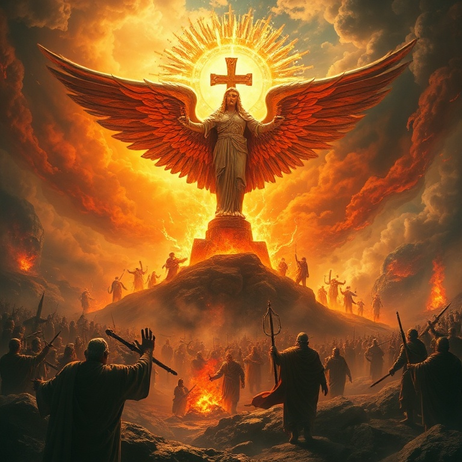

# A Queda do Altivo: Um Estudo em Obadias

---

## Introdução

O livro de Obadias é o menor do Antigo Testamento, com apenas 21 versículos, mas sua mensagem é poderosa e atemporal. O profeta, cujo nome significa "servo do Senhor", entrega uma palavra de julgamento contra Edom, nação descendente de Esaú, irmão de Jacó. A rivalidade entre os dois irmãos se estendeu por séculos, e Edom se tornou símbolo do orgulho humano que se levanta contra Deus.

Obadias profetizou provavelmente após a queda de Jerusalém em 586 a.C., quando os edomitas não apenas se alegraram com a desgraça de Judá, mas também participaram ativamente do saque e da violência. Diante dessa traição fraternal, Deus anuncia juízo certo e restauração futura para Israel. A mensagem central é clara: o orgulho precede a queda, e o Senhor reina soberano sobre todas as nações.

O livro nos ensina que Deus vê a injustiça e age no tempo certo. Embora os edomitas se sentissem seguros em suas fortalezas rochosas, nada escapa aos olhos do Juiz de toda a terra. Obadias nos convida a examinar nosso próprio coração e a confiar na justiça divina, mesmo quando o mal parece triunfar temporariamente.

---

## Capítulo 1: A Visão de Obadias

O profeta começa com uma declaração solene: "Assim diz o Senhor Deus a respeito de Edom" (v. 1). Obadias recebe uma visão clara e a transmite com autoridade profética. A nação de Edom, conhecida por sua sabedoria e por suas habitações inacessíveis nas fendas das rochas, recebe uma sentença inequívoca. O orgulho de Edom enganou seu coração, levando-o a crer que era invulnerável.

Deus promete rebaixar os altivos edomitas. Embora eles se exaltassem como águias e fizessem seu ninho entre as estrelas, o Senhor os derrubaria. Essa linguagem poética revela a essência do pecado de Edom: a soberba espiritual que leva uma nação ou indivíduo a se considerar autossuficiente e superior aos demais.

A visão de Obadias nos lembra que Deus resiste aos soberbos, mas dá graça aos humildes. O julgamento de Edom não foi arbitrário; foi a resposta justa de Deus a uma longa história de orgulho e violência contra seu povo. A mesma verdade se aplica hoje: Deus continua a se opor ao orgulho humano em todas as suas manifestações.

---

## Capítulo 2: O Pecado de Edom

Obadias detalha as acusações contra Edom. O pecado fundamental foi a violência contra seu irmão Jacó. Quando estrangeiros saquearam Jerusalém e lançaram sortes sobre a cidade, Edom ficou indiferente — e pior, participou da destruição. O profeta lista crimes específicos: os edomitas ficaram do lado oposto, se alegraram com a desgraça de Judá, falaram arrogantemente e estenderam a mão para saquear.

A gravidade do pecado de Edom está em sua traição familiar. A aliança entre irmãos foi desprezada, e a crueldade substituiu a compaixão. Deus condena não apenas o ato violento em si, mas também a atitude do coração que se alegra com o sofrimento alheio. O pecado de Edom reflete uma insensibilidade espiritual que endurece o coração contra a misericórdia.

A aplicação para nós é direta: somos chamados a amar nosso próximo, especialmente os irmãos na fé. A indiferença diante do sofrimento alheio é pecado aos olhos de Deus. Obadias nos exorta a examinar se há em nós orgulho espiritual ou frieza diante das necessidades dos outros.

---

## Capítulo 3: O Julgamento de Deus

O julgamento divino contra Edom é descrito em termos vívidos e abrangentes. Deus promete destruição completa: "Como tu fizeste, assim se fará contigo; a tua recompensa voltará sobre a tua cabeça" (v. 15). A lei da semeadura e colheita se aplica com precisão. Edom colheria exatamente o que plantou, e sua violência se voltaria contra si mesma.

O profeta enfatiza que não haverá escape. Nem a sabedoria edomita, nem seus aliados, nem suas fortalezas nas montanhas poderiam salvá-los. O julgamento seria total, e Edom desapareceria como nação. A história confirma essa profecia: após a destruição romana, os edomitas simplesmente deixaram de existir como povo distinto.

Este capítulo nos ensina sobre a seriedade do pecado e a certeza do juízo divino. Deus não faz vista grossa à maldade. No entanto, o julgamento de Edom também aponta para a cruz de Cristo, onde o juízo contra o pecado foi executado de uma vez por todas. Em Cristo, aqueles que creem encontram perdão e escapam da condenação eterna.

---

## Capítulo 4: O Dia do Senhor

Obadias expande o horizonte de seu discurso para incluir o "Dia do Senhor", um tema central nos profetas. Este dia traria juízo não apenas sobre Edom, mas sobre todas as nações. "Porque o Dia do Senhor está perto sobre todas as nações" (v. 15). O juízo de Edom se torna um microcosmo do juízo universal que Deus traria sobre todo orgulho humano.

A linguagem apocalíptica descreve um tempo de prestação de contas global. As nações que beberam do cálice da ira divina seriam como se nunca tivessem existido. Mas no Monte Sião haveria livramento, e o reino seria do Senhor. Obadias aponta para o futuro estabelecimento do governo divino sobre toda a terra.

A mensagem do Dia do Senhor é simultaneamente solene e esperançosa. Solene porque anuncia juízo certo sobre o pecado; esperançosa porque promete livramento para os que confiam em Deus. Para o crente, o Dia do Senhor não é motivo de temor, mas de expectativa pela consumação do plano redentor de Deus.

---

## Capítulo 5: A Restauração de Israel

Os versículos finais de Obadias trazem uma mensagem de esperança e restauração. "Mas no Monte Sião haverá livramento, e será santo" (v. 17). Israel seria restaurado, e o território de Edom seria possuído pelos exilados que retornassem. A casa de Jacó seria como fogo que consome o restolho, e o Senhor seria o Rei supremo.

A restauração prometida vai além da mera recuperação territorial. Obadias fala de um reino espiritual onde Deus governa sobre seu povo redimido. Os salvos do Monte Sião herdarão as promessas da aliança, e a presença do Senhor será o centro de tudo. A vitória final pertence a Deus e ao seu povo fiel.

Esta promessa de restauração encontra seu cumprimento máximo em Jesus Cristo, o Rei que veio para salvar seu povo dos pecados. Em Cristo, judeus e gentios são reconciliados e formam um só povo. A mensagem de Obadias, que começa com julgamento, termina com a vitória certa do reino de Deus — uma vitória que nós, pela fé, já podemos celebrar.

---

## Conclusão

Obadias nos lembra que o orgulho é a raiz de todos os pecados e que Deus se opõe firmemente aos soberbos. A história de Edom serve como advertência solene para indivíduos e nações que confiam em sua própria força. Ao mesmo tempo, o livro aponta para a esperança da restauração divina e para o estabelecimento do reino eterno de Deus.

Que possamos aprender com Edom a não confiar em nossas fortalezas humanas, mas a nos humilhar diante do Senhor. Nele encontramos livramento, refúgio e a certeza de que seu reino jamais terá fim.
