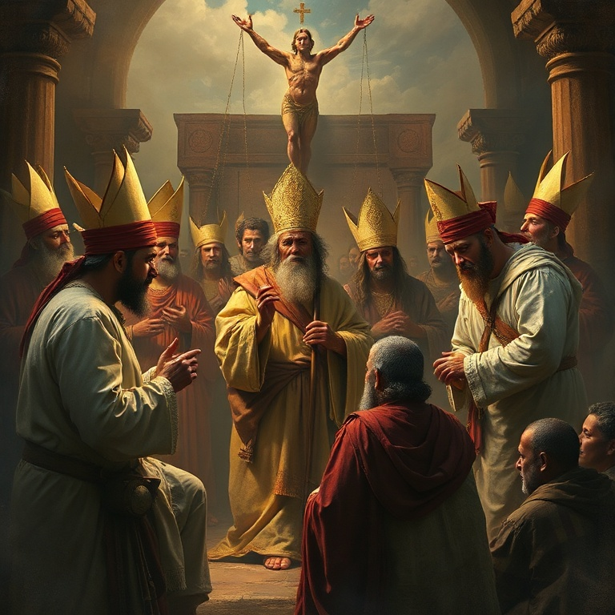
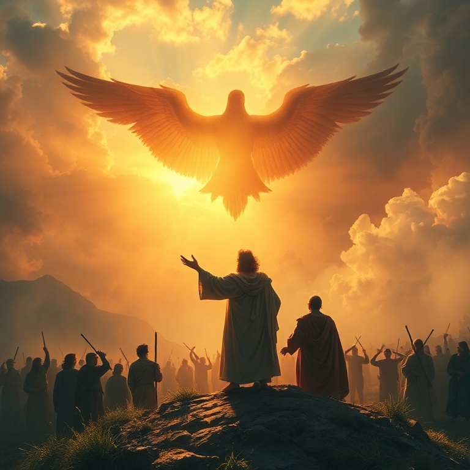

# O que o Senhor Pede: Um Estudo em Miqueias

---

## Introdução

O profeta Miqueias, natural de Moresete, uma pequena cidade em Judá, exerceu seu ministério durante os reinados de Jotão, Acaz e Ezequias, reis de Judá (c. 742–686 a.C.). Ele foi contemporâneo de Isaías e profetizou em um período de grande prosperidade econômica, mas também de profunda corrupção religiosa e social. O nome Miqueias significa "quem é como o Senhor?" — uma pergunta que ecoa ao longo de todo o seu livro.

Miqueias denunciou com coragem os pecados de Israel e Judá: a opressão dos pobres, a corrupção dos líderes, a falsa profecia e a idolatria. Mas ele também anunciou esperança — a vinda de um governante de Belém, a restauração de Sião e o estabelecimento do reino messiânico. Sua mensagem alterna entre juízo e promessa, chamando o povo ao arrependimento genuíno.

O versículo mais conhecido de Miqueias — "Ele te declarou, ó homem, o que é bom; e que é o que o Senhor pede de ti, senão que pratiques a justiça, e ames a misericórdia, e andes humildemente com o teu Deus?" (Mq 6.8) — resume de forma sublime a essência da vida que agrada a Deus. Justiça, misericórdia e humildade são os pilares de uma fé autêntica.

---

## Capítulo 1: Julgamento sobre Israel e Judá

O livro começa com uma teofania poderosa: "Eis que o Senhor sai do seu lugar e desce, e anda sobre as alturas da terra" (Mq 1.3). Deus é apresentado como o Juiz supremo que testemunha contra seu povo. As montanhas se derretem debaixo dele, e os vales se fendem como cera diante do fogo. A criação inteira reage à presença do seu Criador.

Miqueias anuncia juízo específico contra Samaria, capital do reino do norte, por sua idolatria e prostituição espiritual. A cidade seria reduzida a um montão de pedras, e suas imagens de escultura seriam despedaçadas. O juízo se estende também a Judá, que havia seguido os mesmos caminhos de pecado.

O profeta chora e pranteia ao anunciar a destruição que se aproxima. Diferente de muitos falsos profetas que anunciavam apenas paz, Miqueias sofre com a mensagem que precisa entregar. A verdadeira profecia nunca se alegra com o juízo, mas clama por arrependimento. O amor de Deus por seu povo se manifesta tanto na correção quanto na promessa.

---

## Capítulo 2: A Corrupção dos Líderes

Miqueias denuncia veementemente aqueles que planejam a iniquidade em suas camas e a executam ao amanhecer. Os poderosos cobiçam campos e os tomam, oprimem o homem e sua casa, roubam a herança das famílias. A ganância dos ricos deixava os pobres sem lar e sem esperança. O pecado social era uma afronta direta a Deus, que estabelecera a terra como herança para todo o seu povo.

Os líderes de Israel são particularmente visados na denúncia profética. Os governantes, os sacerdotes e os profetas — todos haviam se corrompido. Os chefes julgavam por suborno, os sacerdotes ensinavam por interesse e os profetas adivinhavam por dinheiro. A estrutura religiosa e política estava podre, e o povo sofria as consequências.

Miqueias nos lembra que Deus se importa com a justiça social. A verdadeira espiritualidade não pode ignorar a opressão dos pobres e a corrupção dos líderes. O culto a Deus que não se traduz em amor ao próximo é vazio e hipócrita. A mensagem de Miqueias ressoa em cada época, chamando líderes e povo à integridade e à justiça.

---

## Capítulo 3: O Governante de Belém

Em meio às mensagens de juízo, irrompe uma das profecias mais belas e conhecidas de todo o Antigo Testamento: "E tu, Belém Efrata, posto que pequena entre os milhares de Judá, de ti me sairá o que será Senhor em Israel, cujas saídas são desde os tempos antigos, desde os dias da eternidade" (Mq 5.2). Esta profecia messiânica aponta para o nascimento de Jesus em Belém, cumprida séculos depois.

O governante prometido teria origens humildes — uma pequena cidade, não a imponente Jerusalém. Mas sua origem é eterna, "desde os dias da eternidade". Ele apascentaria o povo de Deus na força do Senhor e seria a paz. Sob seu governo, o remanescente de Jacó seria como orvalho do Senhor, trazendo bênção para muitos.

A profecia de Miqueias aponta para Jesus Cristo, o Messias prometido que nasceu em Belém, viveu entre os humildes e se entregou por seu povo. Ele é o Pastor que cuida de suas ovelhas, o Príncipe da Paz que reconcilia Deus e os homens. Em meio à escuridão do juízo, a luz da promessa messiânica brilha com intensidade redobrada.

---

## Capítulo 4: O Que o Senhor Requer

O capítulo 6 de Miqueias contém o que muitos chamam de "o grande mandamento do Antigo Testamento". Deus entra em juízo com seu povo e pergunta: "Com que me apresentarei ao Senhor e me inclinarei ante o Deus excelso?" (Mq 6.6). O povo oferecia holocaustos, milhares de carneiros e rios de azeite. Mas Deus não se impressiona com rituais vazios.

A resposta divina é clara e direta: "Ele te declarou, ó homem, o que é bom; e que é o que o Senhor pede de ti, senão que pratiques a justiça, e ames a misericórdia, e andes humildemente com o teu Deus?" (Mq 6.8). Três requisitos resumem toda a lei: justiça nas relações, misericórdia para com os necessitados e humildade diante de Deus. Não são opções, mas exigências.

Este versículo é um dos mais subversivos de toda a Bíblia. Ele reduz a religião a seu essencial: não rituais impressionantes, não sacrifícios caros, mas um coração transformado que se reflete em ações justas, atitudes misericordiosas e uma vida de humilde dependência de Deus. Esta é a verdadeira espiritualidade que agrada ao Criador.

---

## Capítulo 5: Esperança e Restauração

A mensagem de Miqueias não termina em juízo. O profeta conclui com uma visão de esperança e restauração. "Quem é Deus como tu, que perdoas a iniquidade e te esqueces da transgressão do remanescente da tua herança?" (Mq 7.18). O nome do profeta encontra seu significado pleno nesta pergunta retórica: não há Deus como o Senhor, que se compraz na misericórdia.

Deus tornará a se compadecer de seu povo, pisará aos pés suas iniquidades e lançará todos os seus pecados nas profundezas do mar. A imagem do perdão divino é vívida e consoladora. Nossos pecados são lançados no abismo do esquecimento divino, removidos para sempre. A fidelidade de Deus às suas promessas é a âncora da esperança de Israel.

Miqueias termina com a certeza de que Deus cumprirá sua aliança com Abraão e Jacó. A restauração não viria pelos méritos de Israel, mas pela graça de Deus. Esta mesma graça nos alcança hoje em Cristo Jesus. Assim como Miqueias esperou no Deus da salvação, nós também aguardamos a consumação de todas as coisas quando o Senhor estabelecerá seu reino de justiça e paz.

---

## Conclusão

O livro de Miqueias nos confronta com a pergunta mais importante da vida: o que Deus pede de nós? A resposta é simples, mas desafiadora: justiça, misericórdia e humildade. Não podemos nos esconder atrás de rituais religiosos ou de uma fé meramente intelectual. Deus quer nosso coração transformado, refletido em ações concretas de amor ao próximo e submissão a ele.

Que possamos, como Miqueias, caminhar humildemente com nosso Deus, praticando a justiça e amando a misericórdia em todas as áreas de nossa vida. Nele encontramos perdão, restauração e a esperança certa de que seu reino virá em plenitude.
