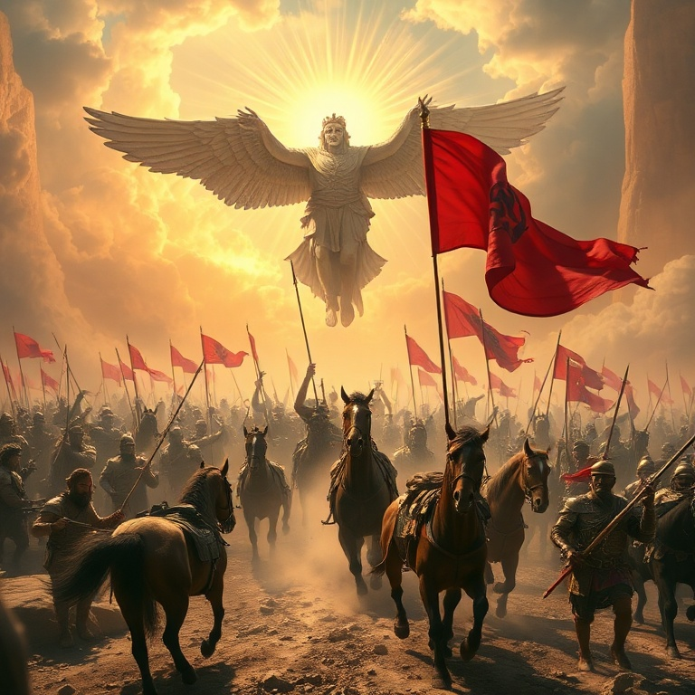
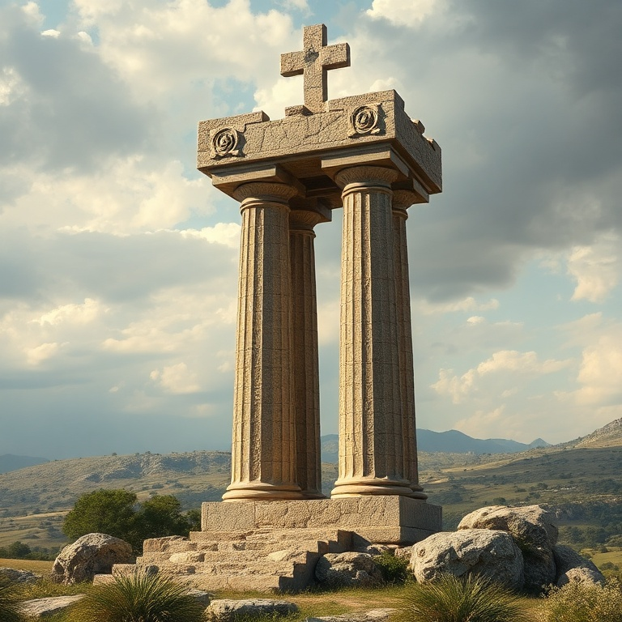

# O Justo Viverá pela Fé: Um Estudo em Habacuque

---

## Introdução

O livro de Habacuque é único entre os profetas por sua estrutura de diálogo entre o profeta e Deus. Habacuque questiona o Senhor sobre a aparente impunidade do mal, e Deus responde, revelando seus planos soberanos. O nome Habacuque significa "abraço", e o livro nos convida a abraçar pela fé os caminhos de Deus, mesmo quando não os compreendemos plenamente.

Habacuque profetizou provavelmente no final do século VII a.C., quando o reino de Judá estava em declínio moral e espiritual. O profeta via violência, injustiça e opressão por toda parte, e Deus parecia inativo. Suas perguntas são nossas perguntas: por que Deus permite o mal? Por que os ímpios prosperam enquanto os justos sofrem?

A resposta de Deus a Habacuque é um dos versículos mais importantes de toda a Bíblia: "O justo viverá pela fé" (Hc 2.4). Este princípio, citado por Paulo, Pedro e o autor de Hebreus, tornou-se o lema da Reforma Protestante e continua sendo o fundamento da vida cristã. Habacuque nos ensina que a fé não é a ausência de dúvidas, mas a confiança em Deus apesar das circunstâncias.

---

## Capítulo 1: A Primeira Queixa

Habacuque começa com um lamento angustiado: "Até quando, Senhor, clamarei eu, e tu não me escutarás? Gritar-te-ei: Violência! E não salvarás?" (Hc 1.2). O profeta via destruição, violência, contenda e discórdia por toda parte. A lei se relaxava, a justiça nunca se manifestava, e os justos eram oprimidos pelos ímpios. O silêncio de Deus era angustiante.

A primeira resposta de Deus surpreende Habacuque. Deus anuncia que levantará os caldeus (babilônios), uma nação amarga e impetuosa, como instrumento de juízo contra Judá. Eles eram temíveis e terríveis, e sua cavalaria era mais rápida que leopardos. Deus usaria um povo pagão e cruel para disciplinar seu próprio povo.

Esta resposta não resolveu o dilema de Habacuque; na verdade, o agravou. Como Deus poderia usar uma nação mais ímpia que Judá para julgar seu povo? A pergunta do profeta reflete a tensão entre a soberania de Deus e a justiça divina. Habacuque aprende que os caminhos de Deus são mais altos que nossos caminhos, e sua sabedoria ultrapassa nossa compreensão limitada.

---

## Capítulo 2: A Resposta de Deus

Diante da perplexidade, Habacuque decide esperar pela resposta de Deus. "Sobre a minha guarda estarei, e sobre a fortaleza me apresentarei e vigiarei, para ver o que ele me dirá" (Hc 2.1). Esta atitude de espera vigilante é um modelo para todos os que buscam compreender os caminhos de Deus. Nem sempre recebemos respostas imediatas, mas podemos confiar que Deus falará no tempo certo.

Deus responde com uma visão que deveria ser escrita em tábuas para que pudesse ser lida claramente. A visão fala de um tempo determinado, e embora demore, deve ser aguardada com paciência, porque certamente se cumprirá. A paciência é uma virtude essencial da fé. Deus não está atrasado; ele age no tempo perfeito de sua soberania.

A resposta divina contrasta o orgulho dos ímpios com a fé dos justos. "Eis que a sua alma se incha, não é reta nele; mas o justo viverá pela fé" (Hc 2.4). Enquanto os orgulhosos confiam em si mesmos, os justos confiam em Deus. A fé é a certeza de que Deus cumprirá suas promessas, mesmo quando tudo parece contradizê-las. O justo vive não pelo que vê, mas por quem confia.

---

## Capítulo 3: A Segunda Queixa

Habacuque não recebeu todas as respostas que queria, mas recebeu algo melhor: a certeza de que Deus é soberano e justo. O profeta passa da queixa à adoração. Ele reconhece os "ais" proclamados contra os ímpios que acumulam riquezas injustas, constroem cidades com sangue e adoram ídolos mudos. A justiça de Deus, embora tardia, é certa.

Os cinco "ais" do capítulo 2 revelam o caráter do orgulho humano: a ganância insaciável que nunca se satisfaz, a ambição que humilha os outros, a violência que destrói vidas, a idolatria que troca o Criador pela criatura. Cada "ai" termina com a declaração de que "a terra se encherá do conhecimento da glória do Senhor, como as águas cobrem o mar" (Hc 2.14).

Esta seção nos ensina que Deus vê e julga cada forma de injustiça. Nada escapa ao seu conhecimento. Os que oprimem os pobres, exploram os fracos e confiam em ídolos serão chamados a prestar contas. A paciência de Deus não é fraqueza, mas oportunidade para arrependimento. O dia do juízo virá, e toda glória será do Senhor.

---

## Capítulo 4: A Soberania de Deus

O capítulo 3 de Habacuque é uma oração e um salmo de louvor que expressa a confiança do profeta na soberania de Deus. Habacuque relembra os grandes feitos de Deus no passado: o Êxodo, a conquista de Canaã, a vitória sobre os inimigos de Israel. Ele descreve Deus vindo em glória, com raios e pestilências diante dele, tremendo os montes e abrindo os rios.

A teofania do capítulo 3 é uma das mais magníficas da Bíblia. Deus é apresentado como o Guerreiro divino que luta por seu povo. "Sai para salvação do teu povo, para salvação do teu ungido" (Hc 3.13). A soberania de Deus não é abstrata; ela se manifesta na história em atos concretos de juízo e redenção.

Habacuque aprende a confiar na soberania de Deus não apesar de suas dúvidas, mas através delas. Ele não entende todos os detalhes dos planos divinos, mas conhece o caráter de Deus. E isso é suficiente. A fé madura não exige respostas para todas as perguntas; ela confia na bondade e sabedoria de Deus, mesmo na escuridão.

---

## Capítulo 5: A Oração de Fé

O livro termina com uma das declarações de fé mais sublimes de toda a Escritura. Habacuque contempla um cenário de completa devastação: a figueira não floresceria, as vinhas não dariam fruto, o campo não produziria alimento, os currais estariam vazios. Em outras palavras, tudo o que sustentava a vida e a esperança humana seria removido.

Mesmo assim, o profeta declara: "Todavia, eu me alegrarei no Senhor, exultarei no Deus da minha salvação" (Hc 3.18). A alegria de Habacuque não dependia das circunstâncias, mas do Senhor. Ele havia aprendido que Deus é o bem maior, mais valioso que todas as bênçãos materiais. A perda de tudo não poderia roubar sua alegria em Deus.

Habacuque termina com uma imagem de confiança renovada: "O Senhor Deus é a minha fortaleza, e fará os meus pés como os da corça, e me fará andar sobre as minhas alturas" (Hc 3.19). A fé não nos livra das dificuldades, mas nos dá força para superá-las. Como a corça que escala as montanhas, o justo vive pela fé, firmado em Deus, seu refúgio inabalável.

---

## Conclusão

Habacuque nos ensina que a fé verdadeira não é a ausência de dúvidas, mas a confiança em Deus apesar das circunstâncias. O profeta passou da perplexidade à adoração, da queixa ao louvor, do medo à confiança. Ele aprendeu que o justo vive pela fé, não pelo que vê ou compreende.

Que possamos, como Habacuque, levar nossas dúvidas e perguntas a Deus, confiando que ele é soberano, justo e bom. E que, em meio a todas as circunstâncias, possamos declarar: "Todavia, eu me alegrarei no Senhor, exultarei no Deus da minha salvação."
