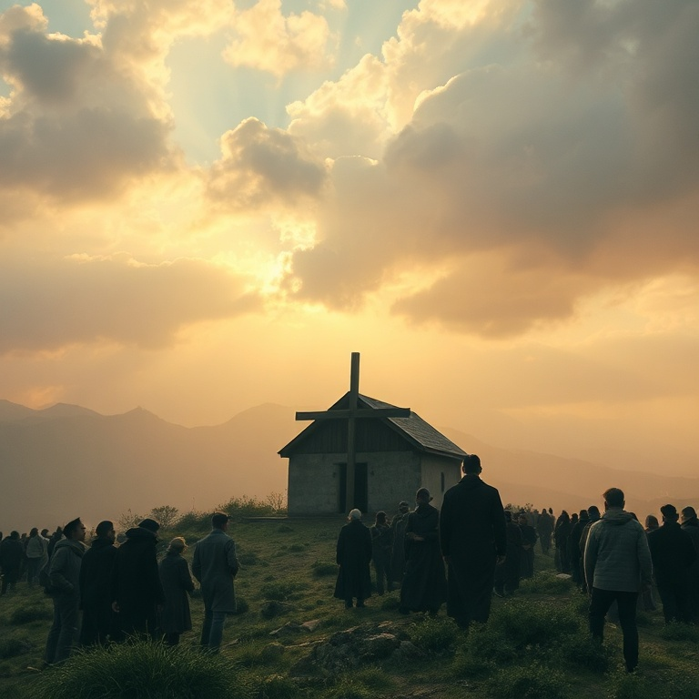
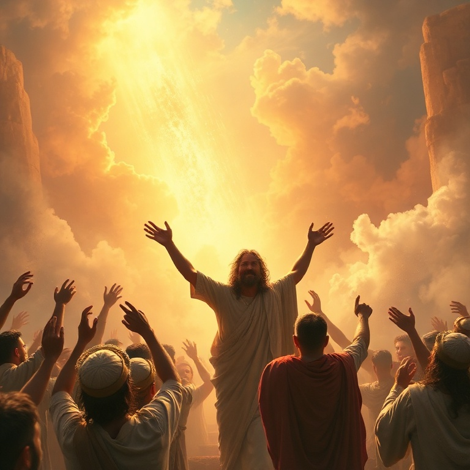

# O Grande Dia: Um Estudo em Sofonias

---

## Introdução

O profeta Sofonias exerceu seu ministério durante o reinado de Josias, rei de Judá (c. 640–609 a.C.), um período de reforma religiosa e renovação espiritual. Sofonias era descendente do rei Ezequias, o que lhe dava acesso à corte real e uma perspectiva privilegiada sobre a corrupção religiosa e política de seu tempo. Seu nome significa "o Senhor escondeu" ou "o Senhor protegeu".

A mensagem central de Sofonias é o "Dia do Senhor" — um tema que percorre todo o livro. Este dia traria juízo sobre Judá por sua idolatria e injustiça, sobre as nações pagãs por seu orgulho e opressão, mas também traria restauração e bênção para o remanescente fiel. Sofonias anuncia o juízo com clareza, mas também proclama a esperança com alegria.

O livro de Sofonias nos lembra que o Dia do Senhor é simultaneamente um dia de trevas para os ímpios e de luz para os justos. Para aqueles que se humilham diante de Deus, buscam a justiça e confiam no Senhor, o grande dia traz livramento e alegria. A mensagem de Sofonias nos chama ao arrependimento genuíno e à esperança na restauração divina.

---

## Capítulo 1: O Dia do Senhor se Aproxima

Sofonias começa com uma declaração terrível: "Destruirei completamente todas as coisas sobre a face da terra, diz o Senhor" (Sf 1.2). O juízo divino seria abrangente, atingindo homens e animais, aves e peixes. A linguagem ecoa o dilúvio de Noé, sugerindo um juízo cósmico sobre o pecado humano. Deus purificaria a terra de toda maldade.

O profeta especifica os pecados de Judá: os que adoravam Baal e os deuses das estrelas, os que juravam pelo Senhor e por Moloque, os que se desviavam de Deus e não o buscavam. A idolatria havia penetrado todos os níveis da sociedade. Mesmo em Jerusalém, a cidade do grande Rei, a adoração falsa florescia.

O Dia do Senhor é descrito como dia de ira, angústia, destruição, trevas e escuridão. "A voz do Dia do Senhor é amarga; clama ali o valente" (Sf 1.14). Não há escape para os que rejeitam a Deus. Suas riquezas não podem salvá-los, e seus ídolos não podem protegê-los. O juízo divino é certo, e ninguém pode resistir a ele.

---

## Capítulo 2: Julgamento sobre Judá

Sofonias dirige uma palavra específica a Jerusalém e a seus líderes. Os príncipes são leões rugidores, os juízes são lobos da tarde que não deixam os ossos para a manhã, os profetas são levianos e traiçoeiros, e os sacerdotes profanam o santuário e violentam a lei. A liderança de Judá estava completamente corrompida.

O profeta denuncia aqueles que dizem em seu coração: "O Senhor não faz bem nem mal" (Sf 1.12). A indiferença espiritual era tão grave quanto a idolatria ativa. Muitos em Judá haviam deixado de crer que Deus age na história. O secularismo prático levava à imoralidade e à injustiça. O povo vivia como se Deus não existisse.

O julgamento sobre Judá é um chamado ao exame pessoal. Deus não tolera a indiferença espiritual. A fé que não se traduz em obediência é fé morta. Sofonias nos convida a examinar se estamos vivendo como se Deus realmente importa, ou se, como Judá, nos acomodamos a uma religiosidade vazia que não transforma o coração.

---

## Capítulo 3: Julgamento sobre as Nações

Sofonias expande o escopo do juízo divino para incluir as nações vizinhas de Judá. Filístia, Moabe, Amom, Etiópia e Assíria — todas seriam julgadas por seu orgulho e por sua hostilidade contra o povo de Deus. Nínive, capital da Assíria, se tornaria um deserto árido, pasto para rebanhos. A soberba precede a queda.

O juízo sobre as nações revela que Deus é o Senhor de toda a terra, não apenas de Israel. Nenhuma nação escapa ao seu governo. Os poderes que oprimem seu povo e desafiam sua autoridade um dia prestarão contas. A história confirma o cumprimento destas profecias: todas estas nações desapareceram ou foram subjugadas.

Para o povo de Deus, o juízo sobre as nações é motivo de esperança. Deus não abandona seu povo nas mãos dos opressores. No tempo determinado, ele age em favor dos justos. A certeza do juízo divino contra o mal nos dá forças para perseverar, mesmo quando os ímpios parecem prosperar temporariamente.

---

## Capítulo 4: O Clamor pelo Arrependimento

Em meio às mensagens de juízo, Sofonias oferece esperança ao remanescente fiel. "Congregai-vos, sim, congrega-vos, ó nação que não tens desejo" (Sf 2.1). O profeta clama por arrependimento antes que chegue o Dia do Senhor. Buscai ao Senhor, vós todos os humildes da terra, que pondes em prática os seus juízos; buscai a justiça, buscai a mansidão.

O arrependimento genuíno envolve três ações: buscar ao Senhor, buscar a justiça e buscar a mansidão. Buscar ao Senhor significa priorizar o relacionamento com Deus acima de tudo. Buscar a justiça significa viver de acordo com os padrões divinos. Buscar a mansidão significa humilhar-se diante de Deus e dos homens.

A oferta de salvação para o remanescente mostra que Deus não deseja a morte do pecador, mas que ele se arrependa e viva. Mesmo quando o juízo é iminente, Deus estende a mão da misericórdia. Sofonias nos convida a nos humilhar diante de Deus, reconhecer nossos pecados e buscar refúgio no Senhor antes que o grande dia chegue.

---

## Capítulo 5: O Cântico da Restauração

O livro de Sofonias termina com uma explosão de esperança. "Canta alegremente, ó filha de Sião; rejubila, ó Israel; alegra-te e exulta de todo o coração, ó filha de Jerusalém" (Sf 3.14). O juízo passou, e Deus renova seu povo. O Rei de Israel, o Senhor, está no meio de Sião como guerreiro que salva.

Deus promete restaurar o remanescente humilde e justo. Eles serão pasto e se deitarão sem que ninguém os espante. O Senhor se alegrará em seu povo com júbilo, renovará seu amor, e exultará sobre eles com cânticos. A imagem de Deus cantando sobre seu povo é uma das mais comoventes de toda a Bíblia.

A promessa de restauração aponta para o evangelho de Jesus Cristo. Nele, o juízo de Deus contra o pecado foi satisfeito, e a restauração do povo de Deus se tornou realidade. Em Cristo, somos o remanescente redimido, o povo sobre o qual Deus se alegra. O grande Dia do Senhor, que para os ímpios é dia de trevas, para nós é dia de redenção e alegria eterna.

---

## Conclusão

Sofonias nos apresenta o grande contraste entre o juízo e a graça de Deus. O Dia do Senhor traz destruição para os ímpios, mas livramento para os que confiam em Deus. O livro nos chama ao arrependimento genuíno, à humildade e à busca sincera do Senhor.

Que possamos viver na expectativa do grande Dia do Senhor, não com medo, mas com alegria, sabendo que em Cristo estamos seguros. E que, como o remanescente fiel, possamos cantar louvores ao Deus que se alegra em seu povo.
