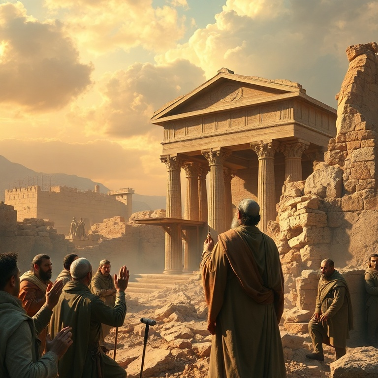
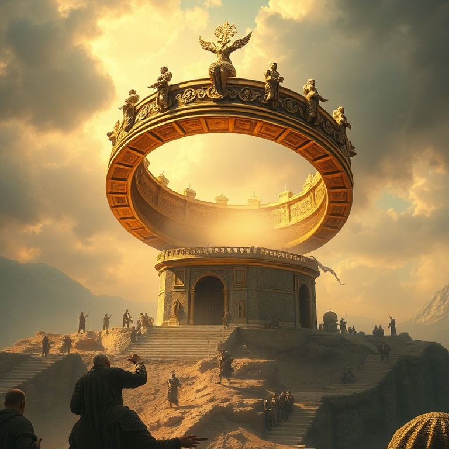

# Considerai os Vossos Caminhos: Um Estudo em Ageu

---

## Introdução

O profeta Ageu exerceu seu ministério em um momento crítico da história de Israel. Após o exílio babilônico, um remanescente havia retornado a Jerusalém sob a liderança de Zorobabel, governador, e Josué, sumo sacerdote. Eles começaram a reconstruir o templo, mas enfrentaram oposição e desânimo. As obras pararam por cerca de 16 anos, enquanto o povo se dedicava a construir suas próprias casas.

Em 520 a.C., Deus levantou Ageu para despertar o povo de sua apatia espiritual. Em quatro mensagens curtas e diretas, o profeta confronta o povo sobre suas prioridades, encoraja-os a retomar a obra e lhes assegura que a glória do novo templo seria maior que a do antigo. A mensagem central de Ageu é clara: "Considerai os vossos caminhos".

Ageu nos ensina que colocar Deus em primeiro lugar não é opcional para o povo da aliança. Quando priorizamos nossas próprias necessidades e negligenciamos as coisas de Deus, experimentamos frustração e vazio. Mas quando honramos a Deus com nossas prioridades, ele nos abençoa e sua glória se manifesta em nossas vidas.

---

## Capítulo 1: A Primeira Mensagem

A primeira mensagem de Ageu é direta e confrontadora. "Assim fala o Senhor dos Exércitos, dizendo: Este povo diz: Não veio ainda o tempo, o tempo de edificar a Casa do Senhor" (Ag 1.2). O povo havia encontrado desculpas para adiar a obra de Deus. Mas Ageu expõe a hipocrisia de suas prioridades: "Acaso é tempo de habitardes em casas apaineladas, enquanto esta casa fica deserta?"

O profeta estabelece uma conexão direta entre a negligência espiritual do povo e suas dificuldades materiais. Eles semeavam muito e colhiam pouco, comiam mas não se saciavam, bebiam mas não se fartavam, vestiam-se mas não se aquentavam, e o salário se perdia como se o colocassem num saco furado. Deus havia retirado sua bênção porque eles haviam negligenciado sua casa.

A resposta do povo é exemplar: Zorobabel, Josué e todo o remanescente obedeceram à voz do Senhor e temeram diante dele. Ageu os encoraja: "Eu sou convosco, diz o Senhor" (Ag 1.13). E o Senhor despertou o espírito de todos, e eles vieram e trabalharam na casa do Senhor. A obediência começa com o coração despertado por Deus.

---

## Capítulo 2: A Oposição e a Perseverança

Assim que o povo retomou as obras, surgiu a oposição. Ageu entrega sua segunda mensagem para encorajar o povo diante do desânimo. Muitos dos mais velhos, que haviam visto a glória do primeiro templo construído por Salomão, choravam ao ver a modesta reconstrução. O novo templo parecia insignificante em comparação.

Ageu pergunta: "Quem há entre vós que, tendo ficado, viu esta casa na sua primeira glória? E como a vedes agora? Não é esta como nada diante dos vossos olhos?" (Ag 2.3). Mas o profeta imediatamente encoraja: "Sê forte, ó Zorobabel, ... sê forte, ó Josué, ... e trabalhai, porque eu sou convosco, diz o Senhor dos Exércitos".

Deus promete encher o novo templo com sua glória. "A glória desta última casa será maior do que a da primeira" (Ag 2.9). Esta promessa se cumpriu de forma suprema quando Jesus, a glória de Deus encarnada, entrou no templo de Jerusalém. Ageu nos ensina que o valor de nosso trabalho para Deus não é medido por padrões humanos, mas pela presença de Deus.

---

## Capítulo 3: A Glória do Novo Templo

A terceira mensagem de Ageu aborda a pureza e a contaminação. O profeta pergunta aos sacerdotes sobre a lei cerimonial: se alguém levar carne santa na aba de suas vestes, e essa aba tocar em pão, guisado, vinho ou azeite, estas coisas se santificarão? Os sacerdotes respondem: "Não". A santidade não se transmite por contato.

Ageu então pergunta: se alguém contaminado pelo contato com um morto tocar nessas coisas, elas se contaminarão? Os sacerdotes respondem: "Sim". A contaminação, ao contrário da santidade, é contagiosa. A lição é clara: o povo estava contaminado pelo pecado, e suas ofertas também o estavam. A obediência parcial não é suficiente diante de Deus.

A mensagem nos lembra que a santidade de Deus exige pureza de coração e de vida. Não podemos servir a Deus de qualquer maneira e esperar sua aprovação. O arrependimento genuíno e a obediência sincera são essenciais para que nossa adoração seja aceitável diante do Senhor. Deus quer não apenas nossas obras, mas nosso coração.

---

## Capítulo 4: A Pureza e a Obediência

A quarta mensagem de Ageu é uma promessa pessoal a Zorobabel, o governador de Judá. "Naquele dia, diz o Senhor dos Exércitos, tomar-te-ei, ó Zorobabel, ... e te farei como um anel de selo; porque te escolhi, diz o Senhor dos Exércitos" (Ag 2.23). Zorobabel, descendente de Davi, era um tipo do Messias que viria.

A imagem do anel de selo representa autoridade, honra e segurança. Na antiguidade, o anel de selo era usado para autenticar documentos e representava o poder de quem o possuía. Ao prometer fazer de Zorobabel seu anel de selo, Deus estava reafirmando sua aliança davídica e apontando para o futuro Messias.

Esta promessa encontra seu cumprimento máximo em Jesus Cristo, o Filho de Davi, que é o selo de Deus, a autoridade máxima sobre todas as coisas. Em Cristo, as promessas feitas a Zorobabel se cumprem plenamente. Somos selados com o Espírito Santo da promessa, garantia de nossa herança eterna.

---

## Capítulo 5: A Promessa ao Governante

Ageu conclui com uma visão escatológica do reino de Deus. "Ainda uma vez, daqui a pouco, e farei tremer os céus e a terra, e o mar e a terra seca; e farei tremer todas as nações, e virá o Desejado de todas as nações, e encherei esta casa de glória, diz o Senhor dos Exércitos" (Ag 2.6-7).

O "Desejado de todas as nações" aponta para o Messias, Jesus Cristo, que viria para encher a casa de Deus com sua glória. O livro de Ageu termina com a certeza de que Deus está no controle da história e que seu plano redentor se cumprirá. As dificuldades presentes são temporárias; a glória futura é eterna.

Ageu nos ensina que vale a pena investir nossa vida na obra de Deus. Mesmo quando enfrentamos oposição, desânimo ou recursos limitados, podemos confiar que Deus está conosco e que sua glória encherá nosso trabalho. O que fazemos para o Senhor não é em vão. O Desejado de todas as nações virá e cumprirá suas promessas.

---

## Conclusão

Ageu nos desafia a examinar nossas prioridades e a colocar Deus em primeiro lugar. Quando negligenciamos as coisas de Deus, sofremos as consequências. Mas quando nos voltamos para ele com obediência e fé, experimentamos sua presença, seu poder e sua provisão. O Senhor está conosco em cada etapa da jornada.

Que possamos ouvir o chamado de Ageu: "Considerai os vossos caminhos". Que nossas prioridades reflitam nosso amor por Deus, e que nossa vida seja edificada para sua glória. Ele é fiel para cumprir suas promessas e encher nossa vida com sua presença.
