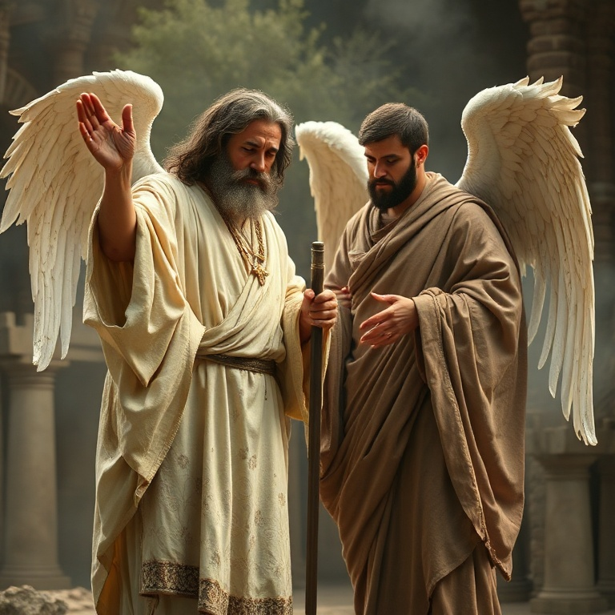
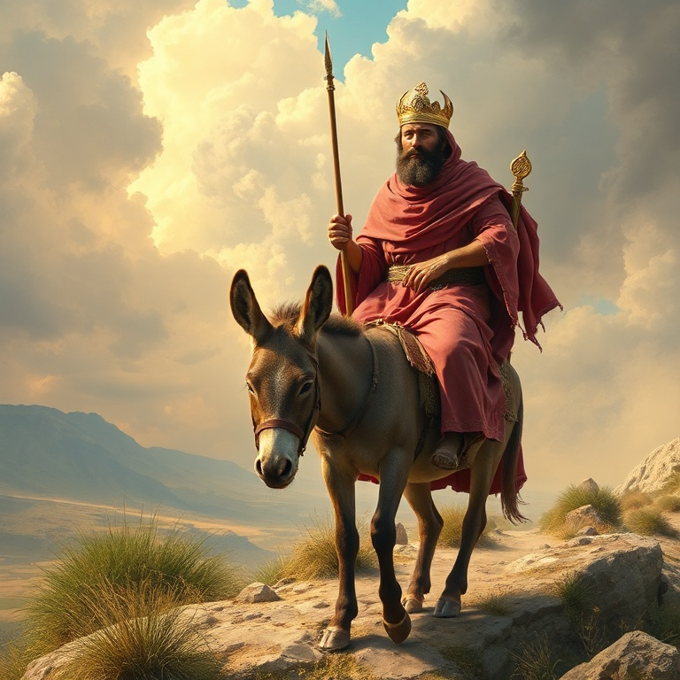
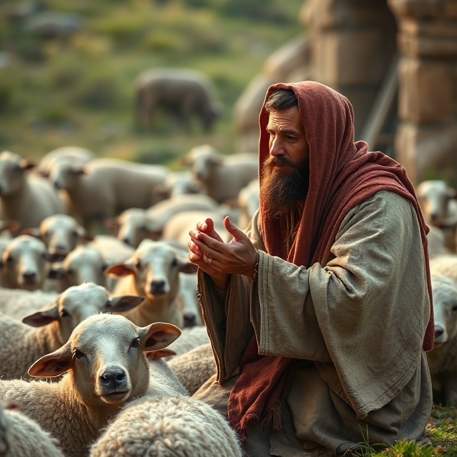

# Olhai para Mim: Um Estudo em Zacarias

---

## Introdução

O profeta Zacarias, contemporâneo de Ageu, exerceu seu ministério após o exílio babilônico, durante o reinado de Dario, rei da Pérsia (c. 520–518 a.C.). Zacarias era de linhagem sacerdotal e iniciou seu ministério ainda jovem. Seu nome significa "o Senhor se lembrou", e seu livro é um dos mais ricos em conteúdo messiânico e escatológico de todo o Antigo Testamento.

O livro de Zacarias pode ser dividido em duas partes principais: os capítulos 1–8 contêm uma série de oito visões noturnas que Zacarias recebeu, seguidas de mensagens sobre jejum e restauração; os capítulos 9–14 contêm dois oráculos proféticos que apontam para o Messias vindouro e para o dia final do Senhor. Nenhum outro profeta do Antigo Testamento contém tantas referências diretas à vida e obra de Jesus Cristo.

Zacarias nos convida a "olhar para" Deus, reconhecendo que ele é o centro da história e da profecia. O livro revela o coração de Deus por seu povo, seu plano de redenção através do Messias, e a vitória final do reino de Deus sobre todas as nações. Em Zacarias, vemos Jesus de forma clara e poderosa.

---

## Capítulo 1: As Visões Noturnas

Zacarias recebeu uma série de oito visões em uma única noite, todas com o objetivo de encorajar o povo a confiar no plano soberano de Deus. A primeira visão é a dos cavaleiros entre as murtas, que relatam que a terra está em paz. Deus mostra que, embora as nações estejam tranquilas, ele está atento e agirá em favor de Jerusalém.

A segunda visão mostra quatro chifres, símbolos dos poderes que dispersaram Israel e Judá, e quatro ferreiros que viriam para abatê-los. A terceira visão apresenta um homem com um cordel de medir, simbolizando a reconstrução de Jerusalém. A quarta visão mostra o sumo sacerdote Josué sendo purificado e vestido com vestes limpas.

As visões seguintes incluem o candelabro de ouro e as duas oliveiras (símbolo do Espírito Santo capacitando Zorobabel e Josué), o rolo voador (juízo contra o pecado), a mulher no efa (a remoção da impiedade) e os quatro carros (anjos que percorrem a terra). Cada visão transmite verdades profundas sobre a soberania e a graça de Deus.

---

## Capítulo 2: O Sumo Sacerdote Josué

Na quarta visão, Zacarias vê Josué, o sumo sacerdote, vestido com trajes sujos, diante do Anjo do Senhor. Satanás está à sua direita para acusá-lo. Mas o Senhor repreende Satanás e declara: "Não é este um tição tirado do fogo?" (Zc 3.2). Josué representa Israel, acusado pelo pecado, mas salvo pela graça de Deus.

Deus ordena que as vestes sujas de Josué sejam removidas e que ele seja vestido com trajes festivos. Uma mitra limpa é colocada em sua cabeça. Esta troca de vestes simboliza o perdão dos pecados e a justiça imputada por Deus. Josué não é justificado por seu próprio mérito, mas pela graça divina que o purifica e o reveste.

Esta visão aponta diretamente para Jesus Cristo, o grande Sumo Sacerdote que intercede por nós. Em Cristo, somos purificados de nossos pecados e revestidos de sua justiça. Satanás pode nos acusar, mas o sangue de Cristo nos defende. Somos tições tirados do fogo, salvos pela graça mediante a fé.

---

## Capítulo 3: O Renovo e o Rei

Em meio às visões, Zacarias recebe uma mensagem clara sobre o Messias vindouro. "Eis aqui o homem cujo nome é Renovo; ele brotará do seu lugar e edificará o templo do Senhor" (Zc 6.12). O Renovo é um título messiânico que aponta para Jesus Cristo, o descendente de Davi que edificaria o verdadeiro templo de Deus.

Zacarias também profetiza sobre a união dos ofícios real e sacerdotal na pessoa do Messias. Josué, o sumo sacerdote, e Zorobabel, o governante davídico, apontam para aquele que seria simultaneamente Rei e Sacerdote. "Ele se assentará e dominará no seu trono, e será sacerdote no seu trono" (Zc 6.13). Esta profecia encontra cumprimento em Jesus, nosso Rei e Sumo Sacerdote.

A mensagem de Zacarias sobre o Renovo nos enche de esperança. Deus não abandonou seu plano de redenção. Mesmo quando as circunstâncias eram difíceis e o povo estava desanimado, Deus estava preparando a vinda do Messias. O Renovo brotaria no tempo determinado e estabeleceria o reino eterno de Deus.

---

## Capítulo 4: O Pastor Ferido

A segunda parte do livro de Zacarias contém profecias marcantes sobre a paixão e morte de Cristo. "Desperta, ó espada, contra o meu Pastor e contra o homem que é o meu companheiro, diz o Senhor dos Exércitos. Fere o Pastor, e as ovelhas se dispersarão" (Zc 13.7). Jesus citou esta profecia na noite de sua prisão, identificando-se como o Pastor ferido por Deus.

Zacarias também profetiza os trinta moedas de prata, o preço da traição de Judas. "Pesaram o meu salário, trinta moedas de prata. Disse-me o Senhor: Lança isso ao oleiro, esse belo preço em que fui avaliado por eles" (Zc 11.12-13). O cumprimento exato desta profecia na traição de Jesus demonstra a precisão da palavra profética.

O Pastor ferido revela o coração de Deus que se entrega por seu povo. Jesus é o Bom Pastor que dá a vida pelas ovelhas. Sua morte não foi acidental; foi planejada desde a eternidade para a redenção dos pecadores. As profecias de Zacarias apontam para a cruz com clareza impressionante, confirmando que Jesus é o Messias prometido.

---

## Capítulo 5: O Grande Dia do Senhor

Zacarias conclui com uma visão grandiosa do Dia do Senhor. "Naquele dia, estarão os seus pés sobre o Monte das Oliveiras, que está diante de Jerusalém para o oriente; e o Monte das Oliveiras será fendido pelo meio" (Zc 14.4). O Senhor virá com todos os seus santos para estabelecer seu reino e julgar as nações.

A vitória final pertence ao Senhor. As nações que guerrearem contra Jerusalém serão derrotadas, e o Senhor será Rei sobre toda a terra. "Naquele dia, um só será o Senhor, e um só será o seu nome" (Zc 14.9). Haverá paz e segurança, e tudo será consagrado ao Senhor. Até os sinos dos cavalos trarão a inscrição "Santidade ao Senhor".

A visão do grande Dia do Senhor nos enche de esperança e nos motiva à perseverança. Vivemos entre a primeira vinda de Cristo, quando o Pastor foi ferido, e sua segunda vinda, quando ele reinará como Rei. Até aquele dia, somos chamados a viver em santidade, aguardando a consumação do plano redentor de Deus.

---

## Conclusão

Zacarias nos convida a olhar para Deus, o centro de toda a história e profecia. O livro revela Jesus Cristo em sua glória: como Renovo que edifica o templo, como Pastor ferido que dá a vida pelas ovelhas, e como Rei que voltará para reinar sobre toda a terra. Em Zacarias, vemos o plano de Deus do início ao fim.

Que possamos, como Zacarias, olhar para o Senhor em cada circunstância, confiando em suas promessas e aguardando com esperança o grande Dia do Senhor. Ele é fiel para cumprir tudo o que prometeu.
